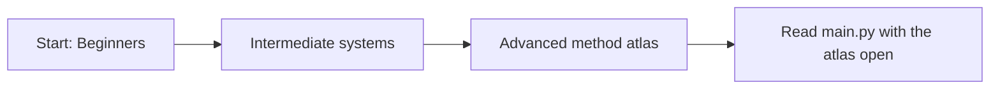

# LifeXP Beginner Guide

This guide is split into three smaller parts.

Read them in order if you are new to the project. Jump to the advanced atlas when you need to look up one specific method.

## Parts

1. [Beginners](docs/beginner-guide/01-beginners.md)
   Learn how to read the app, follow data, and think like the computer.

2. [Intermediate](docs/beginner-guide/02-intermediate.md)
   Understand Tkinter, JSON saves, XP flow, reports, themes, and diagrams of the main systems.

3. [Advanced](docs/beginner-guide/03-advanced.md)
   Use the complete method atlas. Every current `LifeXPApp` method is listed with a simple explanation and an example from the app.

## Best Reading Order

## Quick Advice

When reading code, ask four questions:

- What data exists right now?
- Which method is running?
- What condition or loop decides the next step?
- What changes after this line runs?

That is the core of thinking like the computer.
