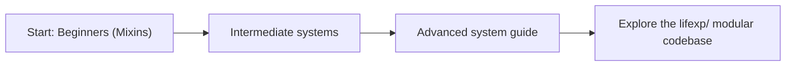

# LifeXP Modular Codebase Guide

This guide is split into three chapters. They have been fully updated to guide you through LifeXP's new **highly modular, mixin-based architecture** under the `lifexp/` package.

Read them in order if you are new to the project. Jump to the advanced part when you want to understand the main methods, system boundaries, and event pipelines more deeply.

## Parts

1. [Beginners](docs/beginner-guide/01-beginners.md)
   Learn how to read modular code, follow data, and understand how **Mixins** and **Multiple Inheritance** allow `self` to seamlessly connect variables and methods across different files.

2. [Intermediate](docs/beginner-guide/02-intermediate.md)
   Understand how individual components connect into systems (Startup order, JSON persistent states, report calculations, style loops, and event debouncing) and where each system resides in the mixin structure (`lifexp/ui_mixin.py`, `lifexp/data_mixin.py`, etc.).

3. [Advanced](docs/beginner-guide/03-advanced.md)
   Deep-dive into high-fidelity modular flows (quest-to-reward event pipelines, recursive widget trees, lazy trophy canvas rendering, daemon thread background tasks, and defensive widget accesses), studying how mixins cleanly cooperate.

## Best Reading Order

## Quick Advice

When reading modular code, ask five questions:

- What data exists right now?
- Which Mixin file houses the method that is running?
- How does `self` connect this line to other mixins?
- What condition or loop decides the next step?
- What changes in the UI or save file after this line runs?

That is the core of thinking like the computer in a modern modular architecture.
