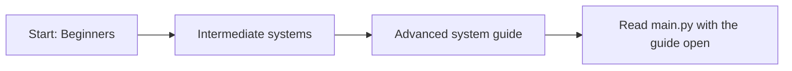

# LifeXP Beginner Guide

This guide is split into three smaller parts.

Read them in order if you are new to the project. Jump to the advanced part when you want to understand the main methods and systems more deeply.

## Parts

1. [Beginners](docs/beginner-guide/01-beginners.md)
   Learn how to read the app, follow data, and think like the computer.

2. [Intermediate](docs/beginner-guide/02-intermediate.md)
   Understand Tkinter, JSON saves, XP flow, reports, themes, and diagrams of the main systems.

3. [Advanced](docs/beginner-guide/03-advanced.md)
   Study the important methods, direct helper relationships, and larger code flows with beginner-friendly diagrams.

## Best Reading Order

## Quick Advice

When reading code, ask four questions:

- What data exists right now?
- Which method is running?
- What condition or loop decides the next step?
- What changes after this line runs?

That is the core of thinking like the computer.
