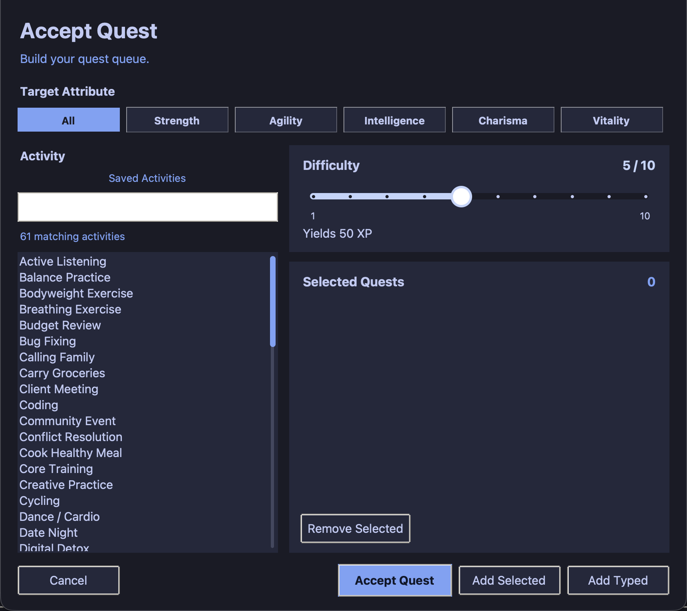

# 🎮 LifeXP

[](https://python.org)
[](LICENSE)
[](https://github.com)
[](https://github.com/nimbold/LifeXP/pulls)
[](https://github.com/psf/black)

LifeXP is a modern, gamified desktop application that turns your everyday tasks, habits, and self-improvement goals into an engaging RPG-style progression system. Complete quests, gain experience points (XP), level up core attributes, unlock prestigious trophies, and watch your digital character grow!

---

## 🗺️ Table of Contents

- [✨ Key Features](#-key-features)
- [🖼️ Screenshot Gallery](#%EF%B8%8F-screenshot-gallery)
- [🚀 Quick Start](#-quick-start)
- [🛠️ Developer Setup & Architecture](#%EF%B8%8F-developer-setup--architecture)
  - [Modular Directory Structure](#modular-directory-structure)
  - [The Mixin-Based Architecture](#the-mixin-based-architecture)
  - [Syntax and Compile Checking](#syntax-and-compile-checking)
- [📦 Packaging & CI/CD Pipelines](#-packaging--cicd-pipelines)
  - [macOS ARM64 App Build](#macos-arm64-app-build)
- [❓ Frequently Asked Questions & Troubleshooting](#-frequently-asked-questions--troubleshooting)
- [📄 License & Metadata](#-license--metadata)

---

## ✨ Key Features

- **RPG-Style Progression**: Connect your achievements to 5 primary attributes: **Strength**, **Agility**, **Intelligence**, **Charisma**, and **Vitality**.
- **Robust Quest Log**: Batch add, edit, complete, or abandon quests with customized XP rewards.
- **Milestone Trophy Room**: Celebrate your dedication with unlockable trophies at levels 5, 10, 25, 50, and 100.
- **Chronicles (Activity Reports)**: Review your daily, weekly, and monthly growth chronicles to track long-term trends.
- **Interactive Visual Polish**: Vibrant HSL-tailored colors, interactive hover animations, and smooth canvas particle effects.
- **Highly Custom Options**: Toggle display fonts, change core UI themes (e.g., Tokyo Night), adjust popup modes, and toggle performance-friendly animations.
- **Reliable Local Storage**: Automatic state saving and synchronization in a local `lifexp_data.json` file.

---

## 🖼️ Screenshot Gallery

| 📝 Quest Log | 🏆 Character Info | 📜 Chronicles |
|:---:|:---:|:---:|
|  |  |  |

| ➕ Accept Quest | ⚙️ Settings Panel |
|:---:|:---:|
|  |  |

---

## 🚀 Quick Start

### Prerequisites
Make sure you have **Python 3** installed on your system. LifeXP uses `Tkinter` (the standard Python GUI toolkit), which is usually included by default.

### Installation
Clone this repository and navigate to the project directory:

```bash
git clone https://github.com/nimbold/LifeXP.git
cd LifeXP
```

### Launching the App
Run the application directly using the Python interpreter:

```bash
python3 main.py
```

---

## 🛠️ Developer Setup & Architecture

### Modular Directory Structure

The project has been refactored from a single monolithic file into a clean, modern, and highly modular architecture.

```text
.
├── main.py                 # Application entry point & LifeXPApp initialization
├── lifexp/                 # Core application package
│   ├── __init__.py         # Package initialization
│   ├── constants.py        # Shared app parameters, curves, font ranges, and configurations
│   ├── runtime.py          # Platform scaling, HTTPS context, and resource path helpers
│   ├── ui_mixin.py         # Tkinter UI building, menus, tabs, and styles
│   ├── data_mixin.py       # JSON loading, saving, backups, and data validation
│   ├── engine_mixin.py     # Progression formulas, level curves, and statistics calculating
│   └── animation_mixin.py  # Canvas particles, transitions, and popup notification queues
├── docs/                   # Detailed documentation
│   └── beginner-guide/     # Comprehensive multi-part learner guides
├── screenshots/            # UI screenshots shown in the README
├── LICENSE                 # License documentation (MIT)
└── README.md               # Quick project overview & reference
```

### The Mixin-Based Architecture

LifeXP employs a **multiple-inheritance Mixin pattern** to combine features across distinct files while keeping a shared `self` reference. This keeps each module focused on a single responsibility:

| Component Mixin | Primary Responsibility |
| :--- | :--- |
| **`UIMixin`** | Builds the windows, configures styles, handles mouse hover states, and displays standard dialogues. |
| **`DataMixin`** | Deals with reading/writing user data, resolving subcategories, and handling system preferences. |
| **`EngineMixin`** | Evaluates progression algorithms, xp caps, milestone achievements, and chronicle histories. |
| **`AnimationMixin`** | Controls rendering cycles, particle explosions, and sequential popup overlays. |

For a deep dive into how variables and methods flow through these systems, see our [Modular Codebase Guide](BEGINNER_GUIDE.md).

### Syntax and Compile Checking
To verify codebase syntax without launching the GUI:

```bash
python3 -m py_compile main.py lifexp/*.py
```

---

## 📦 Packaging & CI/CD Pipelines

### macOS ARM64 App Build

This repository includes a GitHub Actions CI pipeline that automates compiling standalone, optimized desktop binaries for macOS.

- **Pipeline Location**: `.github/workflows/build-macos.yml`
- **Builder**: Runs on a native macOS ARM64 runner.
- **Process**: Installs dependency environments, configures PyInstaller using `LifeXP.spec`, packages resources, and produces an unsigned archive.
- **Artifact**: `LifeXP-macos-arm64-unsigned.zip`

---

## ❓ Frequently Asked Questions & Troubleshooting

<details>
<summary><b>🔒 Unsigned App Warning: "macOS cannot verify the developer"</b></summary>
<p>
Because the automated build artifact is unsigned, macOS Gatekeeper may warn you upon opening the app. This is expected until an Apple Developer certificate is acquired.
</p>
<p>
To run the app anyway:
<ol>
  <li>Open <b>System Settings</b> > <b>Privacy & Security</b>.</li>
  <li>Scroll down to the <b>Security</b> section.</li>
  <li>Click <b>Open Anyway</b> next to the blocked LifeXP app notice.</li>
</ol>
</p>
</details>

<details>
<summary><b>💾 Where are my game saves located?</b></summary>
<p>
Your game progress and achievements are stored in a simple JSON format.
<ul>
  <li><b>Standard runs (Python):</b> Progress is stored in <code>lifexp_data.json</code> directly inside the root workspace folder.</li>
  <li><b>Packaged macOS app build:</b> Progress is isolated in your system support folder: <code>~/Library/Application Support/LifeXP/lifexp_data.json</code></li>
</ul>
</p>
</details>

<details>
<summary><b>🎨 Can I customize the themes and visuals?</b></summary>
<p>
Yes! Navigate to the <b>Settings</b> tab within the application. Here, you can switch between modern color schemes (like the default "Tokyo Night"), adjust text scaling (font sizes), toggle high-fidelity animations, or disable heavy particle effects.
</p>
</details>

<details>
<summary><b>📚 I want to study the code. Where should I start?</b></summary>
<p>
LifeXP is intentionally designed to be highly readable and educational. We recommend:
<ol>
  <li>Reading our interactive entry guide: <a href="BEGINNER_GUIDE.md">BEGINNER_GUIDE.md</a></li>
  <li>Reviewing the <a href="docs/beginner-guide/01-beginners.md">Beginner Mixins tutorial</a> for an overview of Python multiple inheritance.</li>
  <li>Inspecting <a href="lifexp/constants.py">lifexp/constants.py</a> to see how XP curves and level thresholds are calculated.</li>
</ol>
</p>
</details>

---

## 📄 License & Metadata

- **License**: MIT License - Free to use, adapt, and build upon. See the [LICENSE](LICENSE) file for details.
- **Active Version**: `1.0.4`
- **Made for**: Personal growth, self-improvement, and learning game loops in Python!
