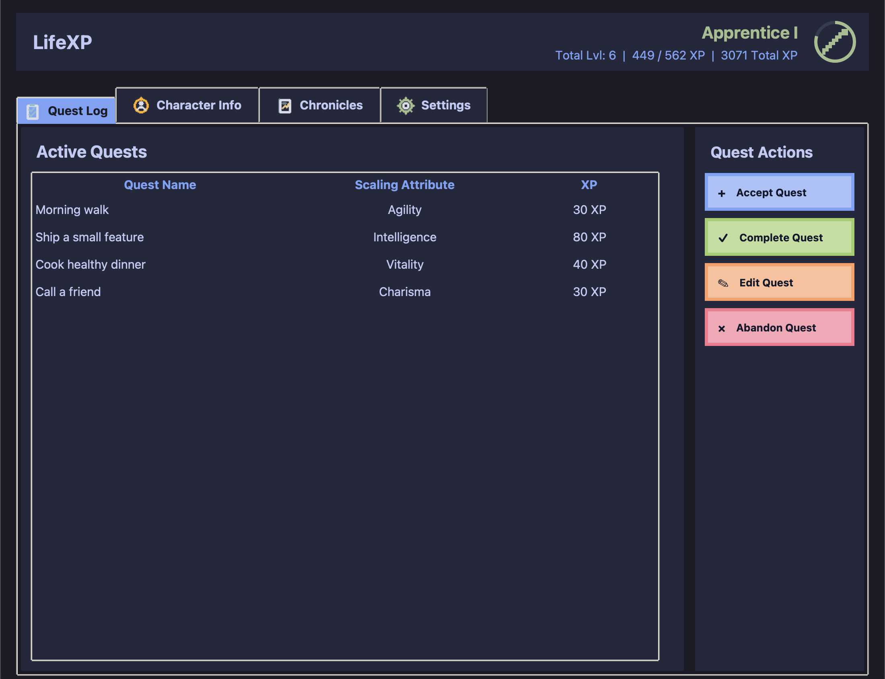
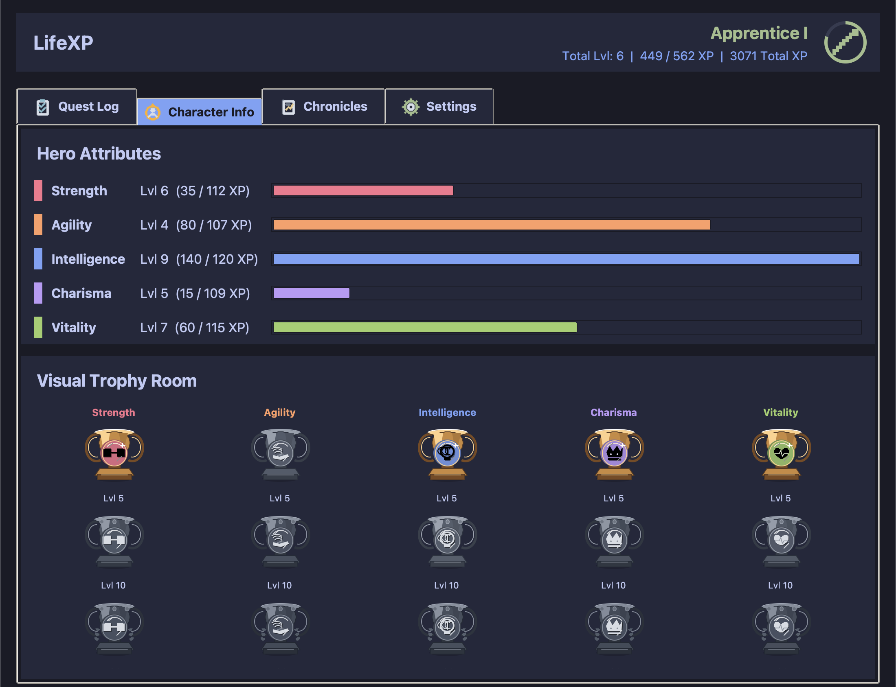
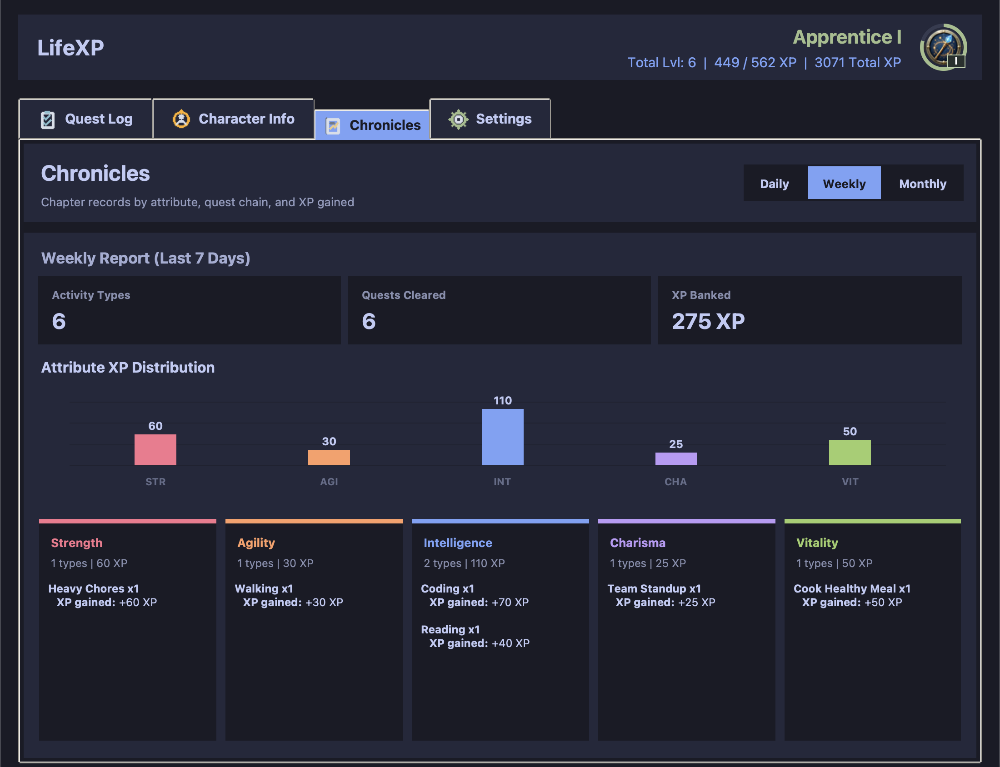
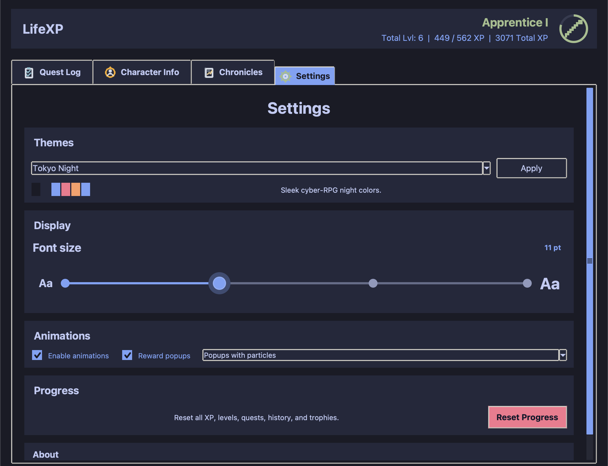

# LifeXP

LifeXP is a small Python desktop app that turns everyday tasks into RPG-style progress.

You add quests, complete them for XP, level up five attributes, unlock trophies, and review your activity history.

## Features

- Quest Log for active tasks.
- Batch add, edit, complete, or abandon quests.
- XP rewards tied to Strength, Agility, Intelligence, Charisma, and Vitality.
- Account rank based on total lifetime XP.
- Trophy milestones at levels 5, 10, 25, 50, and 100.
- Daily, weekly, and monthly reports in Chronicles.
- Local saves in `lifexp_data.json`.
- Theme, font-size, popup, and animation settings.

## Screens

- `Quest Log`: manage quests.
- `Character Info`: view levels, XP bars, rank, and trophies.
- `Chronicles`: review completed activity.
- `Settings`: change themes, display options, and reset progress.

## Screenshots

| Quest Log | Character Info | Chronicles | Settings |
| --- | --- | --- | --- |
|  |  |  |  |

## Run

Requirements:

- Python 3
- Tkinter, usually included with Python

Start the app:

```bash
python3 main.py
```

Check syntax:

```bash
python3 -m py_compile main.py
```

## Files

```text
main.py              App code
README.md            Quick project overview
BEGINNER_GUIDE.md    Beginner-friendly code explanation
lifexp_data.json     Local save file, created automatically
```

`lifexp_data.json` is personal progress data. It is not source code.

## Learning

This project is useful for learning:

- Tkinter windows, widgets, layout, and events.
- Lists and dictionaries.
- Classes, methods, and `self`.
- Loops and `if` statements.
- Saving and loading JSON.
- XP formulas and small algorithms.
- Canvas drawing and simple animations.

Start with [BEGINNER_GUIDE.md](BEGINNER_GUIDE.md) if you are new to Python or Tkinter.

## Version

`1.01`
