# LifeXP Guide Part 1: Beginners

This chapter teaches the basic Python you need before reading the intermediate guide.

The goal is not to memorize every method in the codebase. The goal is to understand the syntax patterns that appear again and again in LifeXP.

Read this guide alongside the modular LifeXP files:
- [main.py](file:///Users/nima/Documents/Code/LifeXP/main.py): The clean, modular application entry point.
- [lifexp/constants.py](file:///Users/nima/Documents/Code/LifeXP/lifexp/constants.py): Holds balance constants, version numbers, font sizing, and visual timings.
- [lifexp/runtime.py](file:///Users/nima/Documents/Code/LifeXP/lifexp/runtime.py): Handles OS, file paths, packaging detection, and platform scaling.
- [lifexp/ui_mixin.py](file:///Users/nima/Documents/Code/LifeXP/lifexp/ui_mixin.py): Builds all visual tabs, quest logs, active quest items, and theme styles.
- [lifexp/data_mixin.py](file:///Users/nima/Documents/Code/LifeXP/lifexp/data_mixin.py): Manages saving progress to JSON, loading profiles, backups, and resets.
- [lifexp/engine_mixin.py](file:///Users/nima/Documents/Code/LifeXP/lifexp/engine_mixin.py): Controls core RPG calculations, XP gains, level curves, and task completions.
- [lifexp/animation_mixin.py](file:///Users/nima/Documents/Code/LifeXP/lifexp/animation_mixin.py): Drives high-fidelity canvas animations, particle explosions, and floating text.

## How To Use This Guide

For each Python idea, study it in this order:

1. Learn what the syntax means.
2. Read the real example from LifeXP.
3. Follow what the computer reads, line by line.
4. Look at the small diagram.
5. Find one more similar example in the project.

When code feels confusing, slow down and ask:

- What value exists right now?
- What line runs next?
- Did an `if` skip anything?
- Did a loop repeat?
- Did a function return a value?
- Did a Tkinter callback wait for a user click?

## The App In One Picture

LifeXP is a Tkinter desktop app. The user clicks buttons, the app changes Python data, and then the app redraws widgets.

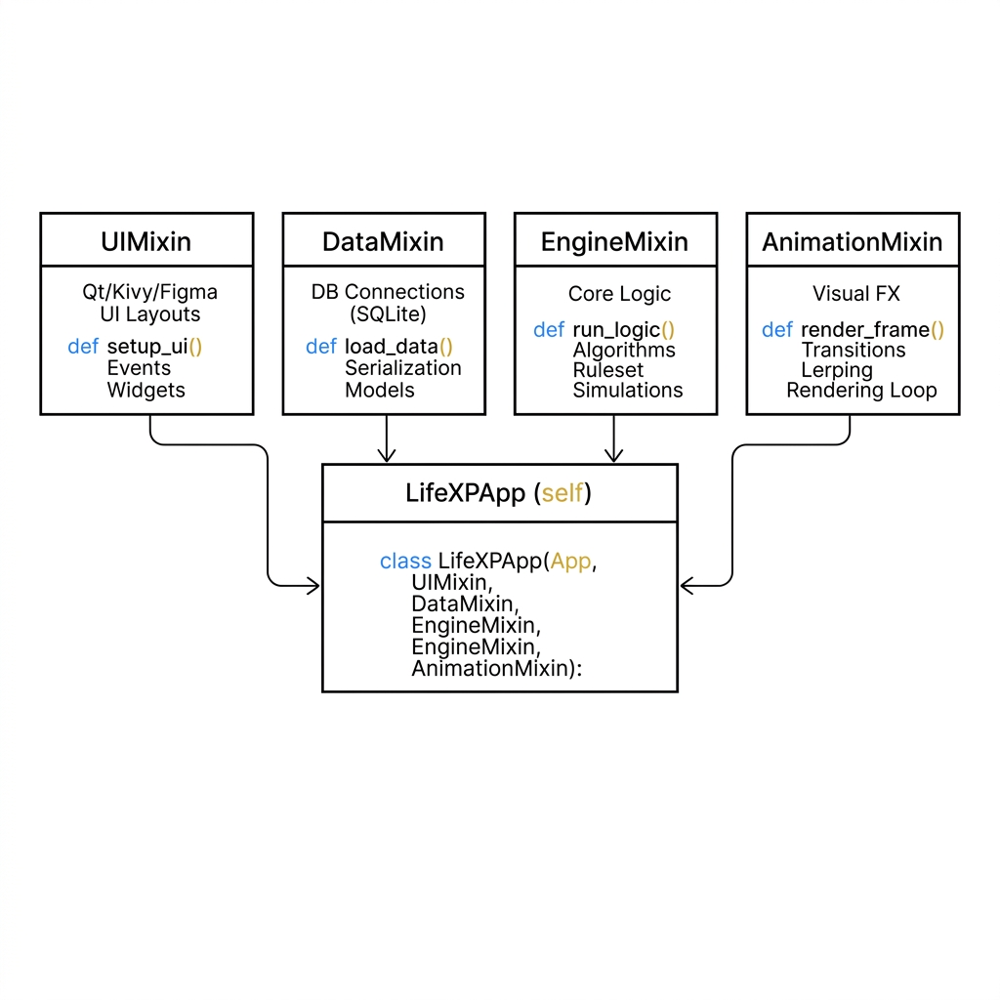

## 1. Imports

### Short Lesson

An `import` brings code from another module into the current file.

LifeXP uses imports for:

- Tkinter windows and widgets
- JSON save files
- Dates, time, and math functions
- Constants from `lifexp/constants.py`
- Helper functions from `lifexp/runtime.py`
- Modular Mixin classes that group related behaviors into separate files

### Example From The Code

In [main.py](file:///Users/nima/Documents/Code/LifeXP/main.py):

```python
import tkinter as tk
from tkinter import ttk, messagebox, simpledialog

from lifexp.constants import BASE_XP_NEEDED, DEFAULT_FONT_SIZE
from lifexp.runtime import get_resource_dir, get_user_data_dir, is_packaged_app

from lifexp.ui_mixin import UIMixin
from lifexp.data_mixin import DataMixin
from lifexp.engine_mixin import EngineMixin
from lifexp.animation_mixin import AnimationMixin
```

### What The Computer Reads

1. Load standard GUI modules like `tkinter`, `ttk`, and `messagebox`.
2. Load global balancing settings like `BASE_XP_NEEDED` from the constants file.
3. Load system environment helpers from `runtime.py`.
4. Load our custom modular Mixins (`UIMixin`, `DataMixin`, `EngineMixin`, `AnimationMixin`) so we can assemble the final app from separate specialized files.

### Infographic

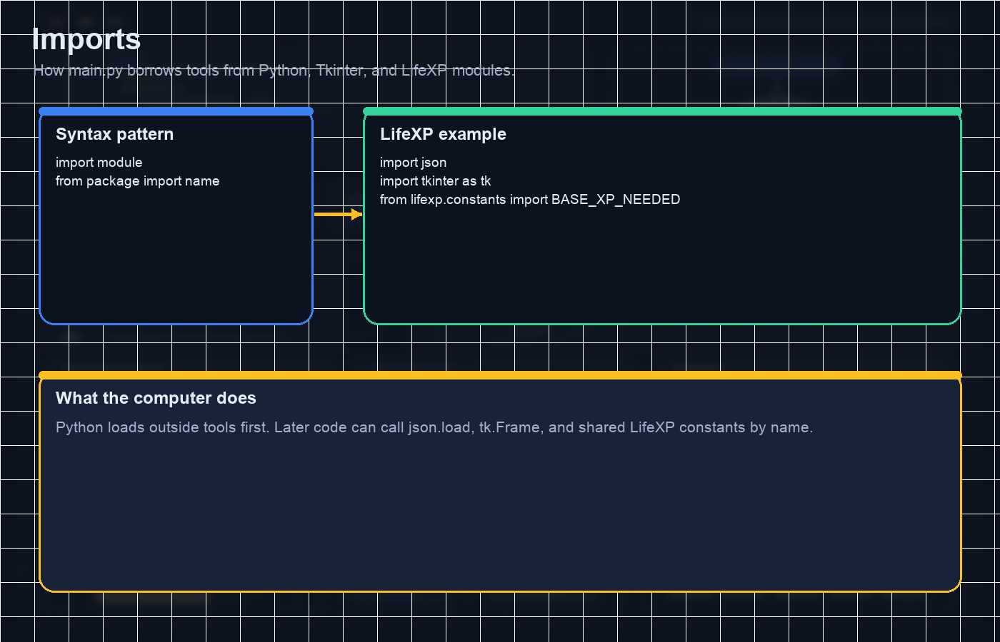

## 2. Variables

### Short Lesson

A variable stores a value under a name.

Python reads assignment from right to left:

```python
name = value
```

Means:

1. Create or calculate the value on the right.
2. Store it in the name on the left.

### Example From The Code

```python
self.current_theme_name = "Tokyo Night"
self.font_size = DEFAULT_FONT_SIZE
self.animations_enabled = True
```

### What The Computer Reads

1. Store the text `"Tokyo Night"` as the current theme name.
2. Store the default font size from the constants file.
3. Store `True`, meaning animations are enabled.

These names are attached to `self`, so they belong to the current LifeXP app object.

### Infographic

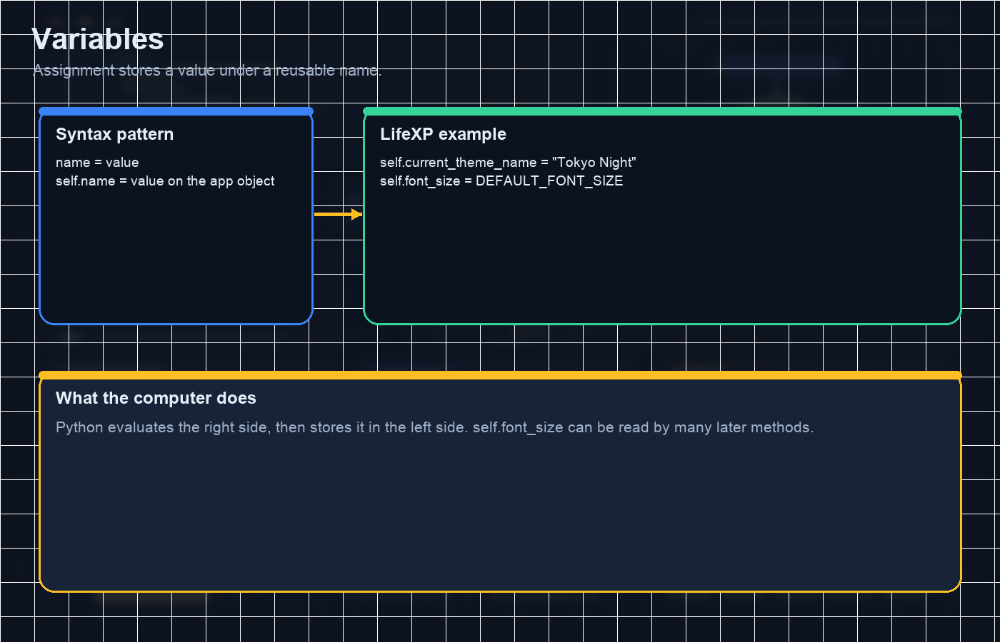

## 3. Constants

### Short Lesson

A constant is a normal variable that the project treats as a fixed setting. In modern modular projects, we keep these in a dedicated file so they are easy to find and adjust.

Python does not force constants to stay unchanged. The uppercase naming is a signal to humans: "This is a setting. Do not casually rewrite it."

### Example From The Code

In [lifexp/constants.py](file:///Users/nima/Documents/Code/LifeXP/lifexp/constants.py):

```python
BASE_XP_NEEDED = 100
ACCOUNT_BASE_XP_NEEDED = 500
XP_POPUP_STEPS = 125
```

### What The Computer Reads

1. Remember that basic attribute levels start from `100` XP.
2. Remember that account levels start from `500` XP.
3. Remember that the XP popup animation lasts `125` steps.
4. Any other file in the app can import and read these settings without needing to load UI or animation logic.

### Infographic

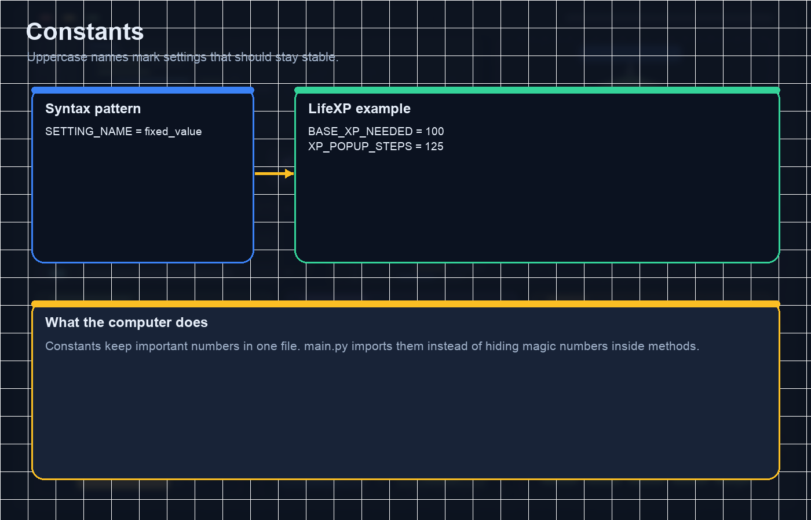

## 4. Strings, Integers, Booleans, And None

### Short Lesson

Python values have types.

The beginner types you see constantly in LifeXP are:

- `str`: text, like `"Strength"`
- `int`: whole numbers, like `100`
- `bool`: `True` or `False`
- `None`: no value

### Example From The Code

```python
self.current_theme_name = "Tokyo Night"
self.current_total_level = 0
self.animations_enabled = True
self.tab_selected_bg = None
```

### What The Computer Reads

1. `"Tokyo Night"` is text.
2. `0` is a number.
3. `True` is an on/off value.
4. `None` means no selected tab background has been stored yet.

### Infographic

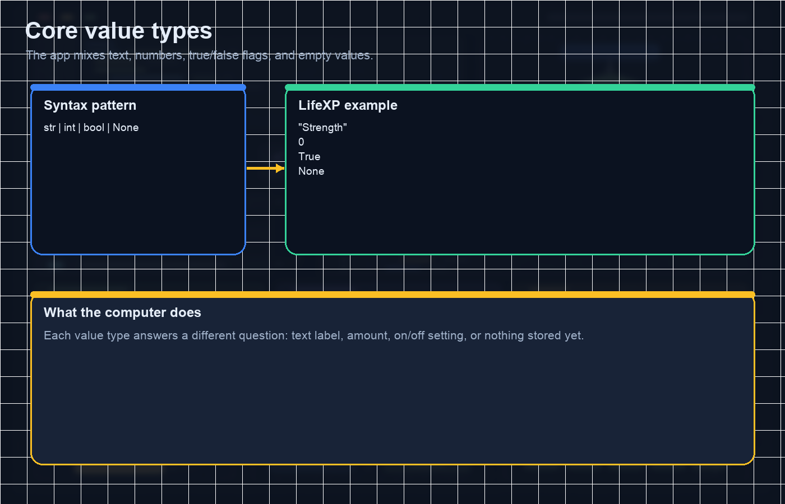

## 5. Lists

### Short Lesson

A list stores ordered items.

Lists use square brackets:

```python
items = ["first", "second", "third"]
```

You use lists when order matters, when you may have many items, or when you want to loop through items.

### Example From The Code

```python
self.attributes = ["Strength", "Agility", "Intelligence", "Charisma", "Vitality"]
```

Another example:

```python
level_events = []
level_events.extend(self.gain_xp(attr, xp_gain))
```

### What The Computer Reads

For `self.attributes`:

1. Create a list with five strings.
2. Store the list on the app object.
3. Later, loops use this list to build stats, colors, progress bars, trophies, and reports.

For `level_events`:

1. Start with an empty list.
2. Add new level-up events returned by `gain_xp`.
3. Use the list later for animations.

### Infographic

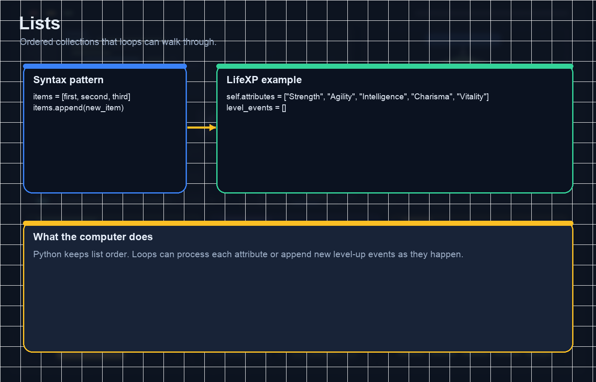

## 6. Dictionaries

### Short Lesson

A dictionary stores values by name.

Dictionaries use curly braces:

```python
person = {
    "name": "Hero",
    "level": 3
}
```

You ask for a value with its key:

```python
person["level"]
```

### Example From The Code

```python
normalized.append({
    "name": name,
    "attribute": attr,
    "subcategory": str(task.get("subcategory") or name).strip() or name,
    "xp": xp
})
```

### What The Computer Reads

1. Build one dictionary for one quest.
2. Store the quest name under `"name"`.
3. Store the scaling attribute under `"attribute"`.
4. Store the activity category under `"subcategory"`.
5. Store the XP reward under `"xp"`.
6. Append that dictionary to the `normalized` list.

### Infographic

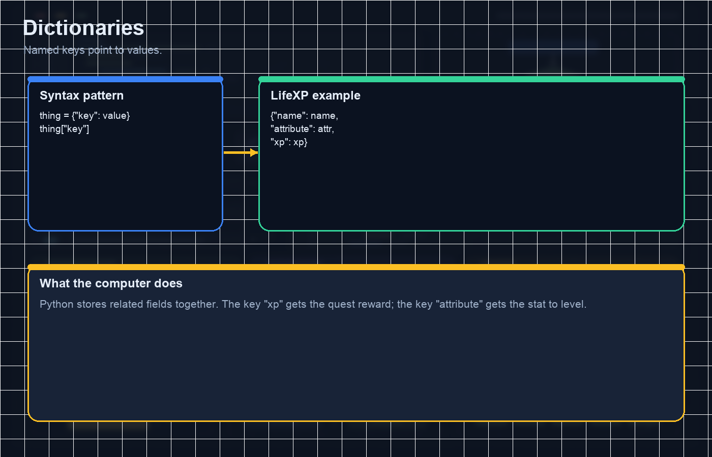

## 7. Nested Data

### Short Lesson

Real apps often combine lists and dictionaries.

LifeXP's save data is nested:

- `self.data` is a dictionary.
- `self.data["tasks"]` is a list.
- Each task inside that list is a dictionary.
- `self.data["stats"]` is a dictionary.
- Each stat inside that dictionary is another dictionary.

### Example From The Code

```python
stat = self.data["stats"][attribute]
stat["xp"] += amount
```

### What The Computer Reads

1. Go into `self.data`.
2. Find the `"stats"` dictionary.
3. Inside `"stats"`, find the current `attribute`, such as `"Strength"`.
4. Store that stat dictionary in `stat`.
5. Add the reward amount to `stat["xp"]`.

### Infographic

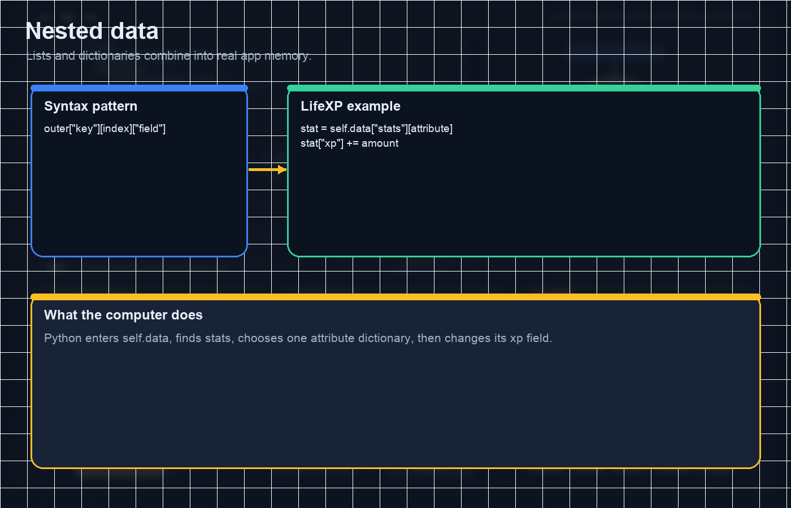

## 8. Functions And Methods With `def`

### Short Lesson

`def` creates a function.

Inside a class, a function is usually called a method.

The method body is the indented code under the `def` line.

### Example From The Code

```python
def get_xp_needed(self, level):
    """Returns the XP required to pass the given attribute level."""
    if level not in self.xp_needed_cache:
        self.xp_needed_cache[level] = self.get_scaled_xp_needed(level, BASE_XP_NEEDED)
    return self.xp_needed_cache[level]
```

### What The Computer Reads

When Python first sees this code, it does not run the method body. It stores the method definition.

Later, when code calls `self.get_xp_needed(level)`, Python does this:

1. Put the app object into `self`.
2. Put the given number into `level`.
3. Check whether the level is already cached.
4. If not cached, calculate and store it.
5. Return the XP cost.

### Infographic

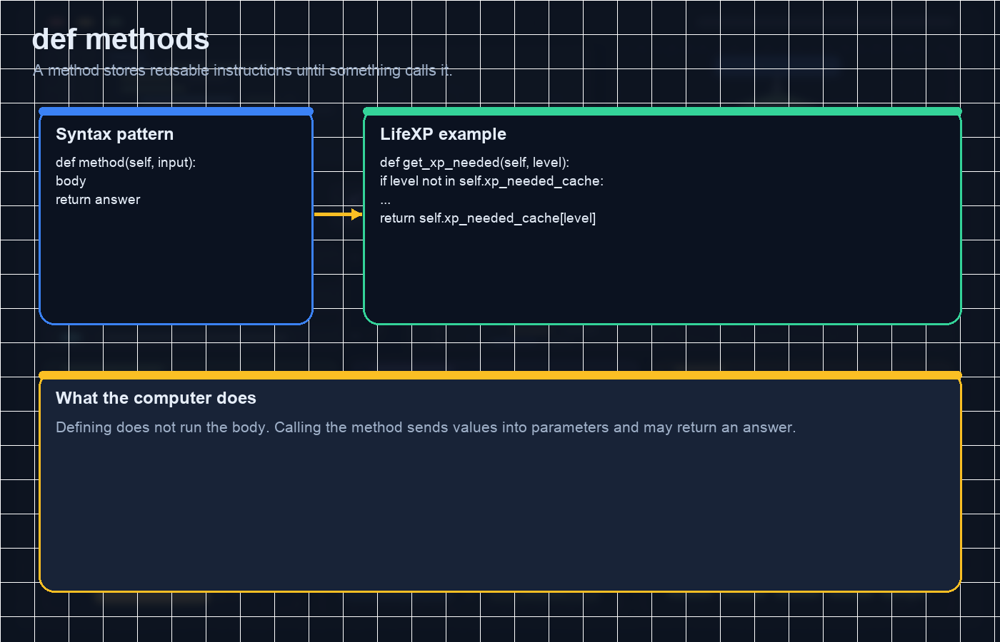

## 9. Classes And `self`

### Short Lesson

A class groups related data and behavior.

To keep a large application clean, we use a modular design pattern called **Mixins** combined with **Multiple Inheritance**. Instead of writing thousands of lines in one giant class file, we split the code into separate mixin classes:
- `UIMixin` manages visual layouts.
- `DataMixin` manages JSON file persistence.
- `EngineMixin` manages RPG rules and math.
- `AnimationMixin` manages particles and fireworks.

We then inherit from all of them in our main `LifeXPApp` class. `self` means "this exact instantiated app object." Even though methods are written in different files, `self` connects them all! When a method in `EngineMixin` calls `self.save_data()`, Python looks across all mixins and finds `save_data` in `DataMixin`.

### Example From The Code

In [main.py](file:///Users/nima/Documents/Code/LifeXP/main.py):

```python
class LifeXPApp(UIMixin, DataMixin, EngineMixin, AnimationMixin):
    def __init__(self, root):
        self.root = root
        self.attributes = ["Strength", "Agility", "Intelligence", "Charisma", "Vitality"]
        # ...
        self.data = self.load_data()  # load_data is defined in DataMixin!
```

### What The Computer Reads

1. Create a class `LifeXPApp` that inherits all methods and variables from our four mixin files.
2. When `LifeXPApp` starts, run `__init__` to store core variables.
3. Store the Tkinter root window in `self.root`.
4. Define the `self.attributes` list, which will be accessible by all mixins.
5. Call `self.load_data()`. Because of mixins, the computer finds this method inside `DataMixin`, reads `lifexp_data.json`, and attaches the result directly to `self.data`.

### Infographic

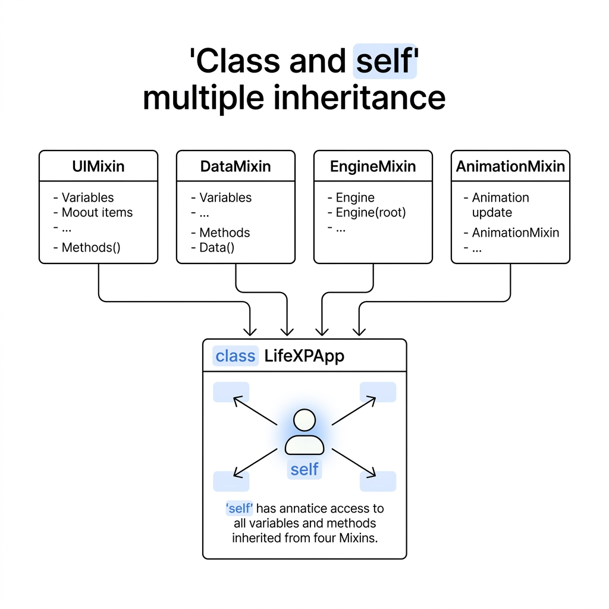

## 10. Indentation

### Short Lesson

Python uses indentation to decide what code belongs together.

This is not decoration. Indentation changes meaning.

### Example From The Code

```python
if not indices:
    return

tasks = [self.data["tasks"][index] for index in indices]
```

### What The Computer Reads

1. Check `if not indices`.
2. If that condition is true, run the indented `return`.
3. The `tasks = ...` line is not indented under the `if`, so it runs only if the method did not already return.

### Infographic

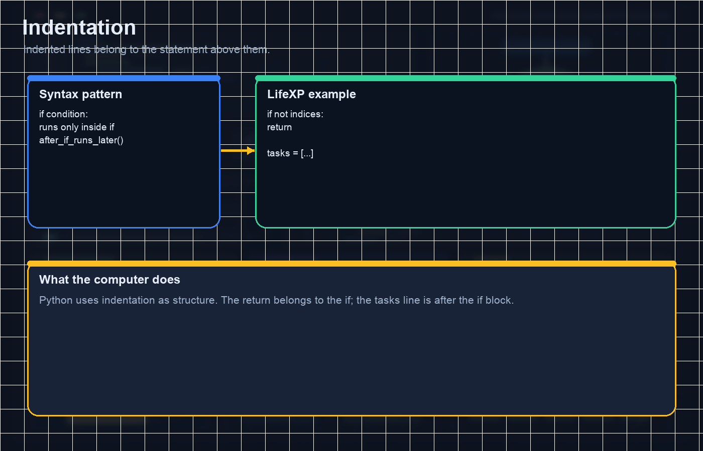

## 11. `if` And Early `return`

### Short Lesson

An `if` statement chooses whether a block of code runs.

An early `return` stops the current method immediately.

### Example From The Code

```python
indices = self.get_selected_task_indices("Select a quest to complete it.")
if not indices:
    return
```

### What The Computer Reads

1. Ask the UI which quest rows are selected.
2. Store the selected indexes in `indices`.
3. If the list is empty, stop the method.
4. If the list has indexes, keep going.

This prevents the app from trying to complete a quest when the user selected nothing.

### Infographic

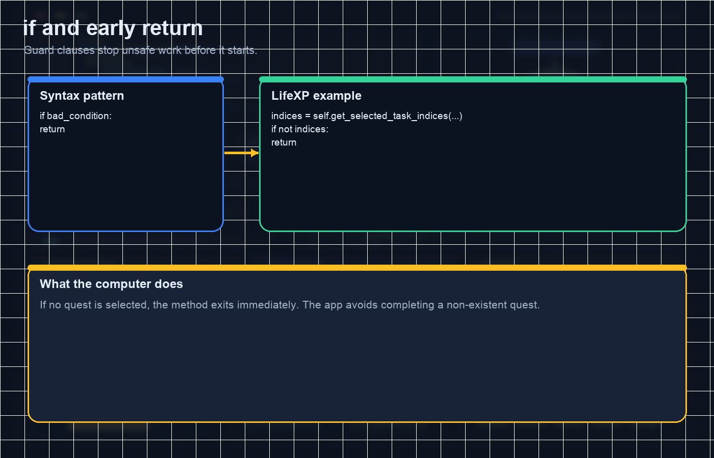

## 12. `for` Loops

### Short Lesson

A `for` loop repeats once for each item in a collection.

Basic shape:

```python
for item in items:
    do_something(item)
```

LifeXP uses `for` loops when it needs to process every task, every stat, every widget, every theme color, or every selected row.

### Example From The Code

```python
for task in tasks:
    attr = task["attribute"]
    xp_gain = task["xp"]
    total_xp_gain += xp_gain
    level_events.extend(self.gain_xp(attr, xp_gain))
```

### What The Computer Reads

Imagine `tasks` contains three completed quests.

1. Take the first task dictionary.
2. Store it in the variable `task`.
3. Read its `"attribute"`.
4. Read its `"xp"`.
5. Add that XP to the total.
6. Give XP to the correct attribute.
7. Go back to the top of the loop for the second task.
8. Repeat for the third task.
9. When no tasks remain, leave the loop.

### Infographic

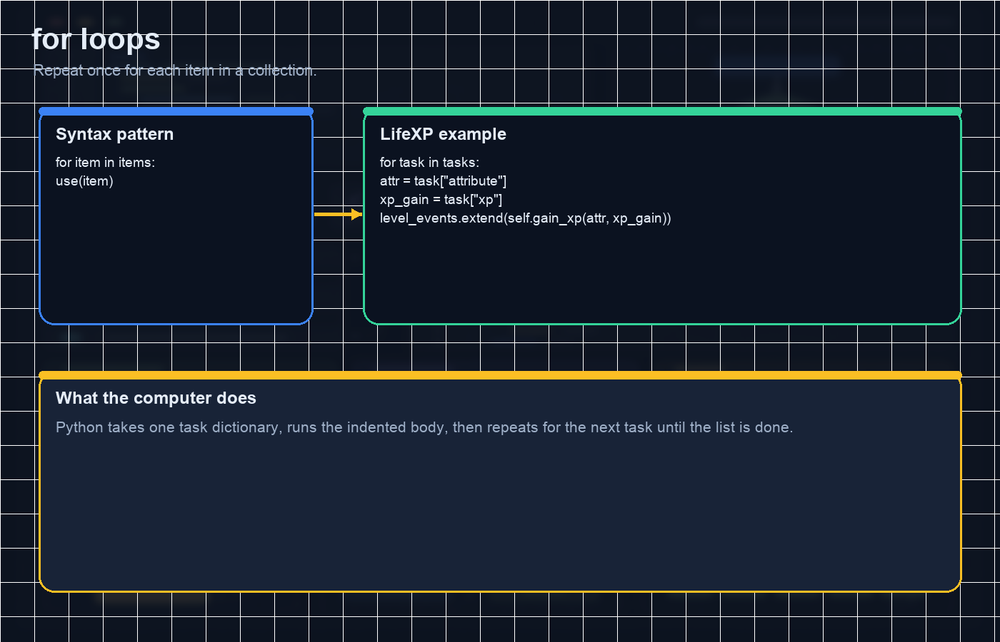

## 13. `while` Loops

### Short Lesson

A `while` loop repeats while a condition stays true.

Basic shape:

```python
while condition:
    do_work()
```

Use a `while` loop when you do not know ahead of time how many repeats are needed.

### Example From The Code

```python
xp_needed = self.get_xp_needed(stat["level"])
while stat["xp"] >= xp_needed:
    stat["xp"] -= xp_needed
    stat["level"] += 1
    xp_needed = self.get_xp_needed(stat["level"])
```

### What The Computer Reads

Imagine a quest gives a lot of XP.

1. Calculate how much XP is needed for the current level.
2. Ask: does the stat have enough XP?
3. If no, skip the loop.
4. If yes, subtract the level cost.
5. Increase the level by one.
6. Calculate the new level cost.
7. Ask the condition again.
8. Repeat until the remaining XP is lower than the current level cost.

This is why one large quest can cause multiple level-ups.

### Infographic

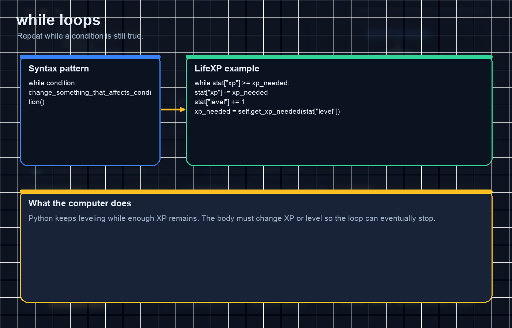

## 14. List Comprehensions

### Short Lesson

A list comprehension is a compact way to build a new list.

Basic shape:

```python
new_list = [make_item(old_item) for old_item in old_list]
```

It is still a loop. It is just written inside square brackets.

### Example From The Code

```python
tasks = [self.data["tasks"][index] for index in indices]
```

### What The Computer Reads

1. Start a new list.
2. Take the first selected `index`.
3. Read `self.data["tasks"][index]`.
4. Put that task dictionary into the new list.
5. Repeat for each selected index.
6. Store the finished list in `tasks`.

Longer version:

```python
tasks = []
for index in indices:
    tasks.append(self.data["tasks"][index])
```

### Infographic

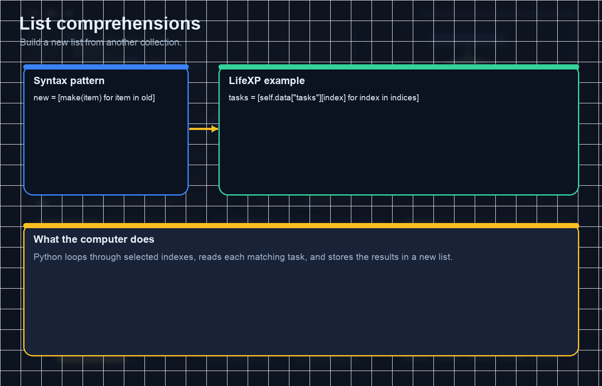

## 15. `enumerate`

### Short Lesson

`enumerate` gives you both the index and the item while looping.

Basic shape:

```python
for index, item in enumerate(items):
    ...
```

### Example From The Code

```python
for i, task in enumerate(self.data["tasks"]):
    self.task_tree.insert("", tk.END, iid=i, values=(task["name"], task["attribute"], f"{task['xp']} XP"))
```

### What The Computer Reads

1. Look at `self.data["tasks"]`.
2. For the first task, set `i` to `0` and `task` to the first task dictionary.
3. Insert one visual row into the Tkinter table.
4. Use `iid=i` so the visual row knows which list index it represents.
5. Repeat for the next task with `i` set to `1`.

### Infographic

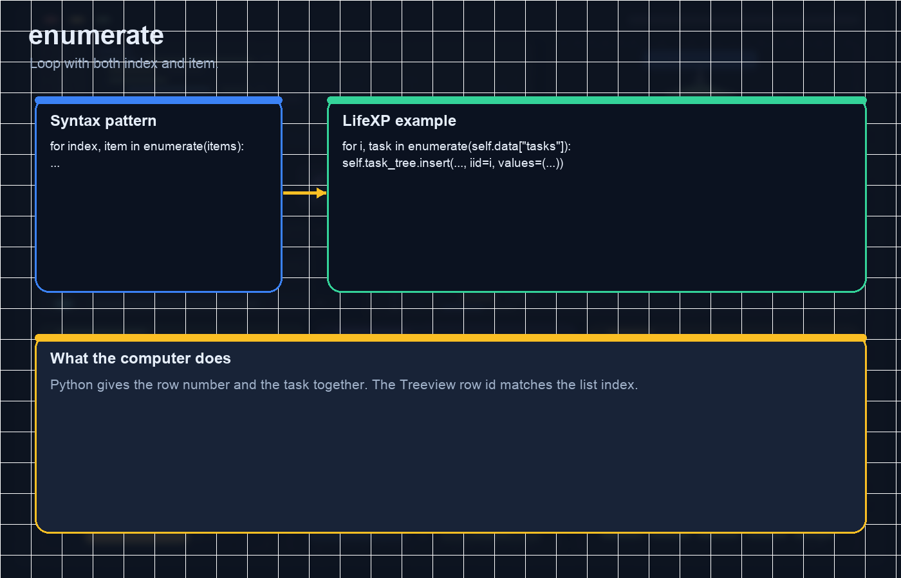

## 16. `.append`, `.extend`, `.pop`, And `.get`

### Short Lesson

Objects have methods. A method call looks like this:

```python
object.method(arguments)
```

LifeXP uses these list and dictionary methods constantly.

### Examples From The Code

```python
self.data["history"].append({
    "name": task["name"],
    "attribute": attr,
    "subcategory": task.get("subcategory", "General"),
    "xp": xp_gain,
    "date": datetime.now().isoformat()
})
```

```python
level_events.extend(self.gain_xp(attr, xp_gain))
```

```python
self.data["tasks"].pop(index)
```

```python
task.get("subcategory", "General")
```

### What The Computer Reads

- `.append(...)`: add one item to the end of a list.
- `.extend(...)`: add many items from another list.
- `.pop(index)`: remove and return one item at that index.
- `.get(key, fallback)`: read a dictionary key, or use the fallback if the key is missing.

### Infographic

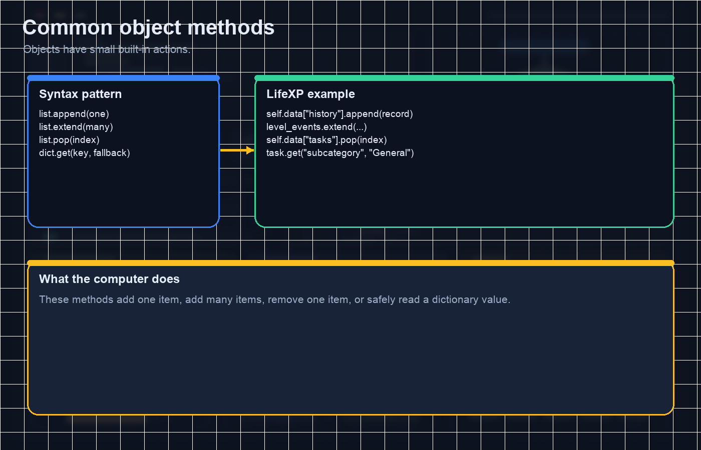

## 17. `try` And `except`

### Short Lesson

`try` and `except` let the app attempt risky code without crashing.

Use this when something might fail:

- reading a damaged JSON file
- converting text to a number
- working with OS files
- asking Tkinter for a window property that may not exist yet

### Example From The Code

```python
try:
    xp = max(1, int(task.get("xp", 0)))
except (TypeError, ValueError):
    continue
```

### What The Computer Reads

1. Try to read the task XP.
2. Try to convert it to an integer.
3. Force it to be at least `1`.
4. If the value cannot be converted, jump to `except`.
5. `continue` skips this bad task and moves to the next task in the loop.

### Infographic

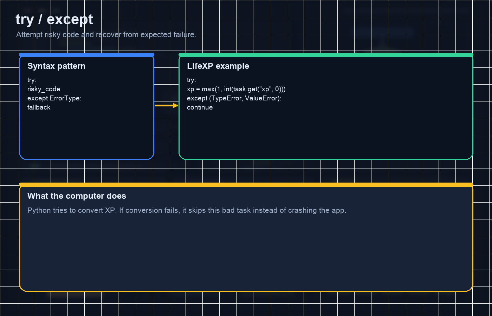

## 18. `with open` And JSON

### Short Lesson

`with open(...) as f:` opens a file and automatically closes it afterward.

JSON is a text format that can store Python-like dictionaries and lists.

LifeXP uses JSON as the save file.

### Example From The Code

```python
with open(self.data_file, 'r', encoding="utf-8") as f:
    data = json.load(f)
```

Saving goes the other direction:

```python
with open(temp_file, 'w', encoding="utf-8") as f:
    json.dump(self.data, f, indent=4)
```

### What The Computer Reads

For loading:

1. Open the save file for reading.
2. Call the opened file `f`.
3. Convert the JSON text into Python data.
4. Store that Python data in `data`.
5. Close the file automatically.

For saving:

1. Open the temporary save file for writing.
2. Convert `self.data` into JSON text.
3. Write it to the file.
4. Close the file automatically.

### Infographic

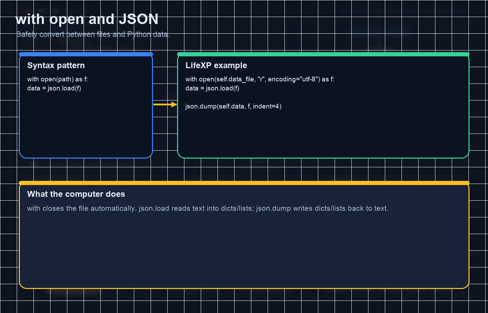

## 19. String Formatting With f-Strings

### Short Lesson

An f-string lets you put variables inside text.

Basic shape:

```python
message = f"Hello {name}"
```

### Example From The Code

```python
popup_text = f"+{total_xp_gain} XP!" if len(tasks) == 1 else f"{len(tasks)} QUESTS  +{total_xp_gain} XP!"
```

Another example:

```python
f"{task['xp']} XP"
```

### What The Computer Reads

For `f"{task['xp']} XP"`:

1. Read the task's XP number.
2. Convert it into text.
3. Put it before `" XP"`.

If the task has `25` XP, the final text is:

```python
"25 XP"
```

### Infographic

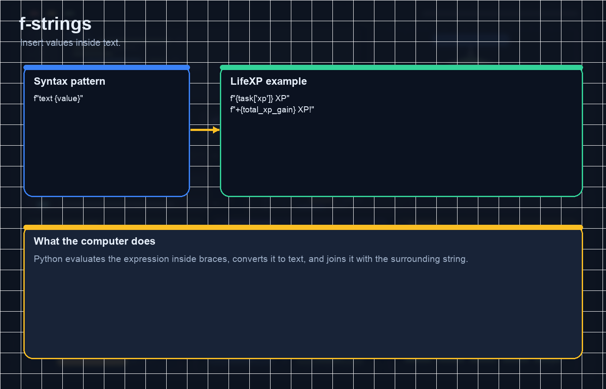

## 20. Comparison And Boolean Operators

### Short Lesson

Comparisons ask true-or-false questions.

Common examples:

- `==`: equal
- `!=`: not equal
- `<`: less than
- `<=`: less than or equal
- `>`: greater than
- `>=`: greater than or equal
- `in`: exists inside a collection
- `not`: reverses true/false
- `and`: both conditions must be true
- `or`: at least one condition must be true

### Example From The Code

```python
if not 0 <= index < len(self.data["tasks"]):
    self.refresh_task_list()
    return []
```

### What The Computer Reads

1. Check whether `index` is at least `0`.
2. Check whether `index` is smaller than the number of tasks.
3. If that full range check is false, `not` turns it into true.
4. The app refreshes the task list and returns an empty list.

This protects the app from using an invalid row index.

### Infographic

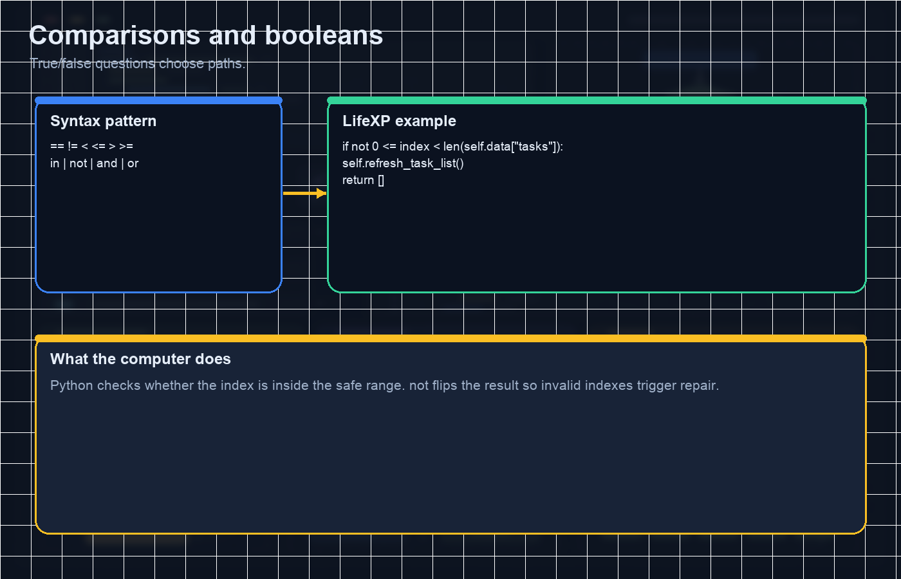

## 21. Tkinter Basics

### Short Lesson

Tkinter is Python's built-in desktop UI toolkit.

Important Tkinter ideas in LifeXP:

- A `Tk` or `Toplevel` is a window.
- A `Frame` is a container.
- A `Label` shows text.
- A `Button` waits for clicks.
- A `Treeview` shows table rows.
- `.pack(...)` and `.grid(...)` place widgets on the screen.
- `.bind(...)` connects keyboard or mouse events to methods.
- `command=...` connects a button click to a method.

### Example From The Code

```python
page = tk.Frame(self.tab_tasks, bg=self.bg_dark)
page.pack(fill=tk.BOTH, expand=True, padx=4, pady=4)

list_frame = tk.Frame(page, bg=self.bg_light)
list_frame.pack(side=tk.LEFT, fill=tk.BOTH, expand=True, padx=(0, 14), pady=0)

tk.Label(
    list_frame,
    text="Active Quests",
    bg=self.bg_light,
    fg=self.text_color,
    font=("{San Francisco}", 16, "bold")
).pack(anchor=tk.W, padx=16, pady=(14, 10))
```

Button callback example:

```python
self.create_quest_action_button(
    action_stack,
    "+",
    "Accept Quest",
    "accept",
    self.add_task_dialog
).pack(fill=tk.X, pady=(0, 9))
```

### What The Computer Reads

For the frame and label:

1. Create a frame inside the task tab.
2. Store it in `page`.
3. Pack it so it fills available space.
4. Create a second frame inside `page`.
5. Store it in `list_frame`.
6. Create a label inside `list_frame`.
7. Set the label text, colors, and font.
8. Pack the label so it appears on screen.

For the button:

1. Create a quest action button.
2. Pass `self.add_task_dialog` as the command.
3. Do not run `add_task_dialog` immediately.
4. Wait until the user clicks the button.
5. Then Tkinter calls `self.add_task_dialog`.

### Infographic

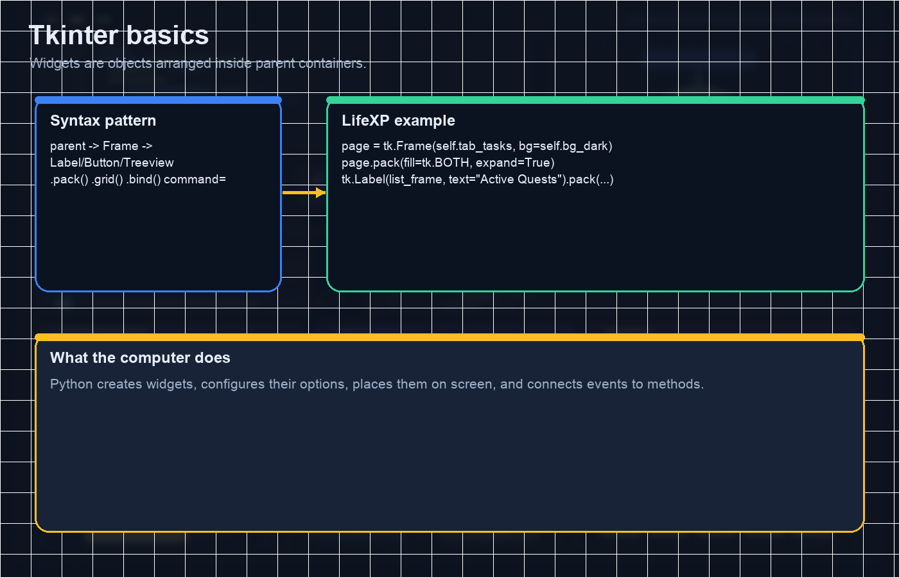

## 22. Event Callbacks

### Short Lesson

An event callback is a function that runs later because something happened.

In normal code, Python runs top to bottom immediately.

In GUI code, Python builds the interface first. Then it waits for events like clicks, keypresses, and scrolls.

### Example From The Code

```python
self.task_tree.bind("<Command-Button-1>", self.toggle_task_tree_selection)
self.task_tree.bind("<Control-Button-1>", self.toggle_task_tree_selection)
```

### What The Computer Reads

1. Tell the task table to watch for Command-click.
2. Tell the task table to watch for Control-click.
3. Do not call `toggle_task_tree_selection` right now.
4. Later, when the event happens, Tkinter calls the method and passes an event object.

### Infographic

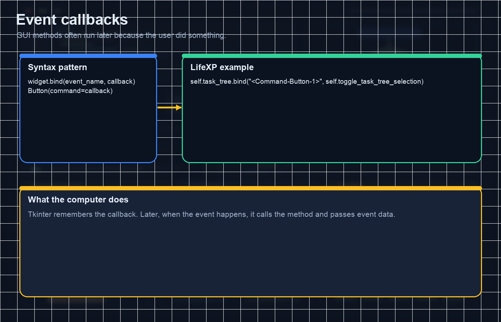

## 23. `return`

### Short Lesson

`return` sends a result back to the caller and ends the current function.

Some methods return useful values. Some methods mainly change app state and return nothing.

### Example From The Code

```python
def get_total_xp_for_stat(self, stat):
    """Returns lifetime XP for one attribute, including already-spent level XP."""
    return stat["xp"] + self.get_total_xp_before_level(stat["level"])
```

### What The Computer Reads

1. Read the XP inside the current level.
2. Calculate XP spent before this level.
3. Add them together.
4. Return the total to whoever called this method.

### Infographic

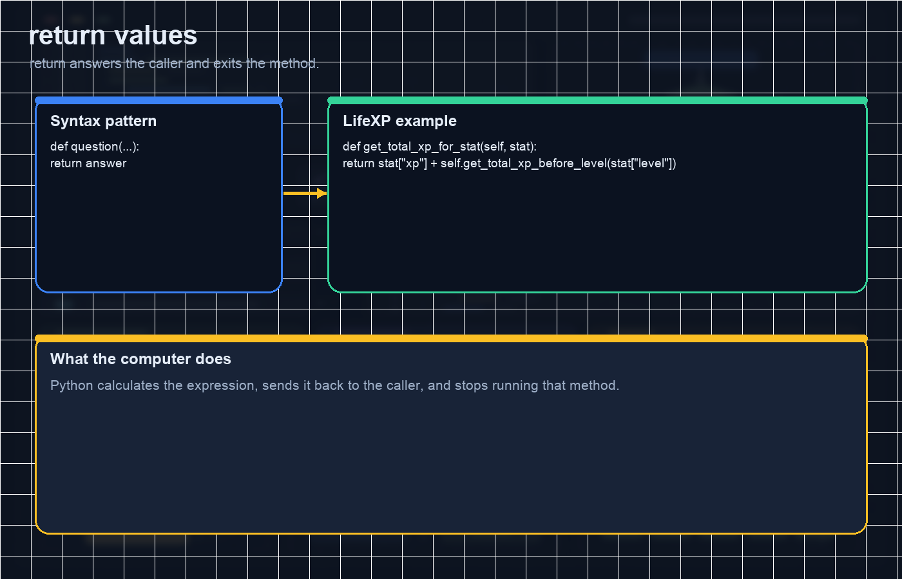

## 24. Reading One Full Flow: Complete Quest

Now combine the basics. See how different modular files work together through the single `self` object!

### Example From The Code

In [lifexp/engine_mixin.py](file:///Users/nima/Documents/Code/LifeXP/lifexp/engine_mixin.py):

```python
    def complete_task(self):
        """The main gameplay loop: Finish task -> Grant XP -> Save History -> Redraw."""
        indices = self.get_selected_task_indices("Select a quest to complete it.")
        if not indices:
            return

        tasks = [self.data["tasks"][index] for index in indices]
        level_events = []
        total_xp_gain = 0

        for task in tasks:
            attr = task["attribute"]
            xp_gain = task["xp"]
            total_xp_gain += xp_gain
            level_events.extend(self.gain_xp(attr, xp_gain))

            self.data["history"].append({
                "name": task["name"],
                "attribute": attr,
                "subcategory": task.get("subcategory", "General"),
                "xp": xp_gain,
                "date": datetime.now().isoformat()
            })

        for index in sorted(indices, reverse=True):
            self.data["tasks"].pop(index)

        self.save_data()
        self.refresh_task_list()
        rank_event = self.update_stats_display(animate_rank=False)
        level_events = self.summarize_level_events(level_events)

        cx, cy = self.get_center()
        popup_text = f"+{total_xp_gain} XP!" if len(tasks) == 1 else f"{len(tasks)} QUESTS  +{total_xp_gain} XP!"
        popup_box = self.play_floating_text(popup_text, "#EBCB8B", cx, cy, size=30, duration_steps=XP_POPUP_STEPS, fade_steps=XP_POPUP_FADE_STEPS)
        self.play_firework_particles("#EBCB8B", popup_box, count=34, palette=["#EBCB8B", "#FFD166", "#F59E0B", "#F97316"], physics=True, life_range=(42, 58), fade_start_ratio=0.42)

        if level_events or rank_event:
            self.schedule_level_up_sequence(level_events, rank_event)
```

### What The Computer Reads

1. **`get_selected_task_indices()`**: Query the Tkinter Treeview table (from `ui_mixin.py`) to find selected quest row indexes.
2. **Early `return`**: If the user clicked complete without selecting a quest, exit immediately.
3. **List Comprehension**: Read each selected task dictionary from our loaded profile tasks (`self.data["tasks"]`).
4. **`for` Loop**: Iterate over selected tasks to extract attributes and XP, call `self.gain_xp()`, and append completed records to `self.data["history"]` with ISO formatted timestamps.
5. **Reverse Sorted Loop**: Safely delete the completed quests from `self.data["tasks"]` (iterating backwards to avoid indexing shift bugs).
6. **`self.save_data()`**: Save the modified profile dictionaries back into the JSON file (defined in `data_mixin.py`).
7. **`self.refresh_task_list()` & `self.update_stats_display()`**: Re-render the tables and progress bars to display the new levels and XP values (defined in `ui_mixin.py`).
8. **`self.play_floating_text()` & `self.play_firework_particles()`**: Spawn premium visual effects on the canvas, drawing glowing XP popups and launching custom fireworks from the popups (defined in `animation_mixin.py`).

### Infographic

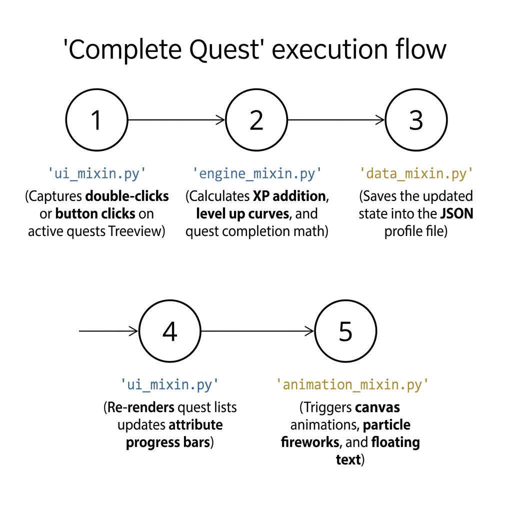

## 25. Beginner Reading Checklist

Use this checklist when reading any LifeXP method:

1. Find the method name after `def`.
2. Identify the inputs in parentheses.
3. Notice which variables are created.
4. Track every `self.something` because it belongs to the app object.
5. For every `if`, ask which branch runs.
6. For every `for`, ask what collection is being looped through.
7. For every `while`, ask what condition eventually becomes false.
8. For every dictionary, identify the keys.
9. For every list, ask what kind of items it stores.
10. For every Tkinter widget, ask where it is placed and what callback it uses.
11. For every `return`, ask what value goes back to the caller.

## 26. Practice Tasks

Do these before moving to the intermediate guide.

### Practice 1: Follow A List

Find this line in [main.py](file:///Users/nima/Documents/Code/LifeXP/main.py):

```python
self.attributes = ["Strength", "Agility", "Intelligence", "Charisma", "Vitality"]
```

Then search across the mixin files (e.g. in `ui_mixin.py` or `engine_mixin.py`) for:

```python
for attr in self.attributes:
```

Write down what each loop does with each attribute.

### Practice 2: Follow A Quest Dictionary

Find where a task dictionary is appended in `normalize_tasks` (in `data_mixin.py`) or `add_task_dialog` (in `ui_mixin.py`).

Answer:

- What keys does one task have?
- Which method displays those keys in the table (see `refresh_task_list` in `ui_mixin.py`)?
- Which method removes the task after completion (see `complete_task` in `engine_mixin.py`)?

### Practice 3: Follow XP

Start at `complete_task` (in `engine_mixin.py`), then follow:

```python
self.gain_xp(attr, xp_gain)
```

Answer:

- Which stat dictionary changes?
- Why is a `while` loop used?
- What does `gain_xp` return?

### Practice 4: Follow A Button

Find this call in [lifexp/ui_mixin.py](file:///Users/nima/Documents/Code/LifeXP/lifexp/ui_mixin.py):

```python
self.create_quest_action_button(action_stack, "+", "Accept Quest", "accept", self.add_task_dialog)
```

Answer:

- Which argument is the callback?
- Does the callback run immediately?
- What user action makes it run?

## 27. What You Should Understand Before Intermediate

You are ready for the intermediate guide when you can explain these without memorizing:

- A list stores ordered items.
- A dictionary stores named values.
- `self.data` is the app's main save structure.
- `def` creates a reusable method.
- `self` points to the current app object.
- `if` chooses whether code runs.
- `for` repeats over a collection.
- `while` repeats until a condition becomes false.
- `return` sends a value back and stops a method.
- `try` / `except` prevents expected failures from crashing the app.
- `with open` safely reads or writes files.
- JSON turns save-file text into Python dictionaries and lists.
- Tkinter widgets create the UI.
- Tkinter callbacks run later when the user does something.

If two code blocks feel hard to connect, use the diagrams and read only one method at a time. The skill is not speed. The skill is tracing what Python does next.
