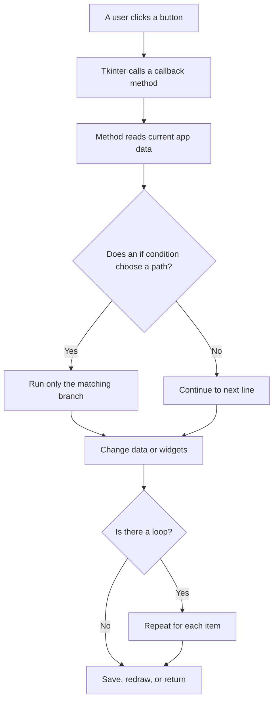
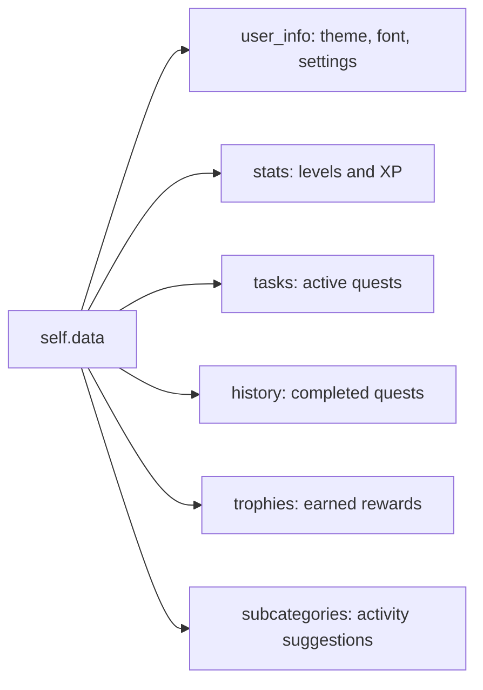
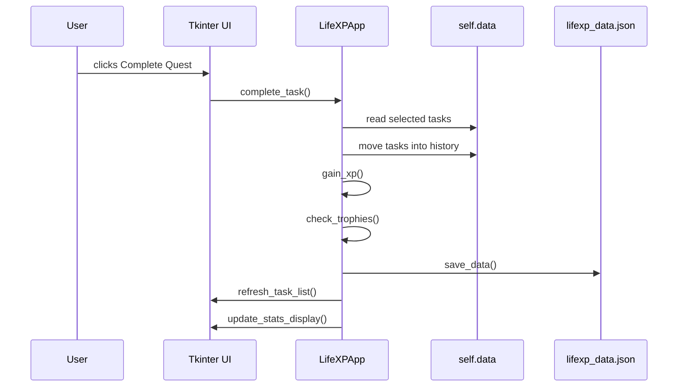

# LifeXP Guide Part 1: Beginners

This part is for readers who are new to Python, Tkinter, or larger files.

The goal is not to memorize the app. The goal is to learn how to follow it.

## How To Read The Code

Start with the files in this order:

1. `lifexp/constants.py`
2. `lifexp/runtime.py`
3. `main.py` imports
4. `LifeXPApp.__init__`
5. UI setup methods
6. quest methods
7. XP methods
8. animation methods

Why this order works:

- constants tell you the app's numbers and names
- runtime helpers explain where files live
- imports show which tools the app uses
- `__init__` shows the startup path
- UI methods show what the user sees
- quest and XP methods show the core behavior
- animations are easier after you understand the data

## Think Like The Computer

The computer does not understand the app like a person. It follows instructions in order.

Use this checklist while reading:

1. Find the method that is running.
2. Read the first line inside it.
3. Track variables as they change.
4. When you see `if`, ask which branch runs.
5. When you see `for` or `while`, ask how many times it repeats.
6. When you see `return`, ask what value goes back to the caller.
7. When data changes, ask which later method reads that data.

### Thinking Flow



## The Big App Object

LifeXP is mostly one class:

```python
class LifeXPApp:
    def __init__(self, root):
        self.root = root
```

A class groups related data and actions.

`self` means "this app object."

Example from the app:

```python
self.data = self.load_data()
self.setup_header()
self.setup_ui()
```

Read this as:

1. load saved data
2. build the header
3. build the tabs

## Main Data Shape

Most progress lives in `self.data`.

```python
self.data = {
    "user_info": {},
    "stats": {},
    "tasks": [],
    "history": [],
    "trophies": [],
    "subcategories": {}
}
```

### Data Infographic



## Python Basics Used In LifeXP

### Variables

A variable stores a value.

```python
total_xp = 0
theme_name = "Tokyo Night"
```

Think: "Remember this value under this name."

### Constants

Constants are values reused across the app.

Example from `lifexp/constants.py`:

```python
BASE_XP_NEEDED = 100
ACCOUNT_BASE_XP_NEEDED = 500
```

Think: "These numbers control balancing."

### Lists

A list stores ordered items.

Example from `main.py`:

```python
self.attributes = ["Strength", "Agility", "Intelligence", "Charisma", "Vitality"]
```

Think: "The app can loop through these five names."

### Dictionaries

A dictionary stores named values.

Example:

```python
"Strength": {
    "level": 6,
    "xp": 35
}
```

Think: "Use the key `level` to find the level."

### If Statements

An `if` statement chooses one path.

Example from the app:

```python
if theme_name not in self.themes:
    return
```

Think: "If the theme is unknown, stop this method now."

### For Loops

A `for` loop repeats for each item.

Example:

```python
for attr, color in self.attr_colors.items():
    self.style.configure(
        f"{attr}.Horizontal.TProgressbar",
        background=color
    )
```

Think:

1. get one attribute and color
2. create its progress-bar style
3. repeat for the next attribute

### While Loops

A `while` loop repeats while a condition is true.

Example:

```python
while stat["xp"] >= xp_needed:
    stat["xp"] -= xp_needed
    stat["level"] += 1
```

Think:

1. Does the stat have enough XP to level up?
2. If yes, spend XP and increase the level.
3. Check again.

This matters because one big quest can give more than one level.

### Methods

A method is a function inside a class.

Example:

```python
def get_xp_needed(self, level):
```

Think: "This method needs a level and gives back the XP cost."

### Return Values

`return` sends a value back.

Example:

```python
return self.xp_needed_cache[level]
```

Think: "The caller asked a question. This line answers it."

### Callbacks

A callback is code that runs later.

Example:

```python
ttk.Button(parent, text="Complete", command=self.complete_task)
```

Think: "When the user clicks this button, run `complete_task`."

## How One Quest Moves Through The App



## Beginner Reading Exercise

Open `main.py` and find `complete_task`.

Read it like this:

1. What selected task indexes does it read?
2. Where does each completed task go?
3. Which line gives XP?
4. Which line saves data?
5. Which lines redraw the screen?

Do not skip around at first. Let the computer's order guide you.
