# LifeXP Guide Part 2: Intermediate

This chapter starts where the beginner guide ends.

The beginner guide taught single pieces of syntax: lists, dictionaries, `for`, `while`, `def`, `self`, Tkinter widgets, callbacks, JSON, and `return`.

The intermediate guide teaches how those pieces connect into systems.

At this level, do not only ask "What does this line mean?" Ask:

- Which method called this method?
- Which data shape does this method expect?
- Which later method depends on this change?
- Is this code protecting the app from bad data?
- Is this code updating memory, the screen, the disk, or all three?

## How To Use This Guide

Each lesson follows the same structure as the beginner guide:

1. A short lesson.
2. A real example from LifeXP.
3. What the computer reads.
4. A simple infographic.
5. A practice question.

By the end, you should be able to follow two or three connected code blocks without losing the thread.

## The Intermediate Mental Model

LifeXP has four major kinds of code:

- Startup code creates the app.
- Data code loads, cleans, saves, and migrates progress.
- UI code builds widgets and redraws them.
- Game logic changes quests, XP, trophies, and reports.

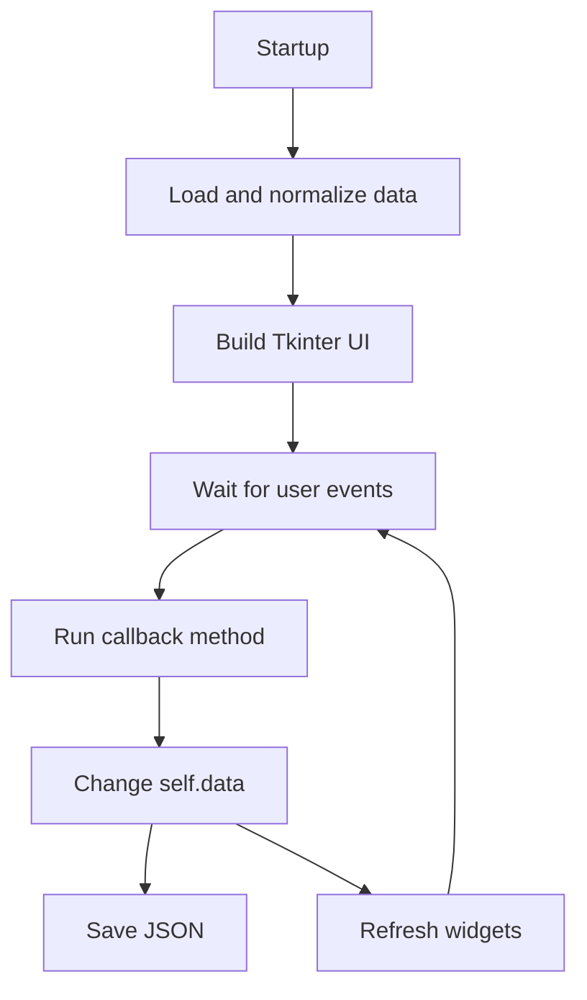

## 1. Project Structure

### Short Lesson

A real project is split into files and folders so different kinds of code have clear homes.

In LifeXP:

- `main.py` contains the main app class and most behavior.
- `lifexp/constants.py` contains shared settings.
- `lifexp/runtime.py` contains platform and packaging helpers.
- `assets/` contains images used by the UI.
- `docs/` contains the learning guide.

### Example From The Project

```text
main.py
lifexp/
    __init__.py
    constants.py
    runtime.py
assets/
    app_icon/
    rank_icons/
docs/
    beginner-guide/
```

### What The Computer Reads

When `main.py` starts, Python imports support code:

1. Read standard library imports like `json`, `os`, and `datetime`.
2. Read Tkinter imports.
3. Read values from `lifexp/constants.py`.
4. Read helper functions from `lifexp/runtime.py`.
5. Define the `LifeXPApp` class.
6. At the bottom of the file, create and run the app.

### Infographic

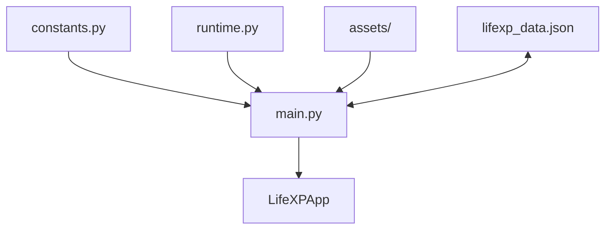

### Practice

Open `main.py` and find the import section. Which imported names come from LifeXP's own package instead of Python itself?

## 2. Startup Order

### Short Lesson

Intermediate reading starts with order.

In an app, some things must happen before other things:

- The root window must exist before widgets can be created.
- Styles must exist before styled widgets are built.
- Data must load before labels can show saved progress.
- Tabs must exist before tab-specific widgets can be placed inside them.

### Example From The Code

```python
self.apply_modern_theme()
self.data = self.load_data()
self._max_stat_level = self._calculate_max_level()
self.current_theme_name = self.data["user_info"].get("theme", self.current_theme_name)
self.apply_modern_theme()

self.setup_header()
self.setup_ui()
self.update_stats_display()
self.refresh_task_list()
self.apply_display_preferences(save=False)
```

### What The Computer Reads

1. Apply an initial theme so style variables exist.
2. Load saved data from disk.
3. Calculate the highest stat level.
4. Read the saved theme from `self.data`.
5. Apply the theme again using the saved theme.
6. Build the header.
7. Build the tabbed UI.
8. Fill stat labels and progress bars.
9. Fill the quest table.
10. Apply saved display preferences without saving again.

The second `apply_modern_theme()` is not a mistake. The first call gives startup a valid style. The second call uses the user's saved theme.

### Infographic

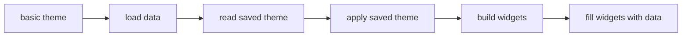

### Practice

Why would `refresh_task_list()` fail if it ran before `setup_tasks_tab()`?

## 3. Method Chains

### Short Lesson

A method chain is a path where one method calls another method, which calls another method.

Beginner reading can focus on one method. Intermediate reading follows the chain.

### Example From The Code

```python
self.setup_ui()
```

Inside `setup_ui`:

```python
self.setup_tasks_tab()
self.setup_character_tab()
self.setup_summary_tab()
self.setup_settings_tab()
self.bind_global_scroll_events()
```

### What The Computer Reads

1. Run `setup_ui`.
2. Create the notebook widget.
3. Create four empty tab frames.
4. Register those frames as tabs.
5. Bind tab events.
6. Call one setup method for each tab.
7. Bind global scrolling.

This keeps `setup_ui` readable. It describes the big structure and delegates details to smaller methods.

### Infographic

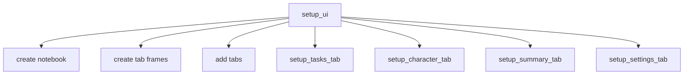

### Practice

In `setup_ui`, which lines create containers, and which lines call methods that fill those containers?

## 4. Data Contracts

### Short Lesson

A data contract is the shape a method expects data to have.

LifeXP expects `self.data` to contain specific top-level keys:

- `"user_info"`
- `"stats"`
- `"tasks"`
- `"history"`
- `"trophies"`
- `"subcategories"`

If these keys are missing, later code can crash.

### Example From The Code

```python
def get_default_data(self):
    """Returns a fresh, complete save-data structure."""
    return {
        "user_info": {
            "name": "Hero",
            "avatar_seed": random.randint(1, 100000),
            "theme": self.current_theme_name,
            "font_size": DEFAULT_FONT_SIZE,
            "animations_enabled": True,
            "particles_enabled": True,
            "popups_enabled": True
        },
        "stats": {attr: {"level": 1, "xp": 0} for attr in self.attributes},
        "tasks": [],
        "history": [],
        "trophies": [],
        "subcategories": {
            "Strength": ["Resistance Training", "Bodyweight Exercise"],
            "Agility": ["Walking", "Running"],
            "Intelligence": ["Reading", "Technical Learning"],
            "Charisma": ["Conversation Practice", "Message a Friend"],
            "Vitality": ["Hydration", "Sleep Routine"]
        }
    }
```

This snippet is shortened, but the shape matches the app.

### What The Computer Reads

1. Build a complete dictionary.
2. Put account settings in `"user_info"`.
3. Build a stats dictionary for every attribute.
4. Start active tasks as an empty list.
5. Start history as an empty list.
6. Start trophies as an empty list.
7. Provide default autocomplete suggestions.
8. Return the full dictionary.

### Infographic

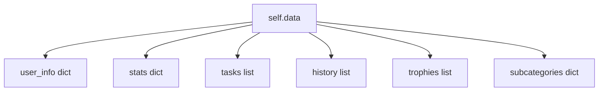

### Practice

Pick one key in `self.data`. Find one method that writes to it and one method that reads from it.

## 5. Dictionary Comprehensions

### Short Lesson

The beginner guide covered list comprehensions. A dictionary comprehension builds a dictionary in one expression.

Basic shape:

```python
new_dict = {key: value for item in collection}
```

### Example From The Code

```python
"stats": {attr: {"level": 1, "xp": 0} for attr in self.attributes}
```

### What The Computer Reads

1. Start a new dictionary.
2. Take the first attribute from `self.attributes`.
3. Use the attribute name as the key.
4. Use `{"level": 1, "xp": 0}` as the value.
5. Repeat for every attribute.
6. Store the finished dictionary under `"stats"`.

If `self.attributes` contains `"Strength"`, the dictionary gets:

```python
"Strength": {"level": 1, "xp": 0}
```

### Infographic

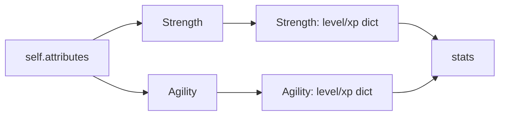

### Practice

Rewrite the stats dictionary comprehension as a normal `for` loop.

## 6. Loading, Patching, And Normalizing

### Short Lesson

Loading a save file is not just "read JSON."

LifeXP must handle:

- missing save files
- damaged JSON
- old save files from previous versions
- hand-edited save files
- wrong data types
- missing keys

The intermediate idea is defensive data loading.

### Example From The Code

```python
default_data = self.get_default_data()

if os.path.exists(self.data_file):
    try:
        with open(self.data_file, 'r', encoding="utf-8") as f:
            data = json.load(f)
            if not isinstance(data, dict):
                return default_data

            for key in default_data:
                if key not in data:
                    data[key] = default_data[key]

            data["user_info"] = self.normalize_user_info(data.get("user_info"), default_data["user_info"])
            data["stats"] = self.normalize_stats(data.get("stats"), default_data["stats"])
            data["tasks"] = self.normalize_tasks(data.get("tasks"))
            data["history"] = self.normalize_history(data.get("history"))

            return data
    except (OSError, json.JSONDecodeError):
        return default_data

return default_data
```

This snippet is shortened to show the main pattern.

### What The Computer Reads

1. Create a safe default data shape.
2. Check whether the save file exists.
3. Try to open and read JSON.
4. If the JSON is not a dictionary, use defaults.
5. Add missing top-level keys.
6. Clean each section with a normalizer method.
7. Return cleaned data.
8. If reading fails, use defaults.
9. If there is no save file, use defaults.

### Infographic

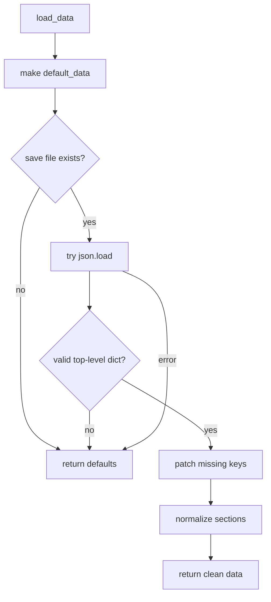

### Practice

Why does `load_data` create `default_data` before reading the save file?

## 7. Normalizer Methods

### Short Lesson

A normalizer takes messy input and returns safe output.

This is one of the most important intermediate patterns in LifeXP.

Instead of letting every UI method check for bad data, the app cleans data once during load.

### Example From The Code

```python
def normalize_tasks(self, tasks):
    """Drops malformed active quests that would crash task actions."""
    normalized = []
    if not isinstance(tasks, list):
        return normalized

    for task in tasks:
        if not isinstance(task, dict):
            continue
        name = str(task.get("name", "")).strip()
        attr = task.get("attribute")
        if not name or attr not in self.attributes:
            continue
        try:
            xp = max(1, int(task.get("xp", 0)))
        except (TypeError, ValueError):
            continue
        normalized.append({
            "name": name,
            "attribute": attr,
            "subcategory": str(task.get("subcategory") or name).strip() or name,
            "xp": xp
        })
    return normalized
```

### What The Computer Reads

1. Start an empty clean list.
2. If `tasks` is not a list, return the empty list.
3. Loop through each saved task.
4. Skip anything that is not a dictionary.
5. Read and clean the task name.
6. Read the attribute.
7. Skip tasks with no name or an unknown attribute.
8. Try to convert XP to an integer.
9. Skip tasks with invalid XP.
10. Append a clean task dictionary.
11. Return the clean list.

### Infographic

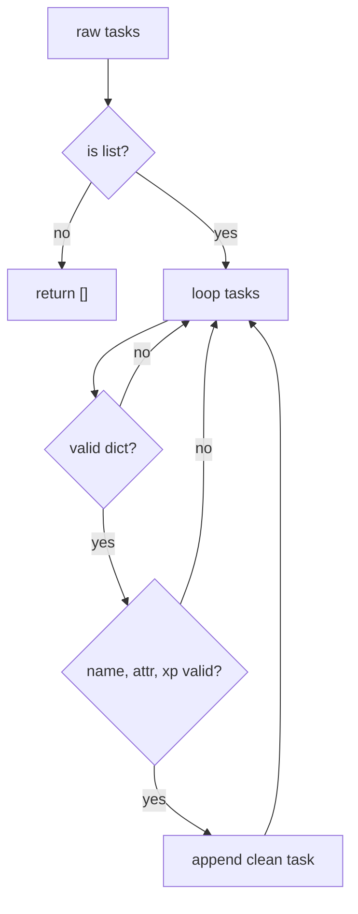

### Practice

Which crashes does `normalize_tasks` prevent later in `complete_task` and `refresh_task_list`?

## 8. Validation And Clamping

### Short Lesson

Validation checks whether a value is acceptable.

Clamping forces a number to stay inside a safe range.

LifeXP uses this for font size, XP, levels, and window dimensions.

### Example From The Code

```python
saved_font_size = int(user_info.get("font_size", normalized["font_size"]))
if saved_font_size >= LEGACY_MAX_FONT_SIZE:
    saved_font_size = max(saved_font_size, DEFAULT_FONT_SIZE)
normalized["font_size"] = max(
    MIN_FONT_SIZE,
    min(MAX_FONT_SIZE, saved_font_size)
)
```

### What The Computer Reads

1. Read the saved font size.
2. Convert it to an integer.
3. If it came from an old app version, make sure it is not too small.
4. Use `min(MAX_FONT_SIZE, saved_font_size)` to stop it from going too high.
5. Use `max(MIN_FONT_SIZE, ...)` to stop it from going too low.
6. Store the safe value.

### Infographic

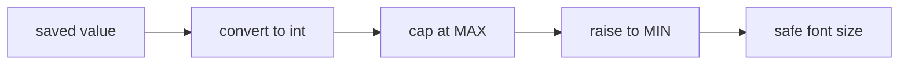

### Practice

If `MIN_FONT_SIZE` is `12`, `MAX_FONT_SIZE` is `17`, and the saved value is `50`, what font size gets stored?

## 9. Caches

### Short Lesson

A cache stores a result so the app does not recalculate it repeatedly.

LifeXP calculates XP costs often. Instead of recomputing the same level cost every time, it stores the answer in a dictionary.

### Example From The Code

```python
def get_xp_needed(self, level):
    """Returns the XP required to pass the given attribute level."""
    if level not in self.xp_needed_cache:
        self.xp_needed_cache[level] = self.get_scaled_xp_needed(level, BASE_XP_NEEDED)
    return self.xp_needed_cache[level]
```

### What The Computer Reads

1. Check whether this level is already in `self.xp_needed_cache`.
2. If not, calculate the XP cost.
3. Store the result under that level.
4. Return the cached value.

The next time the same level is requested, Python skips the calculation and returns the stored value.

### Infographic

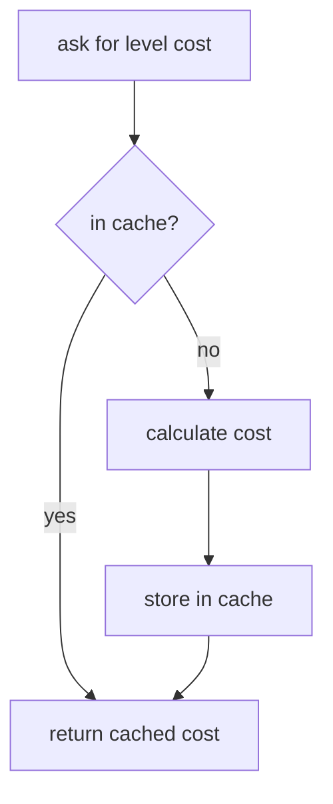

### Practice

Why is a dictionary a good structure for this cache?

## 10. Cumulative Calculations

### Short Lesson

Some app values are not stored directly. They are calculated from smaller stored values.

LifeXP stores current-level XP, but account rank needs lifetime XP.

### Example From The Code

```python
def get_total_xp_for_stat(self, stat):
    """Returns lifetime XP for one attribute, including already-spent level XP."""
    return stat["xp"] + self.get_total_xp_before_level(stat["level"])
```

And account XP uses all stats:

```python
total_xp = sum(
    self.get_total_xp_for_stat(stat)
    for stat in self.data["stats"].values()
)
```

### What The Computer Reads

For one stat:

1. Read XP inside the current level.
2. Calculate how much XP was needed to reach this level.
3. Add them together.
4. Return lifetime XP for that stat.

For account XP:

1. Loop through every stat dictionary.
2. Convert each stat to lifetime XP.
3. Add all lifetime XP values with `sum`.

### Infographic

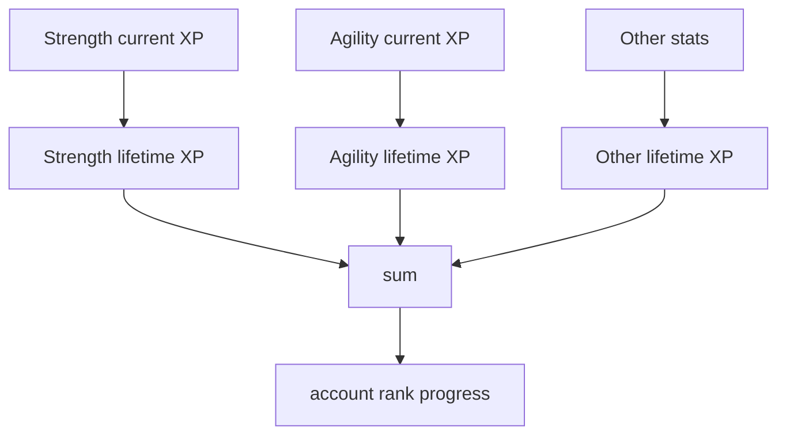

### Practice

Why does account rank use lifetime XP instead of only current-level XP?

## 11. Generator Expressions

### Short Lesson

A generator expression looks like a list comprehension, but it produces values one at a time.

Basic shape:

```python
sum(make_value(item) for item in items)
```

This is useful when a function like `sum` only needs one value at a time.

### Example From The Code

```python
total_xp = sum(
    self.get_total_xp_for_stat(stat)
    for stat in self.data["stats"].values()
)
```

### What The Computer Reads

1. Get the first stat dictionary.
2. Convert it to lifetime XP.
3. Give that number to `sum`.
4. Get the next stat dictionary.
5. Repeat until no stats remain.
6. Store the final sum in `total_xp`.

### Infographic

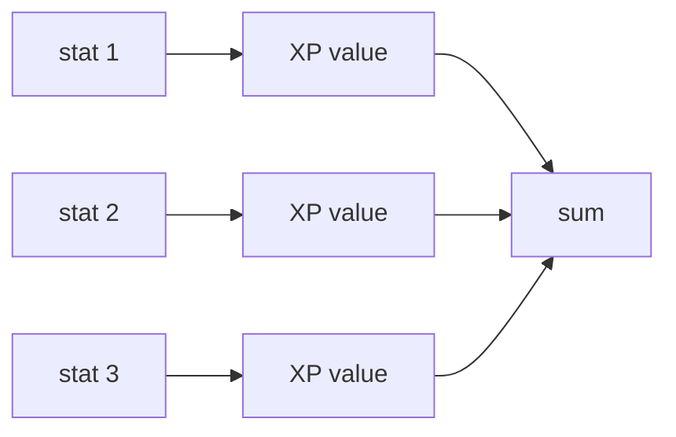

### Practice

Rewrite the generator expression as a normal `for` loop with `total_xp = 0`.

## 12. Binary Search

### Short Lesson

Binary search finds a value by repeatedly cutting a search range in half.

LifeXP uses it to find account level from total XP. This is faster than checking every level from `1` upward.

### Example From The Code

```python
low = 1
high = 2
while self.get_total_account_xp_before_level(high) <= total_xp:
    high *= 2

while low < high:
    mid = (low + high + 1) // 2
    if self.get_total_account_xp_before_level(mid) <= total_xp:
        low = mid
    else:
        high = mid - 1
```

### What The Computer Reads

First loop:

1. Start with `low = 1` and `high = 2`.
2. If the user has enough XP for `high`, double `high`.
3. Repeat until `high` is above the user's possible level.

Second loop:

1. Pick a middle level.
2. If the user has enough XP for that level, move `low` up.
3. If not, move `high` down.
4. Repeat until `low` and `high` meet.

### Infographic

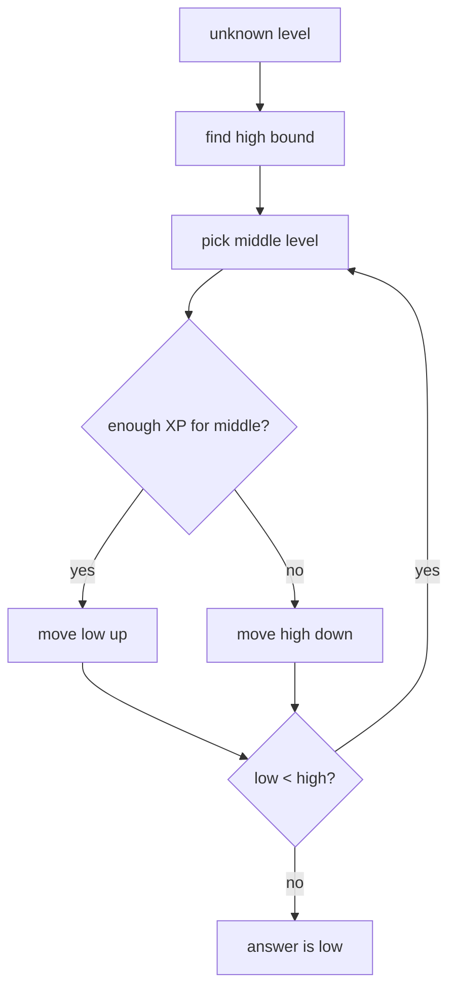

### Practice

Why does the first `while` loop double `high` instead of adding `1`?

## 13. UI State And Data State

### Short Lesson

GUI apps have two kinds of state:

- Data state: Python memory, like `self.data["tasks"]`.
- UI state: what widgets currently show, like rows inside `self.task_tree`.

When data changes, the UI must be refreshed.

### Example From The Code

```python
for quest in pending_quests:
    self.add_saved_subcategory(quest["attribute"], quest["name"])
    self.data["tasks"].append(quest.copy())

added_count = len(pending_quests)
self.save_data()
self.refresh_task_list()
close_dialog()
```

### What The Computer Reads

1. Loop through draft quests from the dialog.
2. Remember each activity for future autocomplete.
3. Copy each quest into the real active task list.
4. Count how many quests were added.
5. Save the data to disk.
6. Redraw the task table.
7. Close the dialog.

### Infographic

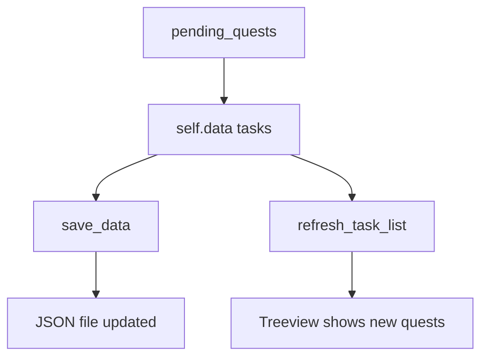

### Practice

What would the user see if `self.data["tasks"].append(...)` ran but `refresh_task_list()` did not?

## 14. Copying Dictionaries

### Short Lesson

When you append a dictionary to a list, you append a reference to that dictionary.

`quest.copy()` creates a shallow copy so the active task list gets its own dictionary.

### Example From The Code

```python
self.data["tasks"].append(quest.copy())
```

### What The Computer Reads

1. Take the draft quest dictionary.
2. Create a new dictionary with the same keys and values.
3. Append that new dictionary to the active task list.

This reduces accidental connection between the dialog's temporary queue and the app's saved task list.

### Infographic

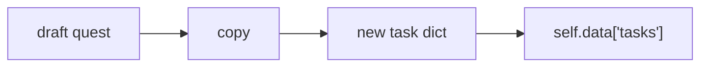

### Practice

Why is copying useful when moving data from a temporary dialog list into saved app data?

## 15. Nested Functions

### Short Lesson

A nested function is a function defined inside another function.

LifeXP uses nested functions inside dialog setup methods because those helpers only matter inside that one window.

### Example From The Code

```python
def setup_settings_tab(self):
    ...
    def update_theme_preview(event=None):
        for widget in swatches.winfo_children():
            widget.destroy()

        theme = self.themes[selected_theme.get()]
        colors = [theme["bg_dark"], theme["bg_light"], theme["accent"]] + list(theme["attr_colors"].values())[:3]
        for color in colors:
            tk.Frame(swatches, bg=color, width=16, height=24).pack(side=tk.LEFT, padx=1)

        description_label.config(text=theme["description"])

    theme_picker.bind("<<ComboboxSelected>>", update_theme_preview)
    update_theme_preview()
```

### What The Computer Reads

1. Run `setup_settings_tab`.
2. Create settings widgets.
3. Define `update_theme_preview`.
4. Bind the combobox selection event to that nested function.
5. Call `update_theme_preview()` once so the preview starts filled.
6. Later, when the selected theme changes, Tkinter calls the same function again.

The nested function can use local variables from `setup_settings_tab`, such as `swatches`, `selected_theme`, and `description_label`.

### Infographic

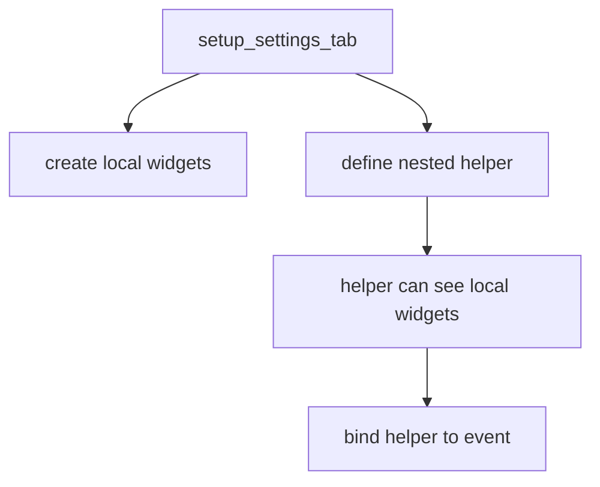

### Practice

Why would `update_theme_preview` be less convenient as a top-level method on the class?

## 16. `nonlocal`

### Short Lesson

`nonlocal` lets a nested function reassign a variable from the surrounding function.

It is not the same as `self`. `self` stores data on the app object. `nonlocal` works with a local variable from the outer function.

### Example From The Code

```python
def update_suggestions(*args):
    nonlocal suggest_after_id
    suggest_after_id = None
    typed = activity_var.get().strip().lower()
    ...

def update_suggestions_debounced(*args):
    nonlocal suggest_after_id
    if suggest_after_id is not None:
        dialog.after_cancel(suggest_after_id)
    suggest_after_id = dialog.after(120, update_suggestions)
```

### What The Computer Reads

1. `suggest_after_id` belongs to the surrounding dialog method.
2. `update_suggestions_debounced` needs to replace it.
3. `nonlocal suggest_after_id` tells Python not to create a new local variable.
4. If an old scheduled refresh exists, cancel it.
5. Schedule a new refresh.
6. Store the new scheduled callback id.
7. When `update_suggestions` finally runs, set the id back to `None`.

### Infographic

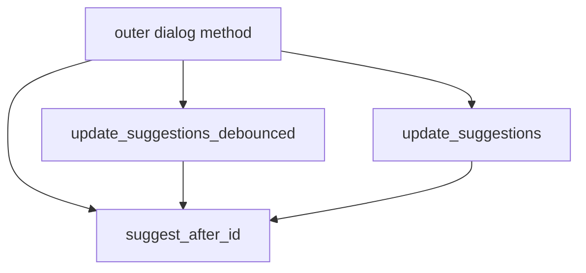

### Practice

What bug would happen if `update_suggestions_debounced` assigned `suggest_after_id` without `nonlocal`?

## 17. Debouncing With `after`

### Short Lesson

Debouncing means waiting briefly before running a function, and resetting the wait if more events happen.

This is useful for search boxes. If the user types quickly, the app should not rebuild suggestions after every single key.

### Example From The Code

```python
def update_suggestions_debounced(*args):
    nonlocal suggest_after_id
    if suggest_after_id is not None:
        dialog.after_cancel(suggest_after_id)
    suggest_after_id = dialog.after(120, update_suggestions)

activity_var.trace_add("write", update_suggestions_debounced)
```

### What The Computer Reads

1. Watch `activity_var` for text changes.
2. When text changes, call `update_suggestions_debounced`.
3. If a refresh is already scheduled, cancel it.
4. Schedule a new refresh 120 milliseconds later.
5. If the user keeps typing, repeat the cancel-and-reschedule process.
6. When typing pauses, run `update_suggestions`.

### Infographic

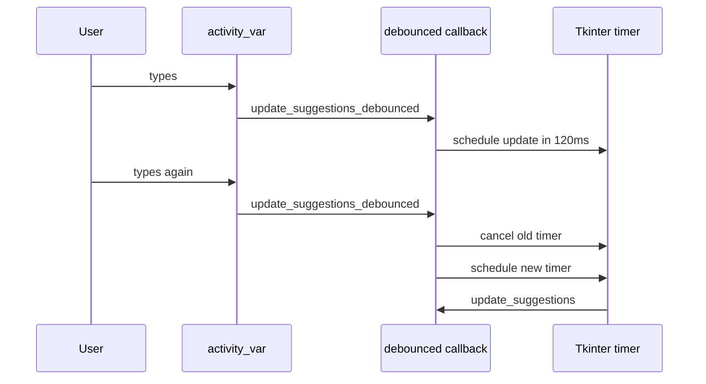

### Practice

Why is debouncing better than rebuilding the suggestion list on every keystroke?

## 18. Autocomplete Data Flow

### Short Lesson

Intermediate code often combines data filtering, UI clearing, and UI rebuilding in one method.

`update_suggestions` reads typed text, finds matching activities, clears the listbox, and inserts matching rows.

### Example From The Code

```python
typed = activity_var.get().strip().lower()
selected_filter = attr_var.get()
owner_map = self.get_subcategory_owner_map()
if selected_filter == all_filter_label:
    available_subs = self.get_all_subcategories()
else:
    available_subs = sorted(
        dict.fromkeys(self.data["subcategories"].get(selected_filter, [])),
        key=str.lower
    )

suggestion_list.delete(0, tk.END)

hits = available_subs if not typed else [sub for sub in available_subs if typed in sub.lower()]
if hits:
    for hit in list(hits)[:80]:
        owning_attr = owner_map.get(hit, selected_filter)
        insert_activity_item(suggestion_list, hit, owning_attr)
```

### What The Computer Reads

1. Read the user's typed text.
2. Read the selected attribute filter.
3. Build a map of activity names to owning attributes.
4. If the filter is "All", use every known activity.
5. Otherwise, use activities from the selected attribute.
6. Remove all old visible suggestions.
7. If the input is empty, show all available suggestions.
8. If there is typed text, keep only suggestions that contain that text.
9. Insert up to 80 hits into the listbox.

### Infographic

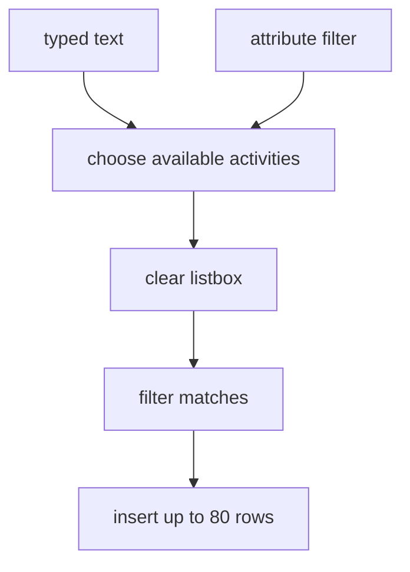

### Practice

Why does the code call `suggestion_list.delete(0, tk.END)` before inserting hits?

## 19. `dict.fromkeys` For Deduplication

### Short Lesson

`dict.fromkeys(items)` can remove duplicates while preserving order.

This works because dictionary keys are unique.

### Example From The Code

```python
available_subs = sorted(
    dict.fromkeys(self.data["subcategories"].get(selected_filter, [])),
    key=str.lower
)
```

### What The Computer Reads

1. Read the saved subcategory list for the selected attribute.
2. Build a dictionary where every activity name becomes a key.
3. Duplicate names collapse into one key.
4. Sort the unique names case-insensitively.
5. Store the result in `available_subs`.

### Infographic

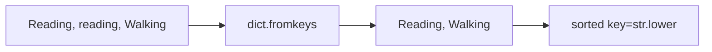

### Practice

Why is this cleaner than manually checking each item with a loop?

## 20. Sorting With `key`

### Short Lesson

`sorted` can take a `key` function.

The key tells Python what value to sort by.

### Example From The Code

```python
sorted_activities = sorted(
    activities.items(),
    key=lambda item: (-item[1]["count"], -item[1]["xp"], item[0])
)
```

### What The Computer Reads

1. Convert the activity dictionary into `(activity_name, details)` pairs.
2. Sort by negative count, so higher counts come first.
3. If counts tie, sort by negative XP, so higher XP comes first.
4. If XP also ties, sort by activity name.
5. Store the sorted list.

The minus signs reverse number sorting without reversing the final name sort.

### Infographic

```mermaid
flowchart TD
    A["activity rows"] --> B["sort by count descending"]
    B --> C["then XP descending"]
    C --> D["then name ascending"]
```

### Practice

Why does the sort key use `-item[1]["count"]` instead of `item[1]["count"]`?

## 21. Report Aggregation

### Short Lesson

Aggregation means turning many raw records into summary numbers.

The Chronicles report reads history records and builds:

- total XP
- completed quest count
- unique activity count
- XP per attribute
- activity counts per attribute

### Example From The Code

```python
activity_by_attribute = {attr: {} for attr in self.attributes}

for record in self.data["history"]:
    try:
        record_date = self.parse_history_date(record["date"])
    except (TypeError, ValueError):
        continue

    if record_date >= target_date:
        completed_tasks += 1
        xp = max(0, int(record.get("xp", 0)))
        total_xp += xp
        attr = record.get("attribute")
        activity = record.get("subcategory") or record.get("name", "General")

        if attr in activity_by_attribute:
            if activity not in activity_by_attribute[attr]:
                activity_by_attribute[attr][activity] = {"count": 0, "xp": 0}
            activity_by_attribute[attr][activity]["count"] += 1
            activity_by_attribute[attr][activity]["xp"] += xp
```

This snippet is shortened slightly around XP error handling.

### What The Computer Reads

1. Create one empty activity dictionary per attribute.
2. Loop through every history record.
3. Try to parse the record date.
4. Skip records with bad dates.
5. If the record is inside the report timeframe, count it.
6. Add its XP to the total.
7. Find its attribute and activity name.
8. If the attribute is valid, create an activity bucket if needed.
9. Increase that activity's count.
10. Increase that activity's XP total.

### Infographic

```mermaid
flowchart TD
    A["history records"] --> B["parse dates"]
    B --> C["filter by timeframe"]
    C --> D["count quests"]
    C --> E["sum XP"]
    C --> F["group by attribute"]
    F --> G["group by activity"]
    G --> H["count and XP per activity"]
```

### Practice

Why does the report use nested dictionaries instead of one flat list?

## 22. UI Refresh Methods

### Short Lesson

A refresh method reads current data and updates existing widgets.

It should not invent new app data. It should redraw the screen from the current source of truth.

### Example From The Code

```python
for attr in self.attributes:
    stat = self.data["stats"][attr]
    lvl = stat["level"]
    xp = stat["xp"]
    xp_needed = self.get_xp_needed(lvl)

    self.stat_labels[attr].config(text=f"Lvl {lvl}  ({xp} / {xp_needed} XP)")
    self.stat_labels[f"{attr}_pb"]['maximum'] = xp_needed
    self.stat_labels[f"{attr}_pb"]['value'] = xp
```

### What The Computer Reads

1. Loop through every attribute.
2. Read the saved stat dictionary.
3. Read the level and current XP.
4. Calculate XP needed for the current level.
5. Update the text label.
6. Update the progress bar maximum.
7. Update the progress bar current value.

### Infographic

```mermaid
flowchart LR
    A["self.data stats"] --> B["update labels"]
    A --> C["update progressbar max"]
    A --> D["update progressbar value"]
    B --> E["Character tab"]
    C --> E
    D --> E
```

### Practice

Why is `self.data["stats"]` the source of truth, not the progress bar value?

## 23. Style Dictionaries

### Short Lesson

Themes are dictionaries. The app reads a theme dictionary and copies values into shared color variables.

This lets the rest of the UI use names like `self.bg_dark` instead of hard-coded color strings everywhere.

### Example From The Code

```python
theme = self.themes[self.current_theme_name]
self.bg_dark = theme["bg_dark"]
self.bg_light = theme["bg_light"]
self.accent_green = theme["accent"]
self.text_color = self.get_readable_text_color(self.bg_light, theme["text"])
self.attr_colors = theme["attr_colors"].copy()
self.attr_text_colors = {
    attr: self.get_readable_text_color(color, self.card_text_color)
    for attr, color in self.attr_colors.items()
}
```

### What The Computer Reads

1. Find the current theme dictionary.
2. Copy its background and accent colors into app variables.
3. Calculate readable text colors.
4. Copy attribute colors.
5. Build text colors for each attribute color.

### Infographic

```mermaid
flowchart TD
    A["theme dictionary"] --> B["self.bg_dark"]
    A --> C["self.bg_light"]
    A --> D["self.accent_green"]
    A --> E["self.attr_colors"]
    E --> F["attribute progress styles"]
```

### Practice

Why is it better for widgets to use `self.bg_dark` than to repeat `"#1A1B26"` everywhere?

## 24. Style Loops

### Short Lesson

Loops are not only for data. They also prevent repeated UI setup code.

LifeXP creates progress-bar styles for every attribute with one loop.

### Example From The Code

```python
for attr, color in self.attr_colors.items():
    self.style.configure(
        f'{attr}.Horizontal.TProgressbar',
        background=color,
        troughcolor=self.bg_light,
        bordercolor=self.bg_dark,
        lightcolor=color,
        darkcolor=color
    )
```

### What The Computer Reads

1. Get the first attribute and color.
2. Create a progress-bar style named after that attribute.
3. Use the attribute color as the bar color.
4. Repeat for every attribute.

Without this loop, the app would need nearly identical code for Strength, Agility, Intelligence, Charisma, and Vitality.

### Infographic

```mermaid
flowchart TD
    A["attr_colors"] --> B["Strength style"]
    A --> C["Agility style"]
    A --> D["Intelligence style"]
    A --> E["Charisma style"]
    A --> F["Vitality style"]
```

### Practice

Find another loop in `apply_modern_theme`. What repeated style work does it remove?

## 25. `hasattr` And Optional Widgets

### Short Lesson

Sometimes a method may run before every widget exists.

`hasattr(self, "name")` checks whether the app object already has that attribute.

LifeXP uses this in display preference updates because the method can run during startup and later from settings.

### Example From The Code

```python
if hasattr(self, "font_size_slider_var"):
    self.font_size_slider_var.set(self.font_size)
    self.draw_font_size_slider()

if hasattr(self, "task_tree"):
    self.refresh_task_list()

if hasattr(self, "summary_cards"):
    self.show_summary(self.current_summary_timeframe)
```

### What The Computer Reads

1. If the font slider exists, update it.
2. If the quest table exists, refresh it.
3. If the summary cards exist, redraw the current report.
4. Skip any UI parts that have not been created yet.

### Infographic

```mermaid
flowchart TD
    A["apply_display_preferences"] --> B{"slider exists?"}
    B -->|yes| C["update slider"]
    B -->|no| D["skip slider"]
    A --> E{"task tree exists?"}
    E -->|yes| F["refresh tasks"]
    E -->|no| G["skip tasks"]
```

### Practice

Why would directly calling `self.refresh_task_list()` be risky during early startup?

## 26. Event Binding With `lambda`

### Short Lesson

`lambda` creates a small anonymous function.

In Tkinter, it is often used when the callback needs to accept an event or pass custom arguments.

### Example From The Code

```python
self.notebook.bind("<Leave>", lambda event: self.set_tab_hover(False))
```

Another example:

```python
self.settings_canvas.bind("<Configure>", sync_surface_width)
self.settings_canvas.bind("<Enter>", lambda event: self.settings_canvas.focus_set())
```

### What The Computer Reads

For the notebook example:

1. Watch for the mouse leaving the notebook.
2. When that event happens, Tkinter passes an event object.
3. The lambda receives the event.
4. The lambda calls `self.set_tab_hover(False)`.

The event object is needed by Tkinter's callback system, even if this specific code does not use it.

### Infographic

```mermaid
flowchart LR
    A["Tkinter event"] --> B["lambda event"]
    B --> C["call method with custom argument"]
```

### Practice

Why would `self.set_tab_hover(False)` be wrong directly inside `bind(...)`?

## 27. Temporary Files For Safer Saves

### Short Lesson

Saving directly over the real save file can be risky. If the app crashes during writing, the save file could be left incomplete.

LifeXP writes to a temporary file first, then replaces the real file.

### Example From The Code

```python
temp_file = f"{self.data_file}.tmp"
try:
    with open(temp_file, 'w', encoding="utf-8") as f:
        json.dump(self.data, f, indent=4)
    os.replace(temp_file, self.data_file)
except OSError as exc:
    ...
```

### What The Computer Reads

1. Create a temporary filename.
2. Try to open the temporary file for writing.
3. Write current app data as JSON.
4. Close the temporary file.
5. Replace the real save file with the finished temporary file.
6. If file operations fail, handle the error.

### Infographic

```mermaid
flowchart LR
    A["self.data"] --> B["write .tmp file"]
    B --> C["finished temp file"]
    C --> D["os.replace"]
    D --> E["lifexp_data.json"]
```

### Practice

Why is replacing a finished temp file safer than writing directly into `lifexp_data.json`?

## 28. Reading A Full Intermediate Flow: Add Quest

### Short Lesson

At intermediate level, read a whole feature as a flow across local helpers, app data, save files, and UI refreshes.

Adding a quest is a good example because it uses:

- a dialog
- nested helper functions
- temporary queue data
- autocomplete suggestions
- saved app data
- UI refresh
- animation feedback

### Example From The Code

```python
def save():
    if not pending_quests and not add_current_to_selection(show_error=True):
        return

    for quest in pending_quests:
        self.add_saved_subcategory(quest["attribute"], quest["name"])
        self.data["tasks"].append(quest.copy())

    added_count = len(pending_quests)
    self.save_data()
    self.refresh_task_list()
    close_dialog()

    cx, cy = self.get_center()
    self.play_floating_text(f"{added_count} QUEST{'S' if added_count != 1 else ''} ADDED", self.accent_green, cx, cy)
```

The real code includes a visual symbol in the popup text; this version keeps the lesson ASCII-only.

### What The Computer Reads

1. If the queue is empty, try to add the currently typed activity.
2. If there is still no quest to save, stop.
3. Loop through every queued quest.
4. Save the activity name as a future suggestion.
5. Copy the quest into `self.data["tasks"]`.
6. Count how many quests were added.
7. Write the new data to disk.
8. Refresh the visible task table.
9. Close the dialog.
10. Find the screen center.
11. Show feedback text.

### Infographic

```mermaid
flowchart TD
    A["Accept Quest dialog"] --> B{"pending quests?"}
    B -->|no| C["try typed activity"]
    C --> D{"now has quest?"}
    D -->|no| E["return"]
    B -->|yes| F["loop pending quests"]
    D -->|yes| F
    F --> G["save subcategory"]
    F --> H["append task copy"]
    H --> I["save_data"]
    I --> J["refresh_task_list"]
    J --> K["close dialog"]
    K --> L["play feedback"]
```

### Practice

Trace the difference between `pending_quests` and `self.data["tasks"]`. Which one is temporary, and which one is saved?

## 29. Intermediate Debugging

### Short Lesson

Beginner debugging asks, "What does this line mean?"

Intermediate debugging asks, "Which earlier assumption broke?"

Common intermediate bugs:

- a method runs before a widget exists
- a saved dictionary is missing a key
- a value has the wrong type
- UI state was not refreshed after data changed
- cached data was not cleared after source data changed
- an event callback is called immediately instead of later
- a nested function accidentally creates a local variable instead of using `nonlocal`

### Debugging Checklist

Use this order:

1. Find the file and line number in the error.
2. Identify the method.
3. Identify the data shape the method expected.
4. Find where that data was created or normalized.
5. Check whether this is data state, UI state, disk state, or callback timing.
6. Trace one method backward and one method forward.

### Infographic

```mermaid
flowchart TD
    A["error line"] --> B["current method"]
    B --> C["expected data shape"]
    C --> D["where value was created"]
    D --> E["where value is cleaned"]
    E --> F["where value is used next"]
```

### Practice

If a task row appears in `self.data["tasks"]` but not on screen, which method would you inspect first?

## 30. What You Should Understand Before Advanced

You are ready for the advanced guide when you can explain these ideas without memorizing exact code:

- Startup order matters.
- One method often delegates to several smaller methods.
- `self.data` has a contract that later methods depend on.
- Default data protects the app from missing save files.
- Normalizers turn messy saved data into safe app data.
- Clamping keeps settings inside allowed ranges.
- Caches avoid repeated expensive calculations.
- Generator expressions can feed values into functions like `sum`.
- Binary search can find a level faster than checking every level.
- Data state and UI state are separate.
- Refresh methods redraw widgets from app data.
- Nested functions are useful for one-window helper logic.
- `nonlocal` lets nested functions update outer local variables.
- Debouncing prevents repeated expensive UI updates.
- `dict.fromkeys` can remove duplicates.
- `sorted(..., key=...)` controls sort priority.
- Temporary files make saving safer.

The advanced guide will go deeper into larger flows, animation timing, geometry, rendering, trophy systems, and how methods cooperate across the full app.
