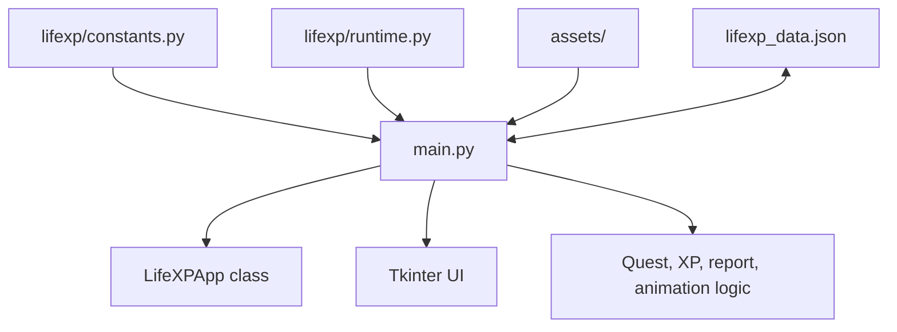
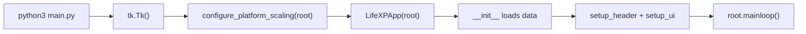
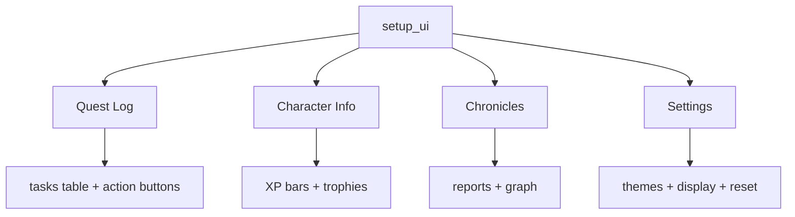
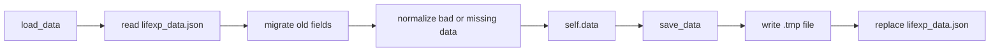
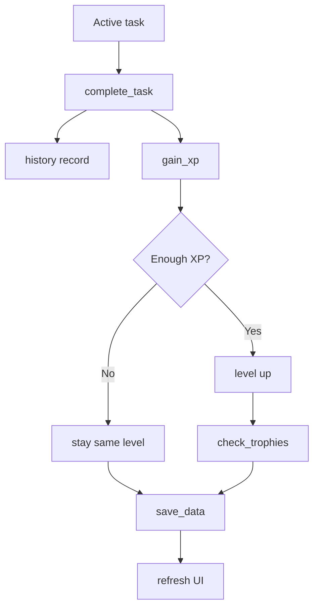
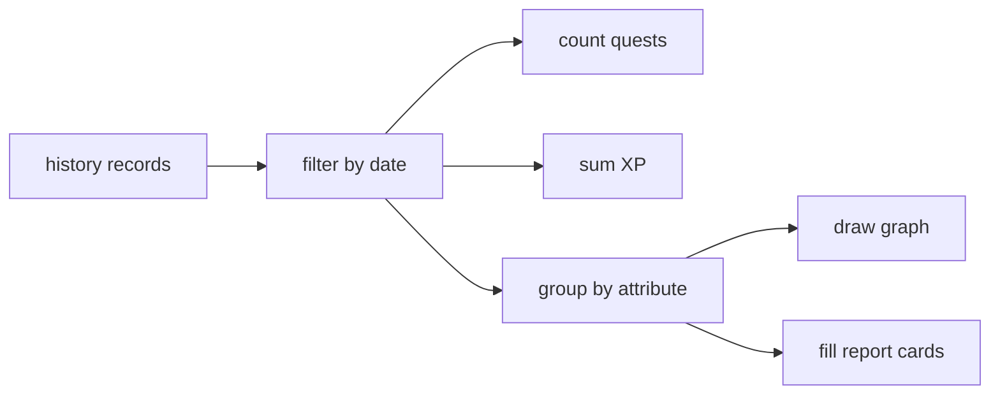
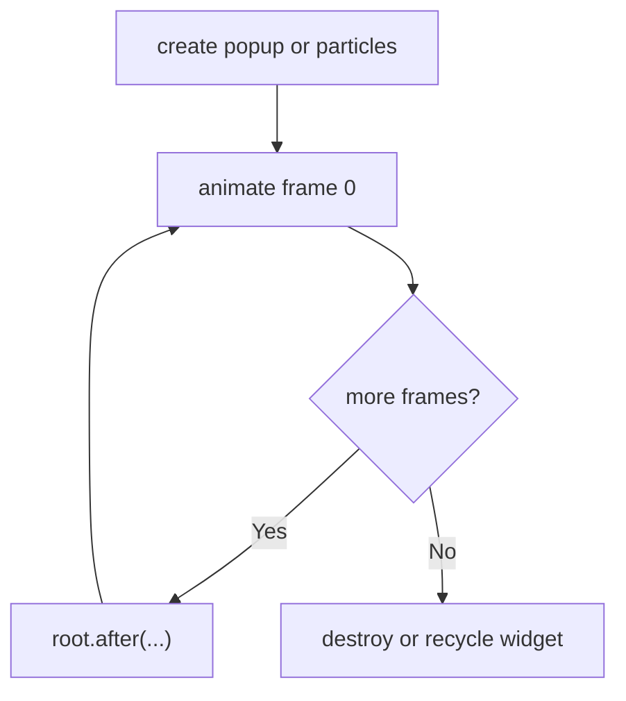

# LifeXP Guide Part 2: Intermediate

This part explains the main systems in LifeXP.

Use it after you understand variables, loops, methods, and `self`.

## Project Structure

```text
main.py
lifexp/
    __init__.py
    constants.py
    runtime.py
assets/
    app_icon/
    rank_icons/
screenshots/
```

### File Infographic



`main.py` is still the main file. The `lifexp` package holds support code:

- `constants.py`: app version, XP values, font limits, popup timing, release URLs
- `runtime.py`: resource paths, packaged-app checks, macOS scaling, HTTPS context

## Startup Flow

The bottom of `main.py` starts the app:

```python
if __name__ == "__main__":
    root = tk.Tk()
    configure_platform_scaling(root)
    app = LifeXPApp(root)
    root.mainloop()
```

Think like the computer:

1. Create the Tkinter root window.
2. Apply platform scaling if needed.
3. Create the app object.
4. Start the Tkinter event loop.

### Startup Infographic



## Tkinter In This App

Tkinter builds visible widgets.

Common widgets:

```python
tk.Frame(...)
tk.Label(...)
ttk.Button(...)
ttk.Progressbar(...)
tk.Canvas(...)
```

Common layout methods:

```python
widget.pack()
widget.grid(row=0, column=0)
widget.place(x=100, y=200)
```

Use this mental model:

- `Frame` groups widgets.
- `Label` shows text or images.
- `Button` runs a callback.
- `Progressbar` shows XP progress.
- `Canvas` draws custom art.

## Tabs And UI Building

`setup_ui` creates the tab system.

```python
self.setup_tasks_tab()
self.setup_character_tab()
self.setup_summary_tab()
self.setup_settings_tab()
```

### UI Infographic



## Saving And Loading

LifeXP saves progress as JSON.

Loading example:

```python
with open(self.data_file, "r", encoding="utf-8") as f:
    data = json.load(f)
```

Saving example:

```python
with open(temp_file, "w", encoding="utf-8") as f:
    json.dump(self.data, f, indent=4)
os.replace(temp_file, self.data_file)
```

The app writes a temporary file first. Then it replaces the real save file. This is safer than writing directly over the old save.

### Save/Load Infographic



## Quest Flow

The core gameplay path is:

```python
complete_task()
gain_xp(...)
check_trophies(...)
save_data()
update_stats_display()
```

### Quest Infographic



## XP Logic

The app stores current-level XP, not total lifetime XP.

Example stat:

```python
{"level": 6, "xp": 35}
```

To calculate lifetime XP, the app adds:

1. XP needed for previous levels
2. XP inside the current level

Code example:

```python
return stat["xp"] + self.get_total_xp_before_level(stat["level"])
```

## Account Rank Logic

Account rank uses total XP from all attributes.

```python
total_xp = sum(
    self.get_total_xp_for_stat(stat)
    for stat in self.data["stats"].values()
)
```

Think:

1. Get every stat dictionary.
2. Convert each one to lifetime XP.
3. Add them together.
4. Convert the total into account level progress.

## Reports

`show_summary` reads history and filters by date.

```python
if record_date >= target_date:
    completed_tasks += 1
```

Then it groups activity by attribute.

### Report Infographic



## Theme System

Themes are dictionaries of colors.

```python
"Tokyo Night": {
    "bg_dark": "#1A1B26",
    "bg_light": "#24283B",
    "accent": "#7AA2F7",
    "text": "#C0CAF5",
    "card_text": "#C0CAF5",
    "attr_colors": {...}
}
```

The app also checks contrast so text stays readable.

```python
self.get_readable_text_color(background, preferred)
```

## Animation Pattern

Tkinter animations use `after`.

```python
def animate(step=0):
    # update one frame
    self.root.after(20, animate, step + 1)
```

Think:

1. Draw one frame.
2. Ask Tkinter to call the method again later.
3. Stop when the animation is done.

### Animation Infographic



## Runtime Helper Functions

These are not methods on `LifeXPApp`, but the app uses them.

- `get_resource_dir`: finds bundled read-only assets.
- `get_user_data_dir`: finds where packaged builds should save user data.
- `is_packaged_app`: checks whether the app is frozen into a package.
- `configure_platform_scaling`: adjusts packaged macOS Tk scaling.
- `get_https_context`: creates an HTTPS context that works in packaged builds.

Example from startup:

```python
configure_platform_scaling(root)
```

Example from `__init__`:

```python
self.resource_dir = get_resource_dir()
```

## How To Debug Like A Programmer

When something breaks, do not start by guessing.

Use this order:

1. Read the error message.
2. Find the file and line number.
3. Find the method that contains that line.
4. Check the values used on that line.
5. Ask what type each value should be.
6. Trace backwards to where the value was created.

Most bugs are one of these:

- wrong type
- missing key
- empty list
- bad date text
- widget not created yet
- method called before data is ready
