# LifeXP Guide Part 3: Advanced, But Still Beginner Friendly

This chapter starts where the intermediate guide ends.

The beginner guide taught syntax. The intermediate guide taught connected code. The advanced guide teaches full systems: how several methods cooperate over time, how UI and data stay synchronized, and how LifeXP handles animation, drawing, resizing, theming, background work, and long-term compatibility.

Do not read advanced code as one giant block. Read it as a chain of responsibilities.

Ask these questions:

- What system is this method part of?
- What state does it read?
- What state does it change?
- Does it run now, later, or repeatedly?
- Does it draw pixels, move widgets, change saved data, or schedule another method?
- What is the direct helper worth reading next?

## How To Use This Guide

Each lesson follows the same structure as the first two guide parts:

1. A short lesson.
2. A real example from LifeXP.
3. What the computer reads.
4. A simple infographic.
5. A practice question.

At this level, one lesson may include several methods. That is the point: advanced reading is about the relationships between methods.

## The Advanced Mental Model

LifeXP has systems that run at different times.

- Immediate systems run during startup or direct button clicks.
- Scheduled systems run later through `root.after`.
- Repeated systems run frame by frame.
- Defensive systems protect the app from old data, invalid UI state, or destroyed widgets.
- Rendering systems draw on `Canvas` widgets.

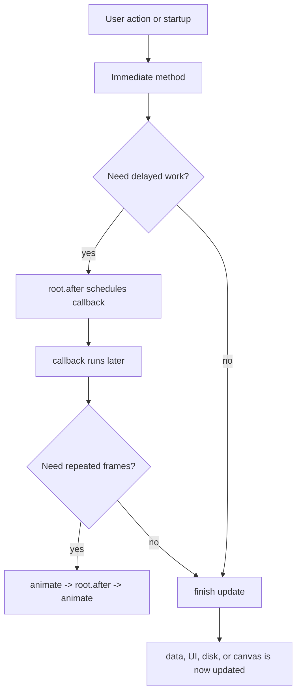

## 1. Reading Advanced Methods In Passes

### Short Lesson

Large methods are easier when you read them in passes instead of trying to understand every detail at once.

Use three passes:

1. Shape: What is this method responsible for?
2. State: What app data, widget data, or local data does it read and write?
3. Timing: Does it run immediately, later, repeatedly, or in a background thread?

### Example From The Code

```python
def schedule_level_up_sequence(self, level_events, rank_event=None):
    """Plays completion rewards after the XP popup has had a short moment."""
    if not self.animations_enabled:
        return

    first_reward_delay = self.popup_overlap_start_ms(XP_POPUP_STEPS, XP_TO_REWARD_START_RATIO)
    trophy_start_gap = self.popup_overlap_start_ms(TROPHY_POPUP_STEPS)

    if rank_event:
        self.root.after(first_reward_delay, lambda event=rank_event: self.play_rank_up_animation(event))

    if level_events:
        self.root.after(first_reward_delay, lambda events=level_events: self.play_level_up_batch(events))
```

### What The Computer Reads

Shape pass:

1. This method schedules reward animations.
2. It does not calculate XP.
3. It does not award trophies.
4. It decides when reward visuals should play.

State pass:

1. It reads `self.animations_enabled`.
2. It reads `level_events`.
3. It reads `rank_event`.
4. It creates delay values.

Timing pass:

1. It does some work immediately.
2. It uses `root.after` to run animation methods later.
3. The lambdas preserve the event data for the later call.

### Infographic

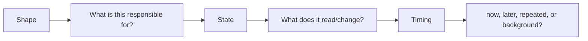

### Practice

Read `play_floating_text` using the same three passes before trying to understand every animation line.

## 2. Reward Event Pipeline

### Short Lesson

Advanced systems often start from data events.

When a quest completes, `gain_xp` returns level-up events. `update_stats_display` can return a rank-up event. Then `schedule_level_up_sequence` turns those data events into timed animations.

The important idea is separation:

- Gameplay methods create event data.
- Animation methods display event data.

### Example From The Code

```python
level_events.extend(self.gain_xp(attr, xp_gain))
...
rank_event = self.update_stats_display(animate_rank=False)
level_events = self.summarize_level_events(level_events)

if level_events or rank_event:
    self.schedule_level_up_sequence(level_events, rank_event)
```

### What The Computer Reads

1. Complete a task and gain XP.
2. Collect level-up events from `gain_xp`.
3. Redraw stats and collect a possible account rank event.
4. Summarize level events so multiple changes stay readable.
5. If there is anything to celebrate, schedule the reward sequence.

The data comes first. The visual effects come after.

### Infographic

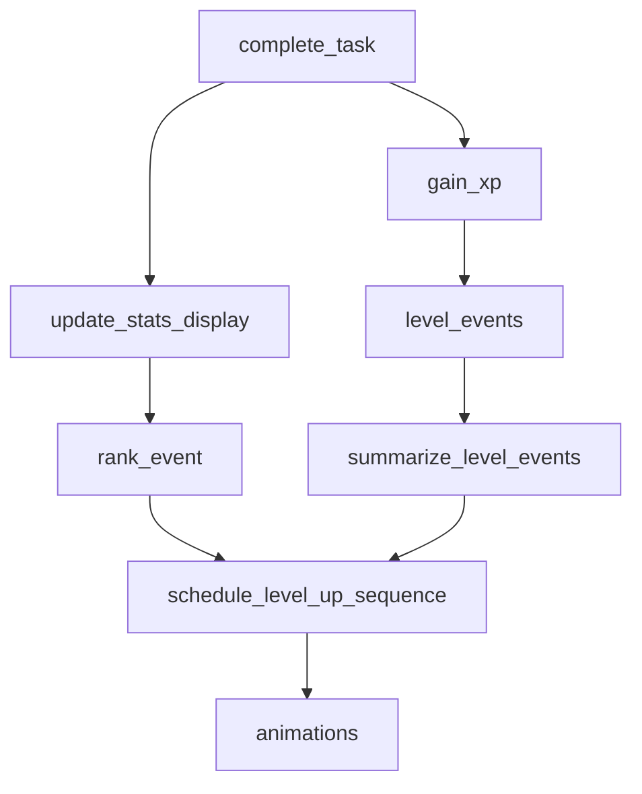

### Practice

Why is it useful that `gain_xp` returns event dictionaries instead of directly playing every animation itself?

## 3. Event Dictionaries

### Short Lesson

An event dictionary is a small package of information about something that happened.

LifeXP uses dictionaries for level-up and rank-up events because they are easy to pass between methods.

### Example From The Code

```python
level_events.append({
    "attribute": attribute,
    "level": stat["level"],
    "trophy": trophy_name
})
```

Rank-up event example:

```python
rank_event = {
    "title": title,
    "color": color,
    "previous_level": previous_level,
    "total_level": total_level,
    "xp_into_level": xp_into_level,
    "xp_needed": xp_needed,
    "total_xp": total_xp,
    "tier_index": tier_index,
    "roman": roman,
    "progress": progress
}
```

### What The Computer Reads

For a level event:

1. Store which attribute leveled up.
2. Store the new level.
3. Store a trophy name if one was unlocked.
4. Append the dictionary to a list of events.

For a rank event:

1. Store the new account title.
2. Store the visual color.
3. Store old and new account level details.
4. Store progress values needed by the avatar and popup.

### Infographic

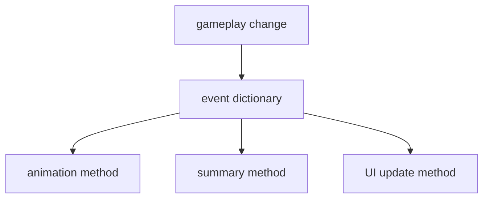

### Practice

Find one place where `rank_event` is created and one place where it is consumed.

## 4. Scheduling With `root.after`

### Short Lesson

`root.after(delay_ms, callback)` tells Tkinter to call a function later.

This is central to advanced Tkinter code. It lets the app delay work without freezing the interface.

### Example From The Code

```python
if rank_event:
    self.root.after(first_reward_delay, lambda event=rank_event: self.play_rank_up_animation(event))

if level_events:
    self.root.after(first_reward_delay, lambda events=level_events: self.play_level_up_batch(events))
```

### What The Computer Reads

1. If a rank event exists, schedule `play_rank_up_animation`.
2. Do not call it now.
3. Wait `first_reward_delay` milliseconds.
4. Then call it with the saved event dictionary.
5. Do the same for level-up events.

The lambda default argument matters. `event=rank_event` freezes the current event value for the later callback.

### Infographic

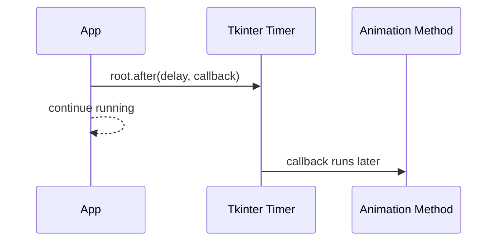

### Practice

Why should an animation sequence use `root.after` instead of `time.sleep`?

## 5. Batching Level-Up Popups

### Short Lesson

If the user completes several quests at once, many attributes might level up.

Showing one popup and particle burst per level can become noisy. LifeXP batches level-up popups into one coordinated group.

### Example From The Code

```python
def play_level_up_batch(self, events):
    """Shows all upgraded attributes together after a multi-quest completion."""
    if not self.animations_enabled:
        return

    cx, cy = self.get_center()
    count = max(1, len(events))
    spacing = 46
    start_y = int(cy + 48 - ((count - 1) * spacing / 2))
    popup_boxes = []

    for index, event in enumerate(events):
        popup_boxes.append(self.play_level_up_animation(
            event,
            x=cx,
            y=start_y + (index * spacing),
            particle_count=0,
            stack=False
        ))

    self.play_level_up_batch_particles(events, popup_boxes)
```

### What The Computer Reads

1. Stop if animations are disabled.
2. Find the center of the app.
3. Count how many level-up events exist.
4. Calculate vertical spacing.
5. Start a list for popup box positions.
6. For each event, show one level-up popup.
7. Store each popup's box position.
8. After all popups exist, create one shared particle burst around the whole group.

### Infographic

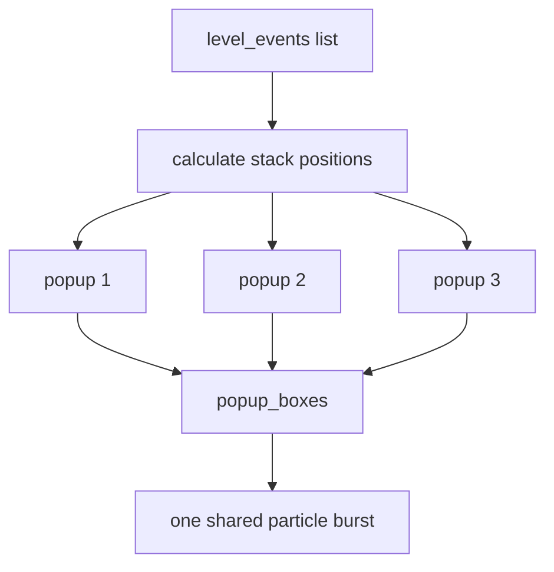

### Practice

Why does the batch call `play_level_up_animation` with `particle_count=0` and then call `play_level_up_batch_particles` once?

## 6. Floating Text Popups

### Short Lesson

`play_floating_text` is one of the best advanced methods to study because it combines:

- geometry
- Tkinter `Toplevel` windows
- opacity
- local helper functions
- animation phases
- safe fallback data
- scheduled frames

### Example From The Code

```python
if not self.animations_enabled or not self.popups_enabled:
    return {
        "x": max(0, min(x, root_w)),
        "y": max(0, min(y, root_h)),
        "width": max(80, self.ui_space(160)),
        "height": max(34, self.ui_space(56))
    }

popup = tk.Toplevel(self.root)
popup.overrideredirect(True)
popup.configure(bg=self.bg_light)
self.set_popup_alpha(popup, 0.0)
self.raise_popup_window(popup)
```

### What The Computer Reads

1. Measure the root window.
2. Round the requested popup position.
3. If animations or popups are disabled, return a fake popup box.
4. Create a borderless `Toplevel` window.
5. Set its background.
6. Make it transparent at first.
7. Raise it above the main app.

The fallback dictionary matters because particle methods still need a source box even when popups are disabled.

### Infographic

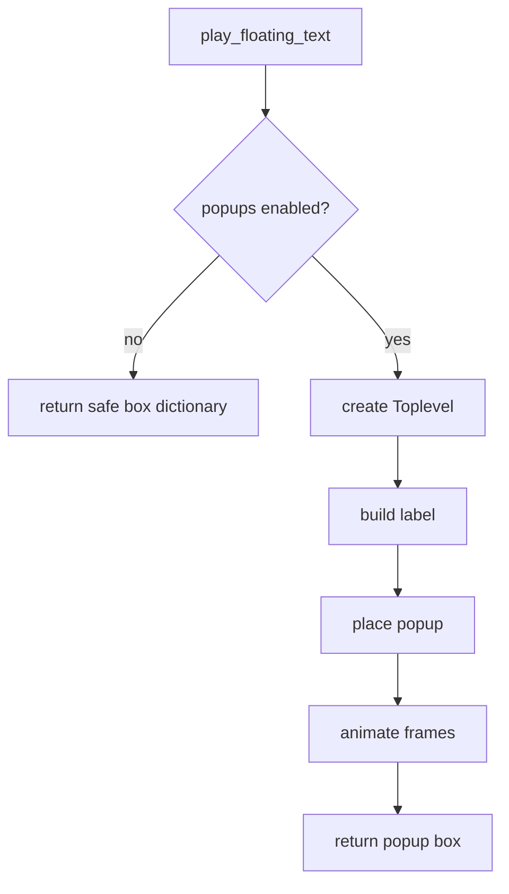

### Practice

Why does `play_floating_text` return a box dictionary instead of returning nothing?

## 7. Animation Frame Loops

### Short Lesson

Tkinter animations work by changing a widget a little, scheduling the next frame, and stopping when finished.

This is a controlled loop over time.

### Example From The Code

```python
def animate(step=0, current_size=display_size, w=popup_w, h=popup_h):
    try:
        if not popup.winfo_exists():
            return
    except tk.TclError:
        return
    if step <= total_steps:
        progress = min(step / float(total_steps), 1.0)
        ...
        self.root.after(next_delay, animate, step + 1, new_size, new_w, new_h)
    else:
        popup.destroy()
```

This snippet is shortened to show the pattern.

### What The Computer Reads

1. Define an `animate` function inside `play_floating_text`.
2. Check whether the popup still exists.
3. Calculate progress from `step`.
4. Move, resize, or fade the popup.
5. Schedule the next frame with `root.after`.
6. When the step count is finished, destroy the popup.

### Infographic

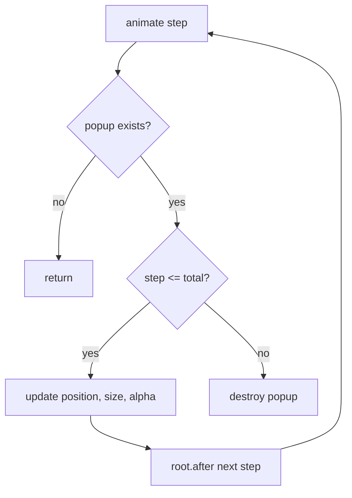

### Practice

Why does the animation check `popup.winfo_exists()` before updating the popup?

## 8. Easing

### Short Lesson

Easing changes motion so it feels less mechanical.

A linear animation moves the same amount each frame. An eased animation can start fast and slow down, or start gently and speed up.

### Example From The Code

```python
def ease_out_cubic(self, progress):
    """Starts fast and slows down near the end for natural UI motion."""
    progress = max(0.0, min(progress, 1.0))
    return 1 - ((1 - progress) ** 3)
```

### What The Computer Reads

1. Clamp `progress` between `0.0` and `1.0`.
2. Transform the progress value using a cubic formula.
3. Return a new progress value.

Animation code can use this returned value to calculate movement or opacity.

### Infographic

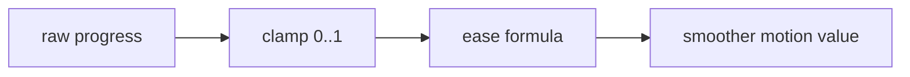

### Practice

Why is easing useful for reward popups?

## 9. Geometry And Clamping

### Short Lesson

Advanced UI code must keep temporary widgets inside the visible app area.

LifeXP uses clamping helpers so popups do not appear offscreen.

### Example From The Code

```python
safe_x, safe_y = self.clamp_box_position(
    popup_w,
    popup_h,
    x,
    y + (stack_offset * stack_direction)
)
popup.geometry(f"+{int(root_x + safe_x - popup_w // 2)}+{int(root_y + safe_y - popup_h // 2)}")
```

### What The Computer Reads

1. Calculate the desired popup position.
2. Adjust it with a stack offset.
3. Clamp the popup box so it stays inside the root window.
4. Convert app-relative coordinates to screen coordinates.
5. Move the `Toplevel` window to that screen position.

### Infographic

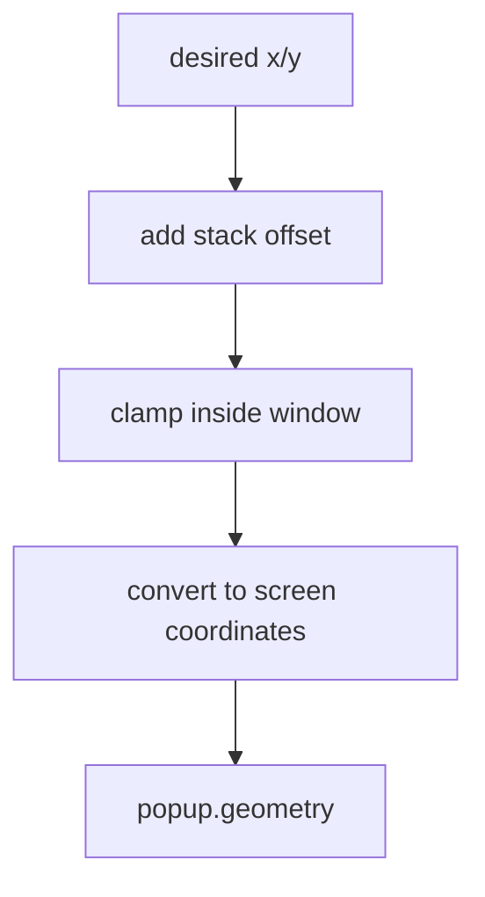

### Practice

Why does the code need both the root window position and the popup size before calling `popup.geometry(...)`?

## 10. Particle Systems

### Short Lesson

A particle system is a group of small objects that each have position, speed, color, size, and lifetime.

LifeXP particles are tiny Tkinter `Frame` widgets. The app updates their positions over many frames.

### Example From The Code

```python
particles.append({
    "widget": particle,
    "token": token,
    "x": float(start_x),
    "y": float(start_y),
    "dx": speed * math.cos(angle),
    "dy": speed * math.sin(angle),
    "size": size,
    "life": life,
    "max_life": life,
    "color": p_color,
    "fade_tick": 0
})
```

### What The Computer Reads

1. Store the particle widget.
2. Store a token that proves the widget still belongs to this particle.
3. Store floating-point `x` and `y` positions.
4. Store `dx` and `dy` velocity.
5. Store size, lifetime, color, and fade timing.
6. Append this dictionary to the particle list.

### Infographic

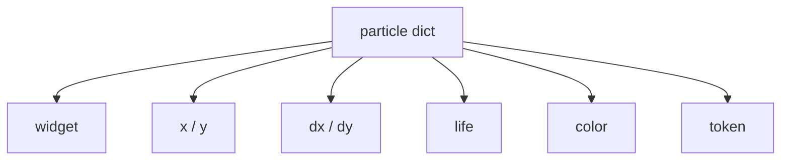

### Practice

Why are `x` and `y` stored as floats even though widget placement uses integer pixels?

## 11. Particle Physics

### Short Lesson

Particle motion is simple math repeated every frame.

Each frame:

- add velocity to position
- reduce velocity with drag
- add gravity to vertical velocity
- fade color over time
- destroy expired particles

### Example From The Code

```python
particle["x"] += particle["dx"]
particle["y"] += particle["dy"]
particle["dx"] *= 0.94 if physics else 0.955
particle["dy"] = (particle["dy"] * (0.94 if physics else 0.955)) + (0.34 if physics else 0.08)

next_x = max(0, min(int(particle["x"]), root_w - size))
next_y = max(0, min(int(particle["y"]), root_h - size))
widget.place(x=next_x, y=next_y)
particle["life"] -= 1
```

### What The Computer Reads

1. Move the particle by its velocity.
2. Slow horizontal velocity.
3. Slow vertical velocity and add gravity.
4. Convert positions to screen-safe integer pixel values.
5. Place the widget at the new position.
6. Reduce its remaining life.

### Infographic

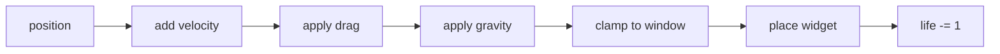

### Practice

What visual difference would you expect between `physics=True` and `physics=False`?

## 12. Particle Widget Pooling

### Short Lesson

Creating and destroying many widgets can be expensive.

LifeXP keeps a pool of particle widgets so it can reuse them. It also uses tokens to avoid accidentally reusing a widget while an old animation still thinks it owns it.

### Example From The Code

```python
particle, token = self.acquire_particle_widget(p_color, size)
particle.place(x=start_x, y=start_y)

particles.append({
    "widget": particle,
    "token": token,
    ...
})
```

Later:

```python
if (
    not widget.winfo_exists()
    or getattr(widget, "_lifexp_particle_token", None) != particle["token"]
):
    particle["life"] = -1
    continue
```

### What The Computer Reads

1. Ask for a particle widget.
2. Receive both the widget and its current token.
3. Store the token in the particle dictionary.
4. On later frames, verify the widget still exists.
5. Verify the widget still has the same token.
6. If not, stop updating that particle.

### Infographic

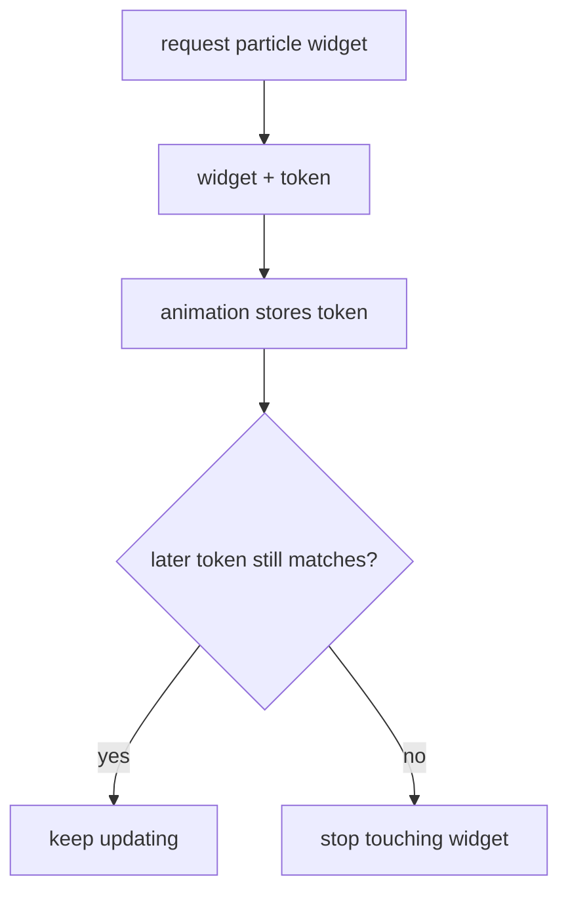

### Practice

Why is a token safer than only checking whether the widget still exists?

## 13. Trophy Tier Expansion

### Short Lesson

The trophy room changes as the player grows.

Before high levels, the app shows fewer trophy tiers. After max stat level passes 25, it reveals long-term tiers.

### Example From The Code

```python
def get_tiers(self):
    tiers_expanded = self._max_stat_level > 25
    if self._tiers_cache is None or tiers_expanded != self._tiers_cache_expanded:
        self._tiers_cache_expanded = tiers_expanded
        if tiers_expanded:
            self._tiers_cache = [("Apprentice", 5), ("Adept", 10), ("Master", 25), ("Grandmaster", 50), ("Legend", 100)]
        else:
            self._tiers_cache = [("Apprentice", 5), ("Adept", 10), ("Master", 25)]
    return self._tiers_cache
```

### What The Computer Reads

1. Check whether the player has passed level 25.
2. If the cached tiers are missing or outdated, rebuild them.
3. If expanded, include Grandmaster and Legend.
4. Otherwise, include the first three tiers.
5. Return the cached tier list.

### Infographic

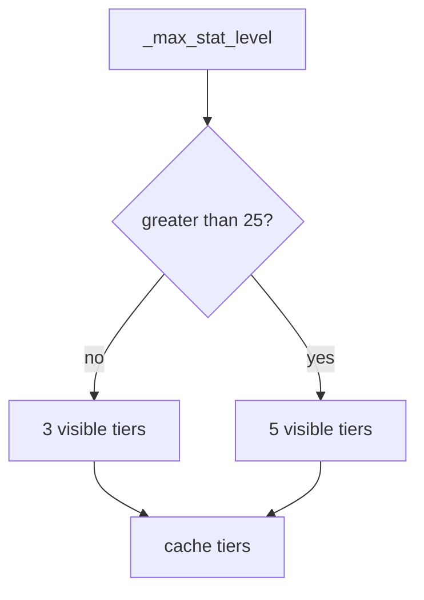

### Practice

Why does the method cache the tier list instead of building a new list every time?

## 14. Lazy Trophy Rendering

### Short Lesson

Some widgets do not have useful sizes until they are visible.

The trophy room waits until the Character tab has real geometry before building trophy canvases.

### Example From The Code

```python
def prepare_visible_trophy_room(self):
    """Builds trophy artwork only after the Character tab is visible."""
    if not hasattr(self, "trophies_frame"):
        return
    if not self.trophy_room_has_visible_geometry():
        self._trophy_resize_after_id = self.root.after(10, self.prepare_visible_trophy_room)
        return
    if not self._trophy_room_built:
        self.rebuild_trophy_room()
    else:
        self.resize_trophy_canvases()
```

### What The Computer Reads

1. If the trophy frame does not exist, stop.
2. If the frame is not visible or has no real size, check again shortly.
3. If the trophy room has not been built, rebuild it.
4. If it already exists, resize the canvases.

### Infographic

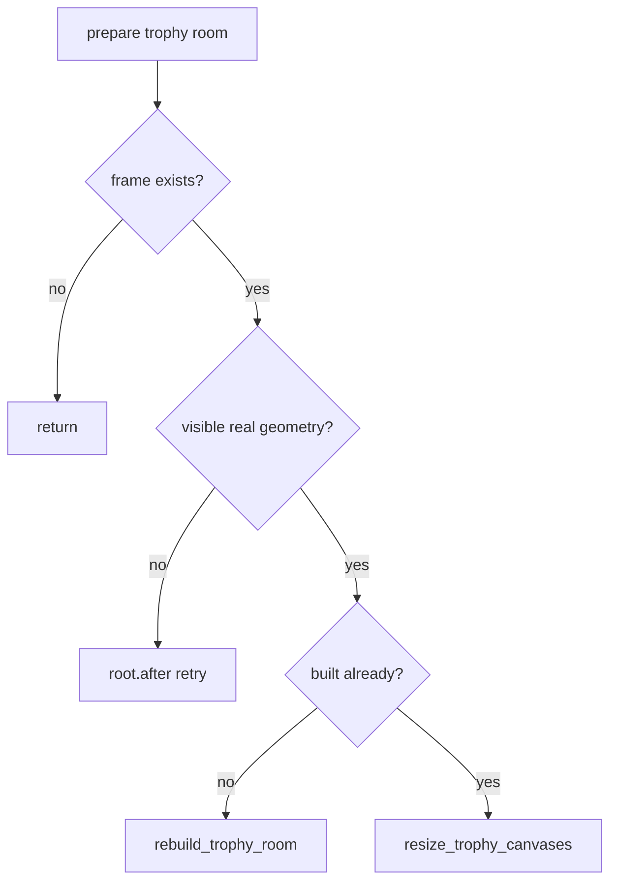

### Practice

Why is it risky to calculate trophy canvas sizes before the trophy frame is visible?

## 15. Canvas Drawing

### Short Lesson

Tkinter `Canvas` drawing is immediate drawing commands.

The app clears the canvas, calculates dimensions, chooses colors, and draws shapes.

### Example From The Code

```python
def draw_trophy(self, canvas, attr, progress, color, level_req):
    """Draws a high-resolution attribute trophy with tier-specific upgrades."""
    canvas.delete("all")

    c_width = int(canvas['width'])
    c_height = int(canvas['height'])
    s = min(c_width * 0.78, c_height * 0.86)
    cx = c_width / 2

    earned = progress >= 1.0
    display_color = color if earned else self._blend_color("#586273", "#A8AFBB", progress * 0.35)
    primary, shadow, highlight, accent = self._trophy_material(level_req, progress)
```

### What The Computer Reads

1. Clear old trophy art.
2. Read the canvas width and height.
3. Calculate a drawing scale.
4. Calculate the center x-coordinate.
5. Decide whether the trophy is earned.
6. Choose earned or locked colors.
7. Get material colors for the tier.
8. Continue drawing shapes with those dimensions and colors.

### Infographic

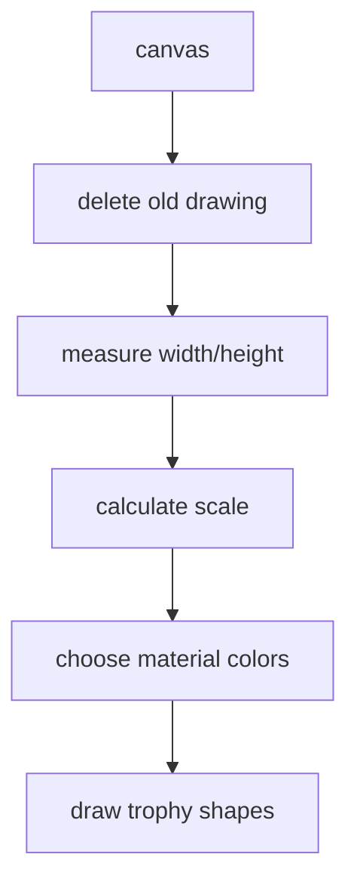

### Practice

Why does `draw_trophy` delete `"all"` before drawing the trophy again?

## 16. Progress-Based Rendering

### Short Lesson

Advanced rendering often uses a progress number between `0.0` and `1.0`.

LifeXP uses progress to show locked trophies as gradually brighter before they are earned.

### Example From The Code

```python
lvl = self.data["stats"][attr]["level"]
progress = min(lvl / float(level_req), 1.0)
self.draw_trophy(canvas, attr, progress, self.attr_colors[attr], level_req)
```

Inside material selection:

```python
progress = max(0.0, min(progress, 1.0))
if progress < 1.0:
    lift = progress * 0.42
    return (
        self._blend_color("#3E4654", "#7E8796", lift),
        self._blend_color("#262C36", "#596272", lift),
        self._blend_color("#7C8594", "#D1D6DF", lift),
        self._blend_color("#4B5563", "#9AA3B2", lift)
    )
```

### What The Computer Reads

1. Read the current attribute level.
2. Divide it by the trophy requirement.
3. Cap the result at `1.0`.
4. Pass progress into `draw_trophy`.
5. Clamp progress again inside material logic.
6. If the trophy is locked, blend darker colors toward brighter colors.
7. If progress reaches `1.0`, use earned material colors.

### Infographic

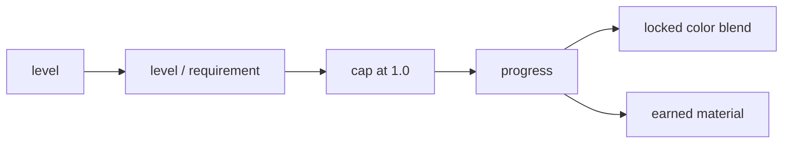

### Practice

If an attribute is level 5 and a trophy requires level 10, what progress value is passed to `draw_trophy`?

## 17. Theme Recoloring Without Rebuilding

### Short Lesson

Changing a theme is harder than changing one variable.

Some widgets follow `ttk.Style`. Other widgets are normal Tk widgets with literal colors already configured. LifeXP updates both.

### Example From The Code

```python
previous_bg_dark = self.bg_dark
previous_bg_light = self.bg_light
previous_accent = self.accent_green
previous_text = self.text_color
previous_attr_colors = self.attr_colors.copy()

self.current_theme_name = theme_name
self.apply_modern_theme()

background_color_map = {
    previous_bg_dark: self.bg_dark,
    previous_bg_light: self.bg_light,
    previous_accent: self.accent_green,
}
```

### What The Computer Reads

1. Remember old theme colors.
2. Change the active theme name.
3. Apply the new theme styles.
4. Build a map from old background colors to new background colors.
5. Build a map from old foreground colors to new foreground colors.
6. Use the maps to recolor already-created widgets.

### Infographic

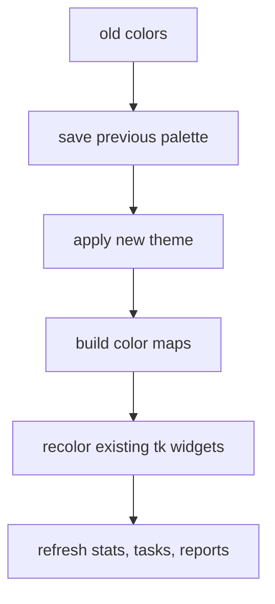

### Practice

Why does `set_theme` need old colors before calling `apply_modern_theme()`?

## 18. Recursive Widget Walking

### Short Lesson

A recursive function calls itself.

`recolor_widget_tree` starts at one widget, updates it, then calls itself for every child widget.

### Example From The Code

```python
for option in bg_options | fg_options:
    try:
        current = widget.cget(option)
    except tk.TclError:
        continue
    current = str(current)
    option_map = background_map if option in bg_options else foreground_map
    if current in option_map:
        try:
            widget.configure(**{option: option_map[current]})
        except tk.TclError:
            pass

for child in widget.winfo_children():
    self.recolor_widget_tree(child, color_map)
```

### What The Computer Reads

1. Try each color-related option on the current widget.
2. Skip options that this widget does not support.
3. Read the current color.
4. Pick the background or foreground map.
5. If the old color is in the map, configure the widget with the new color.
6. Loop through child widgets.
7. Call `recolor_widget_tree` on each child.

### Infographic

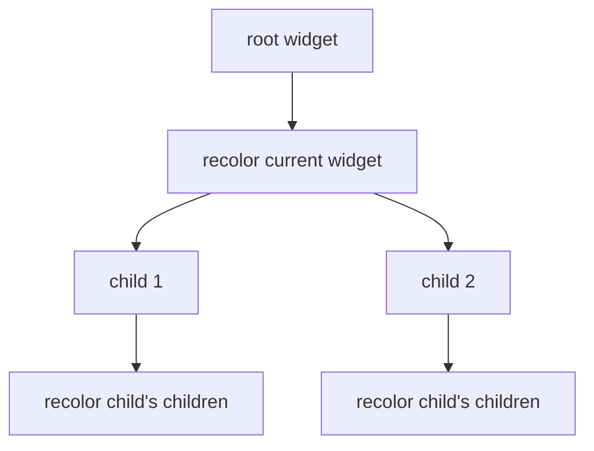

### Practice

Why does `recolor_widget_tree` catch `tk.TclError` instead of assuming every widget supports every color option?

## 19. Recursive Font Rescaling

### Short Lesson

Display preferences can change after widgets already exist.

`rescale_widget_tree` walks through widgets, remembers each widget's original font, and scales from that original font every time.

### Example From The Code

```python
if not hasattr(widget, "_lifexp_base_font"):
    actual = tkfont.Font(root=self.root, font=font_value).actual()
    widget._lifexp_base_font = {
        "family": actual.get("family") or "San Francisco",
        "size": abs(int(actual.get("size") or DEFAULT_FONT_SIZE)),
        "weight": actual.get("weight") or "normal",
        "slant": actual.get("slant") or "roman"
    }
base = widget._lifexp_base_font
widget.configure(
    font=(base["family"], self.scaled_font_size(base["size"]), base["weight"], base["slant"])
)
```

### What The Computer Reads

1. Check whether the widget's original font has been saved.
2. If not, inspect the current font.
3. Store the original font details on the widget.
4. Read the stored original font.
5. Calculate the scaled size from the original size.
6. Configure the widget with the scaled font.

### Infographic

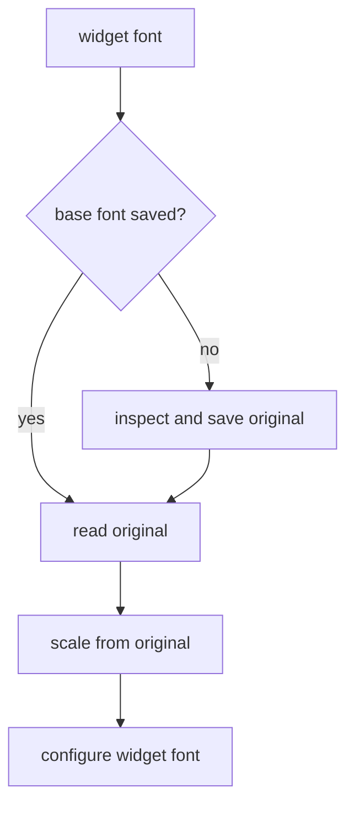

### Practice

Why is it important to scale from the original font instead of scaling the current font again and again?

## 20. Custom Scrollbar State

### Short Lesson

The custom scrollbar is a mini UI component.

It owns:

- a canvas
- a target scrollable widget
- state for the visible range
- helper functions to draw and jump

### Example From The Code

```python
state = {"first": 0.0, "last": 1.0}
scrollbar = tk.Canvas(parent, width=width, bg=self.bg_light, highlightthickness=0, cursor="sb_v_double_arrow")

def set_view(first, last):
    state["first"] = float(first)
    state["last"] = float(last)
    draw()

target.configure(yscrollcommand=set_view)
scrollbar.bind("<Configure>", draw)
scrollbar.bind("<Button-1>", jump)
scrollbar.bind("<B1-Motion>", jump)
```

### What The Computer Reads

1. Create a dictionary to store the current visible scroll range.
2. Create a canvas that will act as the scrollbar.
3. Define `set_view` so the target widget can report its scroll position.
4. Configure the target to call `set_view`.
5. Redraw the scrollbar when its size changes.
6. Jump the target scroll position when the user clicks or drags.

### Infographic

```mermaid
flowchart TD
    A["target widget scrolls"] --> B["set_view(first,last)"]
    B --> C["state dictionary"]
    C --> D["draw scrollbar thumb"]
    E["user clicks scrollbar"] --> F["jump(event)"]
    F --> G["target.yview_moveto"]
```

### Practice

Why does `state` use a dictionary instead of two plain local variables?

## 21. Scroll Routing

### Short Lesson

An app can have several scrollable areas. A global wheel event needs to go to the right one.

LifeXP checks the selected tab and routes scrolling to Settings or Chronicles.

### Example From The Code

```python
def route_global_scroll(self, event):
    """Routes trackpad and wheel events to the active scrollable tab content."""
    if hasattr(self, "notebook"):
        try:
            selected_tab = self.notebook.nametowidget(self.notebook.select())
        except tk.TclError:
            selected_tab = None

        if selected_tab == getattr(self, "tab_settings", None):
            return self.scroll_settings_canvas(event)

    return self.scroll_summary_body(event)
```

### What The Computer Reads

1. Check whether the notebook exists.
2. Try to get the currently selected tab widget.
3. If that fails, use `None`.
4. If the Settings tab is selected, scroll the settings canvas.
5. Otherwise, route the event to the summary body scroll handler.

### Infographic

```mermaid
flowchart TD
    A["wheel event"] --> B{"notebook exists?"}
    B -->|yes| C["get selected tab"]
    B -->|no| D["summary scroll"]
    C --> E{"settings tab?"}
    E -->|yes| F["scroll settings canvas"]
    E -->|no| D
```

### Practice

Why does this method use `getattr(self, "tab_settings", None)` instead of directly reading `self.tab_settings`?

## 22. Report Graph Rendering

### Short Lesson

`draw_summary_graph` turns report data into a small bar chart.

This is advanced because it combines data scaling, canvas dimensions, grid lines, and labels.

### Example From The Code

```python
canvas.delete("all")
width = max(1, canvas.winfo_width())
height = max(1, canvas.winfo_height())

max_xp = max([1] + [totals_by_attribute.get(attr, 0) for attr in self.attributes])
available_w = max(1, width - pad_x - 28)
slot_w = available_w / len(self.attributes)
bar_w = max(18, min(46, slot_w * 0.48))

for index, attr in enumerate(self.attributes):
    xp = totals_by_attribute.get(attr, 0)
    center_x = pad_x + (slot_w * index) + (slot_w / 2)
    bar_h = 4 if xp <= 0 else max(8, (xp / max_xp) * (chart_h - 8))
    canvas.create_rectangle(left, top_y, right, baseline, fill=self.attr_colors[attr], outline="")
```

This snippet is shortened to focus on the rendering math.

### What The Computer Reads

1. Clear the old graph.
2. Measure the canvas.
3. Find the largest XP value.
4. Calculate horizontal space for each attribute.
5. Calculate a reasonable bar width.
6. Loop through attributes.
7. Convert each XP total into a bar height.
8. Draw a rectangle for each attribute.

### Infographic

```mermaid
flowchart TD
    A["XP totals by attribute"] --> B["find max XP"]
    B --> C["calculate slot width"]
    C --> D["loop attributes"]
    D --> E["XP / max XP"]
    E --> F["bar height"]
    F --> G["draw rectangle"]
```

### Practice

Why does the code use `max([1] + values)` instead of just `max(values)`?

## 23. Save Migration

### Short Lesson

Apps change over time. Old save files may use old names.

Migration code updates old save data in place so the rest of the app can use the current data contract.

### Example From The Code

```python
def migrate_renamed_attributes(self, data):
    """Updates old save-file attribute names in place."""
    rename_map = self.get_attribute_rename_map()

    if isinstance(data.get("stats"), dict):
        for old, new in rename_map.items():
            if old in data["stats"]:
                data["stats"][new] = data["stats"].pop(old)

    if isinstance(data.get("tasks"), list):
        for task in data["tasks"]:
            if isinstance(task, dict) and task.get("attribute") in rename_map:
                task["attribute"] = rename_map[task["attribute"]]
```

### What The Computer Reads

1. Get the map of old names to new names.
2. If stats are a dictionary, rename old stat keys.
3. If tasks are a list, loop through task dictionaries.
4. If a task uses an old attribute name, replace it.
5. Similar logic also updates history, subcategories, and trophies.

### Infographic

```mermaid
flowchart TD
    A["old save data"] --> B["rename map"]
    B --> C["update stats"]
    B --> D["update tasks"]
    B --> E["update history"]
    B --> F["update subcategories"]
    B --> G["update trophies"]
    C --> H["current data contract"]
    D --> H
    E --> H
    F --> H
    G --> H
```

### Practice

Why does migration run before normalizing stats, tasks, and history?

## 24. Cache Invalidation

### Short Lesson

A cache is only correct while the data it depends on has not changed.

When source data changes, the cache must be cleared.

### Example From The Code

```python
def add_saved_subcategory(self, attr, name):
    """Adds an activity suggestion if it is new for an attribute."""
    if attr not in self.attributes:
        return False
    name = str(name).strip()
    if not name:
        return False

    self.data["subcategories"].setdefault(attr, [])
    existing_names = {
        saved_name.lower()
        for saved_name in self.data["subcategories"][attr]
        if isinstance(saved_name, str)
    }
    if name.lower() in existing_names:
        return False

    self.data["subcategories"][attr].append(name)
    self._invalidate_subcategory_cache()
    return True
```

### What The Computer Reads

1. Validate the attribute.
2. Clean the activity name.
3. Ensure the subcategory list exists.
4. Build a lowercase set of existing names.
5. If the name already exists, return `False`.
6. Append the new name.
7. Clear the cached subcategory lookups.
8. Return `True`.

### Infographic

```mermaid
flowchart TD
    A["new activity"] --> B{"valid and unique?"}
    B -->|no| C["return False"]
    B -->|yes| D["append to subcategories"]
    D --> E["invalidate cache"]
    E --> F["return True"]
```

### Practice

What stale behavior might happen if the app added a subcategory but did not invalidate the subcategory cache?

## 25. Background Update Checks

### Short Lesson

Tkinter UI code should run on the main thread.

Network requests can be slow, so LifeXP runs the GitHub update check in a background thread, then returns to the Tkinter thread with `root.after`.

### Example From The Code

```python
def check_for_update(self):
    button = getattr(self, "update_button", None)
    if button is not None:
        button.configure(text="Checking...", state=tk.DISABLED)

    def worker():
        try:
            request = urllib.request.Request(
                GITHUB_LATEST_RELEASE_API,
                headers={
                    "Accept": "application/vnd.github+json",
                    "User-Agent": f"{APP_NAME}/{APP_VERSION}"
                }
            )
            with urllib.request.urlopen(request, timeout=8, context=get_https_context()) as response:
                release = json.loads(response.read().decode("utf-8"))
            result = {"ok": True, "tag": release.get("tag_name", ""), "url": release.get("html_url") or GITHUB_RELEASES_URL}
        except (OSError, urllib.error.URLError, json.JSONDecodeError) as error:
            result = {"ok": False, "error": str(error)}

        self.root.after(0, lambda: self.finish_update_check(result))

    threading.Thread(target=worker, daemon=True).start()
```

### What The Computer Reads

1. Disable the update button and show "Checking...".
2. Define a worker function.
3. In the worker, make the GitHub request.
4. Parse the response JSON.
5. Store either a success result or an error result.
6. Use `root.after(0, ...)` to call `finish_update_check` on the Tkinter thread.
7. Start the worker in a daemon thread.

### Infographic

```mermaid
sequenceDiagram
    participant UI as Tkinter UI
    participant Worker as Worker Thread
    participant GitHub
    participant Tk as Tk Main Thread

    UI->>Worker: start thread
    Worker->>GitHub: request release JSON
    GitHub-->>Worker: response or error
    Worker->>Tk: root.after(0, finish_update_check)
    Tk->>UI: update button and show message
```

### Practice

Why should the worker not directly call `messagebox.showinfo(...)` after the network request?

## 26. Defensive Widget Access

### Short Lesson

Advanced Tkinter code must assume widgets might not exist anymore.

A user can close a dialog, a tab may not be built, or a widget may be destroyed before a scheduled callback runs.

### Example From The Code

```python
button = getattr(self, "update_button", None)
if button is not None and button.winfo_exists():
    try:
        button.configure(text="Check for Update", state=tk.NORMAL)
    except tk.TclError:
        pass
```

### What The Computer Reads

1. Try to get `self.update_button`.
2. If it does not exist, use `None`.
3. If it exists and the underlying widget still exists, try to configure it.
4. If Tkinter raises an error anyway, ignore it safely.

This pattern protects scheduled and background callbacks from stale widget references.

### Infographic

```mermaid
flowchart TD
    A["want to update widget"] --> B["getattr fallback None"]
    B --> C{"widget exists?"}
    C -->|no| D["skip"]
    C -->|yes| E["try configure"]
    E --> F{"TclError?"}
    F -->|yes| D
    F -->|no| G["updated"]
```

### Practice

Why can a widget reference exist in Python even after the Tkinter widget has been destroyed?

## 27. Reading A Full Advanced Flow: Complete Quest To Rewards

### Short Lesson

Advanced reading follows a feature across many methods without getting lost in helper details.

This is the complete reward flow:

1. `complete_task`
2. `gain_xp`
3. `check_trophies`
4. `update_stats_display`
5. `update_header`
6. `summarize_level_events`
7. `play_floating_text`
8. `schedule_level_up_sequence`
9. `play_level_up_batch`
10. `play_firework_particles`

### Example From The Code

```python
for task in tasks:
    attr = task["attribute"]
    xp_gain = task["xp"]
    total_xp_gain += xp_gain
    level_events.extend(self.gain_xp(attr, xp_gain))

...

rank_event = self.update_stats_display(animate_rank=False)
level_events = self.summarize_level_events(level_events)

popup_box = self.play_floating_text(popup_text, "#EBCB8B", cx, cy, size=30)
self.play_firework_particles("#EBCB8B", popup_box, count=34, physics=True)

if level_events or rank_event:
    self.schedule_level_up_sequence(level_events, rank_event)
```

### What The Computer Reads

1. Complete every selected task.
2. Add XP and collect level-up events.
3. Save history and remove active tasks.
4. Save data and refresh the quest list.
5. Update stats and collect a possible rank event.
6. Summarize level events.
7. Show the immediate XP popup.
8. Spawn XP particles from the popup box.
9. Schedule delayed level-up, rank-up, and trophy animations.

### Infographic

```mermaid
flowchart TD
    A["Complete Quest"] --> B["gain_xp"]
    B --> C["level events"]
    B --> D["trophy names"]
    A --> E["save and refresh"]
    E --> F["update_stats_display"]
    F --> G["rank event"]
    A --> H["XP popup now"]
    H --> I["XP particles"]
    C --> J["scheduled rewards"]
    G --> J
    D --> J
```

### Practice

Write a one-line summary of this flow in your own words.

## 28. Advanced Debugging

### Short Lesson

Advanced bugs usually come from timing, stale state, geometry, or cache assumptions.

The question is no longer only "What line failed?" It is "Which system assumption became false?"

### Debugging Checklist

Use this order:

1. Is the failing code immediate, scheduled, repeated, or threaded?
2. Does the widget still exist?
3. Does the method depend on visible geometry?
4. Is the data shape normalized?
5. Was a cache invalidated after source data changed?
6. Is this drawing code using current canvas dimensions?
7. Is this callback accidentally running now instead of later?
8. Is UI code running on the Tkinter main thread?

### Infographic

```mermaid
flowchart TD
    A["advanced bug"] --> B{"timing issue?"}
    A --> C{"stale widget?"}
    A --> D{"bad geometry?"}
    A --> E{"stale cache?"}
    A --> F{"bad data shape?"}
    B --> G["check root.after/thread"]
    C --> H["check winfo_exists"]
    D --> I["check visible size"]
    E --> J["check invalidation"]
    F --> K["check normalizers"]
```

### Practice

If a scheduled animation crashes after a popup was destroyed, which defensive check would you look for first?

## 29. What To Read First In `main.py`

### Short Lesson

Advanced reading still needs order.

Do not start with every helper. Follow the highest-value systems first.

### Recommended Reading Path

```mermaid
flowchart TD
    A["complete_task"] --> B["gain_xp"]
    B --> C["check_trophies"]
    A --> D["update_stats_display"]
    D --> E["update_header"]
    A --> F["play_floating_text"]
    A --> G["schedule_level_up_sequence"]
    G --> H["play_level_up_batch"]
    H --> I["play_firework_particles"]
    C --> J["redraw_trophies"]
    J --> K["draw_trophy"]
    L["set_theme"] --> M["recolor_widget_tree"]
    N["check_for_update"] --> O["finish_update_check"]
```

### What The Computer Reads

This path teaches:

1. Core gameplay.
2. XP and trophy events.
3. Header and rank progress.
4. Immediate and delayed reward animation.
5. Particle rendering.
6. Canvas trophy rendering.
7. Theme recoloring.
8. Background update checking.

### Practice

Pick one path from the diagram and read only one direct helper at a time.

## 30. What You Should Understand After Advanced

You have finished the advanced guide when you can explain these ideas without memorizing exact lines:

- Advanced methods should be read by shape, state, and timing.
- Gameplay should create event data before animation displays it.
- `root.after` schedules non-blocking delayed work.
- Animation loops are repeated scheduled frame updates.
- `Toplevel` windows can create lightweight floating popups.
- Geometry helpers keep temporary UI inside the visible app.
- Easing makes movement feel natural.
- Particle systems are lists of dictionaries updated over time.
- Tokens protect pooled widgets from stale animation ownership.
- Trophy tiers expand based on long-term progress.
- Canvas rendering uses measurement, scaling, clearing, and redraws.
- Progress values between `0.0` and `1.0` can drive visual state.
- Theme changes must update both `ttk` styles and normal Tk widget colors.
- Recursive widget walking can recolor or rescale a whole UI tree.
- Custom scrollbars are small components with state and callbacks.
- Migrations keep old save files compatible with new data contracts.
- Caches must be invalidated when their source data changes.
- Background threads can do slow work, but Tkinter UI updates return through `root.after`.
- Defensive widget access prevents scheduled callbacks from touching destroyed widgets.

The next step is not another guide. The next step is to pick one system, trace it in `main.py`, and write your own short method summaries until the code feels navigable.
