# LifeXP Guide Part 3: Advanced, But Still Beginner Friendly

This part explains the important methods and systems in `main.py`.

It does not list every helper method one by one. That became too noisy. Instead, it focuses on the methods that teach the app's real structure.

Use this rule while reading:

```text
Understand A -> B.
Do not chase A -> B -> C -> D on the first pass.
```

Example:

- Good first pass: `complete_task` calls `gain_xp`.
- Too deep for first pass: `complete_task` calls `gain_xp`, which calls `get_xp_needed`, which uses the XP curve, which uses cached totals.

Go one layer deeper only after the first layer makes sense.

## Advanced Reading Strategy

Read each important method in three passes.

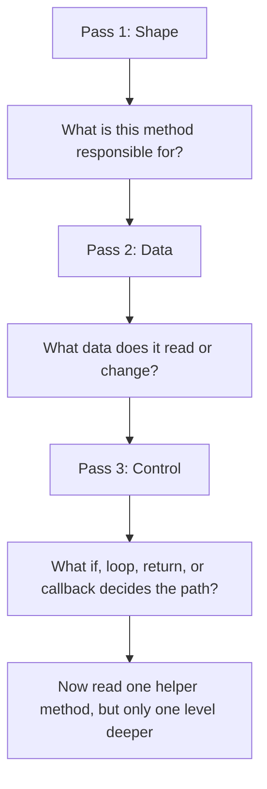

Use this small checklist:

- Inputs: arguments, selected widgets, or `self.data`.
- Work: calculations, validation, drawing, or saving.
- Outputs: changed data, changed widgets, return value, or scheduled callback.
- Next method: only the most important direct helper.

## The App As Four Systems

LifeXP is easier to understand as four systems:

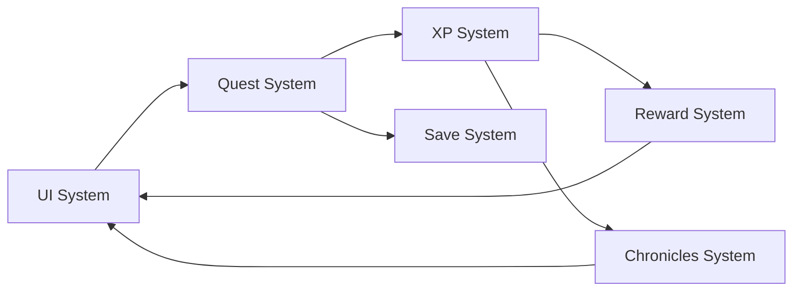

The main methods in those systems are:

| System | Important methods | What to learn |
| --- | --- | --- |
| Startup and UI | `__init__`, `setup_ui`, tab setup methods | How the app is built |
| Quest flow | `add_task_dialog`, `complete_task`, `delete_task`, edit methods | How user actions change data |
| XP and rewards | `gain_xp`, `get_xp_needed`, `check_trophies` | How progress is calculated |
| Saving and reports | `load_data`, `save_data`, `show_summary` | How memory becomes files and reports |
| Visual feedback | `play_floating_text`, `schedule_level_up_sequence` | How animations are scheduled |

## 1. Startup: `__init__`

`__init__` is the app's setup method. It runs once when the app starts.

Example:

```python
app = LifeXPApp(root)
```

Important work inside `__init__`:

```python
self.themes = self.get_theme_definitions()
self.apply_modern_theme()
self.data = self.load_data()
self.setup_header()
self.setup_ui()
self.update_stats_display()
self.refresh_task_list()
```

Think like the computer:

1. Create default app state.
2. Load colors.
3. Load saved data.
4. Build visible widgets.
5. Fill widgets with current data.

### Startup Infographic

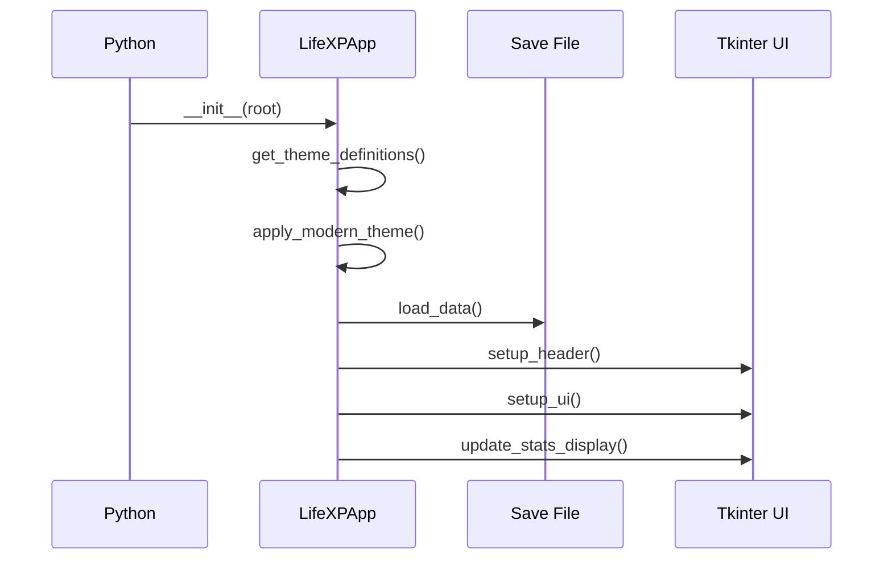

Direct helpers worth reading next:

- `get_theme_definitions`: theme data.
- `load_data`: save-file loading.
- `setup_ui`: tab creation.

Stop there on the first pass. Do not chase every theme helper yet.

## 2. UI Builder: `setup_ui`

`setup_ui` creates the main tabbed layout.

Important pattern:

```python
self.setup_tasks_tab()
self.setup_character_tab()
self.setup_summary_tab()
self.setup_settings_tab()
```

This is a coordinator method. It does not need to know every label and button. It delegates each screen to a separate setup method.

### UI Builder Infographic

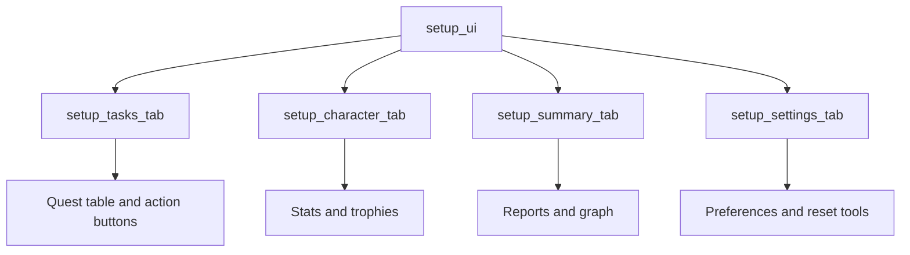

How to read UI setup methods:

1. Find the parent frame.
2. Notice whether widgets use `pack`, `grid`, or `place`.
3. Find callbacks with `command=...` or `.bind(...)`.
4. Ask what method runs when the user clicks or scrolls.

Important callback examples:

```python
command=self.complete_task
command=self.add_task_dialog
self.notebook.bind("<<NotebookTabChanged>>", self.handle_notebook_tab_changed)
```

Supporting methods to know:

- `setup_tasks_tab`: Quest Log UI.
- `setup_character_tab`: stats and trophies.
- `setup_summary_tab`: Chronicles UI.
- `setup_settings_tab`: settings UI.

## 3. Accepting Quests: `add_task_dialog`

`add_task_dialog` opens the Accept Quest window.

This method is long because it builds a popup and defines small helper functions inside it.

Important data:

```python
attr_var = tk.StringVar(value=all_filter_label)
activity_var = tk.StringVar()
difficulty_var = tk.IntVar(value=5)
pending_quests = []
```

What these mean:

- `attr_var`: selected attribute filter.
- `activity_var`: typed activity text.
- `difficulty_var`: difficulty from 1 to 10.
- `pending_quests`: draft quests not saved yet.

### Accept Quest Infographic

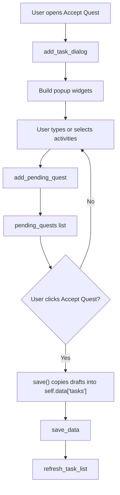

Most important nested helpers:

- `update_suggestions`: rebuilds the saved activity list.
- `add_pending_quest`: creates or updates one draft quest.
- `refresh_selected_list`: redraws the queue preview.
- `save`: moves draft quests into real app data.

Read only those first. Skip the small color and layout helpers until later.

## 4. Completing Quests: `complete_task`

`complete_task` is the main gameplay method.

It turns selected active quests into XP, history, trophies, and UI updates.

Important shape:

```python
indices = self.get_selected_task_indices(...)
tasks = [self.data["tasks"][index] for index in indices]

for task in tasks:
    level_events.extend(self.gain_xp(attr, xp_gain))

self.save_data()
self.refresh_task_list()
self.update_stats_display()
```

Think like the computer:

1. Which rows are selected?
2. Which task dictionaries do those rows point to?
3. For each task, how much XP is gained?
4. What gets added to history?
5. What gets removed from active tasks?
6. Which methods redraw the UI?

### Complete Quest Infographic

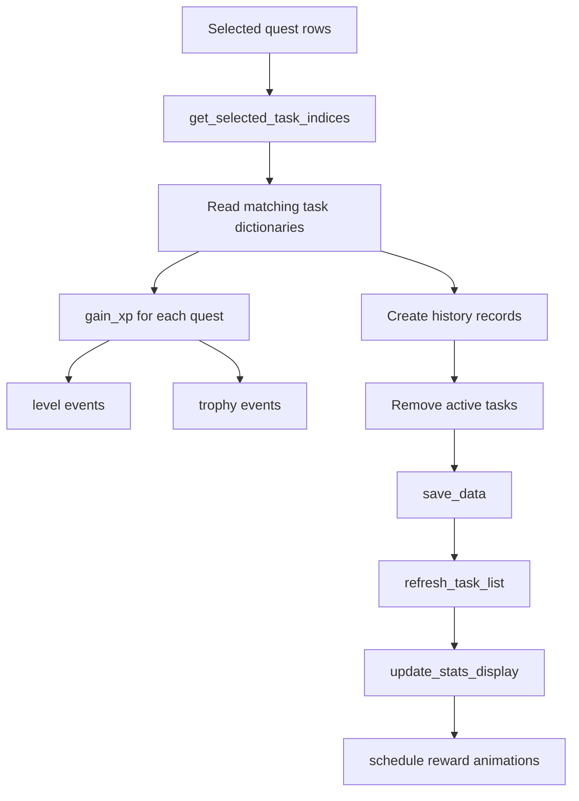

Direct helpers worth reading next:

- `get_selected_task_indices`: table selection to list indexes.
- `gain_xp`: XP and level-up logic.
- `save_data`: write progress.
- `update_stats_display`: redraw progress.

Do not read particle animations yet. They are visual feedback, not core gameplay.

## 5. XP Logic: `gain_xp`

`gain_xp` adds XP to one attribute.

Core idea:

```python
stat["xp"] += amount

while stat["xp"] >= xp_needed:
    stat["xp"] -= xp_needed
    stat["level"] += 1
```

The `while` loop matters. One large XP reward might level up more than once.

### XP Loop Infographic

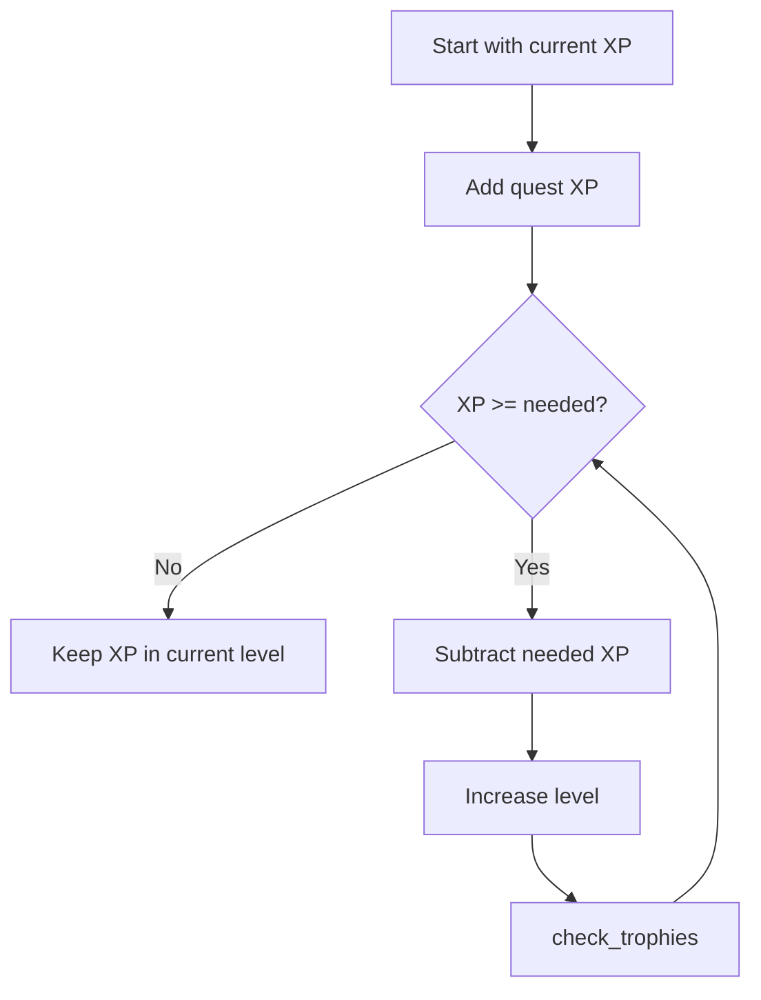

Important related methods:

- `get_xp_needed`: returns XP needed for one attribute level.
- `check_trophies`: checks whether the new level unlocks a milestone.
- `summarize_level_events`: keeps level-up messages readable after batch completion.

Keep the first reading focused on the loop. The exact XP curve can wait.

## 6. XP Cost: `get_xp_needed` And `get_scaled_xp_needed`

`get_xp_needed` answers one question:

```text
How much XP is needed to pass this level?
```

It uses a cache:

```python
if level not in self.xp_needed_cache:
    self.xp_needed_cache[level] = self.get_scaled_xp_needed(level, BASE_XP_NEEDED)
return self.xp_needed_cache[level]
```

Beginner translation:

1. If we already calculated this level, reuse the answer.
2. If not, calculate it once and remember it.

### Cache Infographic

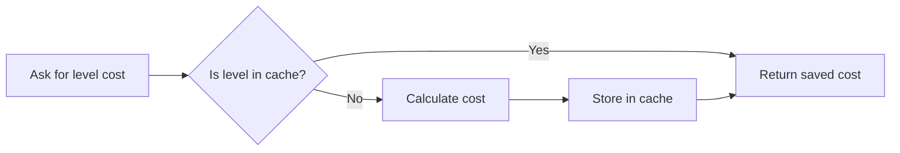

`get_scaled_xp_needed` contains the math curve. You do not need to memorize the formula. Read it as:

```text
base XP + level curve = cost for this level
```

## 7. Trophies: `check_trophies`, `get_tiers`, `draw_trophy`

Trophies are rewards for reaching milestone levels.

`check_trophies` asks:

```text
Did this attribute just reach a trophy level?
```

Important idea:

```python
for tier_name, level_req in self.get_tiers():
    if new_level == level_req:
        trophy_name = f"{attribute} {tier_name}"
```

### Trophy Infographic

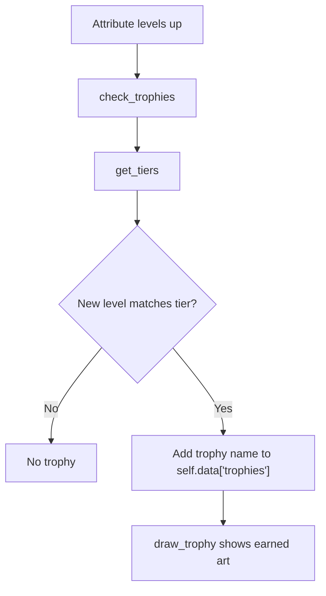

Important methods:

- `get_tiers`: decides which milestone levels exist.
- `check_trophies`: awards trophy names.
- `draw_trophy`: draws trophy art on a canvas.

Do not start with all drawing details. First understand that trophy art is a visual result of data.

## 8. Saving: `load_data`, Normalizers, And `save_data`

`load_data` is more than "open a file." It also repairs old or messy data.

Important shape:

```python
default_data = self.get_default_data()

with open(self.data_file, "r", encoding="utf-8") as f:
    data = json.load(f)

data["stats"] = self.normalize_stats(...)
data["tasks"] = self.normalize_tasks(...)
data["history"] = self.normalize_history(...)
```

### Save System Infographic

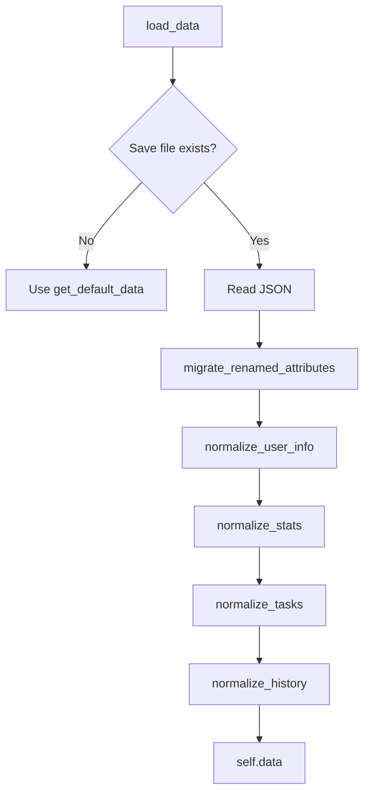

Important helpers:

- `get_default_data`: safe starting shape.
- `normalize_user_info`: preferences and account info.
- `normalize_stats`: levels and XP.
- `normalize_tasks`: active quest records.
- `normalize_history`: completed quest records.

`save_data` is simpler:

```python
with open(temp_file, "w", encoding="utf-8") as f:
    json.dump(self.data, f, indent=4)
os.replace(temp_file, self.data_file)
```

Beginner translation:

1. Write the new save to a temporary file.
2. Replace the old save with the new one.

## 9. Reports: `show_summary`

`show_summary` builds Chronicles.

It reads history records, filters by date, groups by attribute, and redraws report widgets.

Important shape:

```python
for record in self.data["history"]:
    record_date = self.parse_history_date(record["date"])

    if record_date >= target_date:
        completed_tasks += 1
        total_xp += xp
```

### Report Infographic

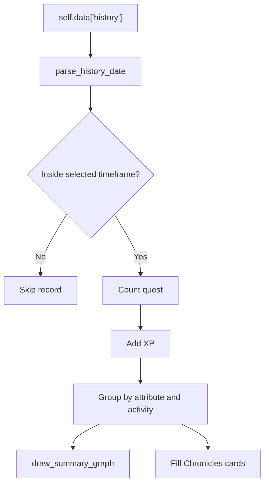

Important helpers:

- `parse_history_date`: turns date text into a `datetime`.
- `draw_summary_graph`: draws the XP bars.
- `configure_summary_body_tags`: styles report text.

Do not start with text tags. First understand the filter and grouping.

## 10. Theme And Display Updates

Theme methods are important because they show how a UI can be redrawn without rebuilding the whole app.

Important methods:

- `get_theme_definitions`: stores theme colors.
- `apply_modern_theme`: applies shared ttk styles.
- `set_theme`: changes the selected theme.
- `refresh_theme_widgets`: updates already-created normal Tk widgets.
- `get_readable_text_color`: keeps text readable.

### Theme Infographic

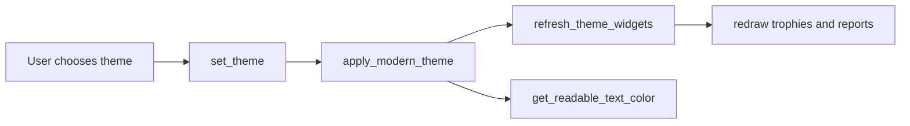

Important idea:

```text
ttk widgets use styles.
normal tk widgets often store colors directly.
```

That is why both `apply_modern_theme` and `refresh_theme_widgets` exist.

## 11. Animations: `play_floating_text` And `root.after`

Animations are not magic. They are repeated small updates.

Important pattern:

```python
def animate(step=0):
    # move or fade something
    self.root.after(next_delay, animate, step + 1)
```

### Animation Infographic

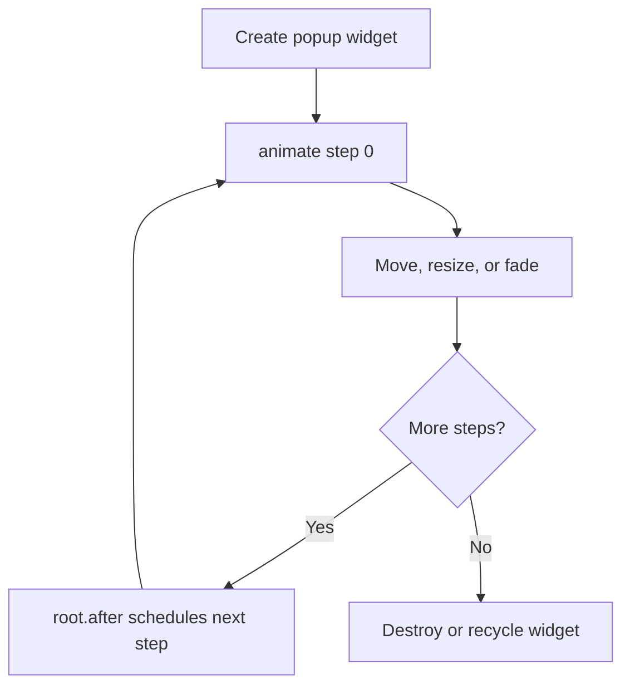

Important animation methods:

- `play_floating_text`: reward text popup.
- `schedule_level_up_sequence`: orders XP, level-up, rank-up, and trophy messages.
- `play_firework_particles`: larger particle burst.
- `play_particles`: smaller particle burst.

Read `play_floating_text` first. It teaches the basic pattern. Particle methods are the same idea with more objects.

## 12. Update Checking: `check_for_update`

This is a useful advanced example because it shows background work.

Important idea:

```text
Network request happens in a worker thread.
Tkinter UI update happens back on the main thread.
```

### Update Check Infographic

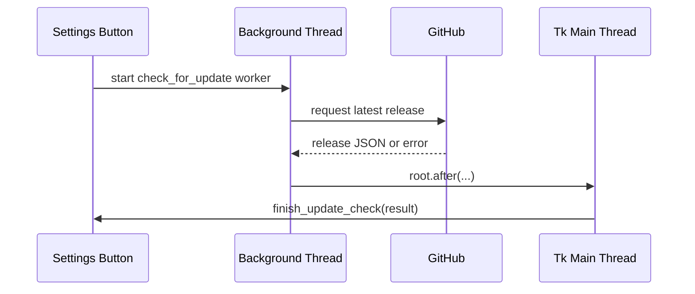

Important methods:

- `check_for_update`: starts the request.
- `finish_update_check`: shows the result.
- `get_https_context`: prepares HTTPS safely for packaged builds.

Do not mix Tkinter widget updates directly into the worker thread. The app uses `root.after(...)` to return to the UI thread.

## Small Supporting Method Groups

These helpers matter, but they are not the best place to start.

### Position Helpers

- `get_center`: returns the app center.
- `clamp_widget_position`: keeps a widget inside the app.
- `clamp_box_position`: keeps a known-size popup inside the app.

Read these when you study popups.

### Color Helpers

- `_hex_to_rgb`: text color to number channels.
- `_blend_color`: blend two colors.
- `improve_color_contrast`: adjust color readability.

Read these when you study themes and animations.

### Cache Helpers

- `_invalidate_subcategory_cache`: clear activity lookup cache.
- `_invalidate_tier_cache`: clear trophy tier cache.
- `_get_total_xp_before_level_generic`: shared cumulative XP helper.

Read these after you understand the main data they cache.

### Scroll Helpers

- `_generic_scroll`: shared scroll math.
- `scroll_summary_body`: scroll Chronicles cards.
- `scroll_settings_canvas`: scroll Settings.
- `route_global_scroll`: sends wheel events to the right place.

Read these after you understand the UI layout.

## What To Read First In `main.py`

Use this order:

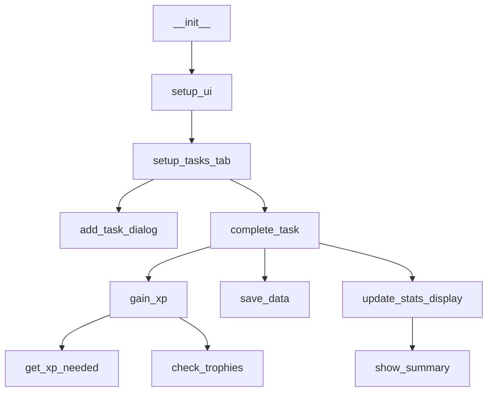

This path teaches the core app without getting lost in every helper branch.

## Final Advice

When a method feels too large, write a tiny summary above it in your own notes:

```text
complete_task:
selected rows -> history + XP -> save -> redraw -> rewards
```

That summary is enough for the first pass.

Then choose one direct helper, such as `gain_xp`, and repeat the same process.
