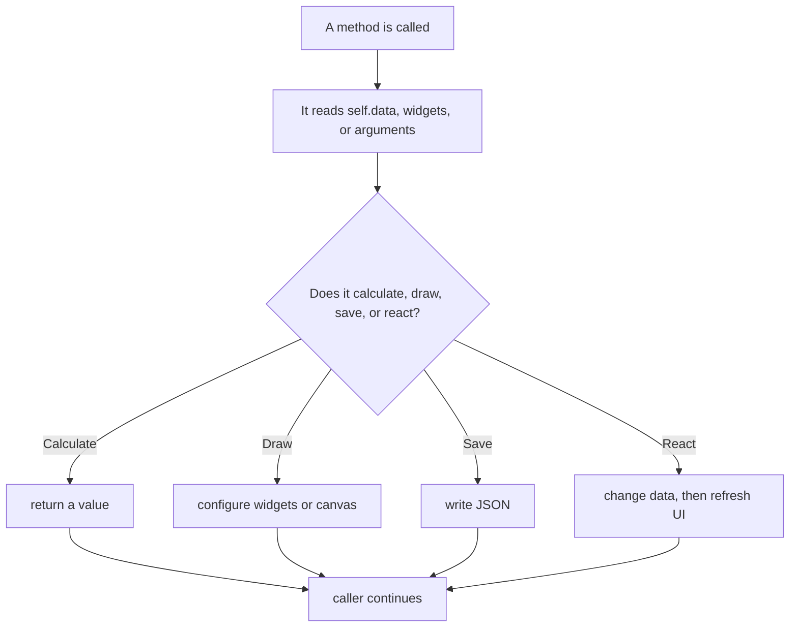

# LifeXP Guide Part 3: Advanced Method Atlas

This part is a lookup guide for the current `LifeXPApp` class.

Every method in the app is listed here. Each entry gives:

- what the method does
- an example from the app
- how to think about it

## How To Use This Atlas

When you find a method in `main.py`:

1. Search this file for the method name.
2. Read the one-line purpose.
3. Look at the example call.
4. Go back to `main.py` and read the real code slowly.

## Method Call Infographic

## Startup, Settings, And Theme Methods

- `__init__(root)`: creates the app object, stores important state, loads data, and builds the UI.
  Example from app startup: `app = LifeXPApp(root)`.
  Think: this is the constructor. It prepares the app before the user clicks anything.

- `get_theme_definitions()`: returns every theme dictionary.
  Example from the app: `self.themes = self.get_theme_definitions()`.
  Think: this is the app's color catalog.

- `_hex_to_rgb(color)`: converts `#RRGGBB` text into red, green, and blue numbers.
  Example from the app: `red, green, blue = self._hex_to_rgb(color)`.
  Think: color math is easier with numbers than text.

- `get_contrast_ratio(foreground, background)`: measures how readable one color is on another.
  Example from the app: `if preferred and self.get_contrast_ratio(preferred, background) >= 4.5:`.
  Think: higher contrast means easier reading.

- `get_readable_text_color(background, preferred=None)`: chooses a readable text color for a background.
  Example from the app: `return self.get_readable_text_color(background, "#0F172A")`.
  Think: this protects the UI from low-contrast themes.

- `get_action_color(role)`: chooses semantic colors for quest actions.
  Example from the app: `"QuestAccept.TButton": self.get_action_color("accept")`.
  Think: ask for a meaning like `accept`, not a hard-coded color.

- `get_action_text_color(background)`: chooses readable text for a colored action button.
  Example from the app: `foreground = self.get_action_text_color(background)`.
  Think: button text must stay readable on every theme.

- `get_action_hover_color(background)`: creates a hover color for an action button.
  Example from the app: `active_background = self.get_action_hover_color(background)`.
  Think: hover state is a small visual change from normal state.

- `scaled_font_size(base_size)`: scales a hard-coded font size from the user's font setting.
  Example from the app: `size = self.scaled_font_size(base_size)`.
  Think: one user setting changes many fonts.

- `ui_space(base_size)`: scales padding and row heights with font size.
  Example from the app: `padding=[self.ui_space(18), self.ui_space(9)]`.
  Think: bigger text needs bigger spacing.

- `ui_font(base_size=DEFAULT_FONT_SIZE, weight=None, family="{San Francisco}")`: returns a Tkinter font tuple.
  Example from the app: `font=self.ui_font(11, "bold")`.
  Think: this keeps font creation consistent.

- `coerce_bool(value, default=True)`: safely converts saved values into real booleans.
  Example from the app: `self.animations_enabled = self.coerce_bool(self.data["user_info"].get("animations_enabled"), True)`.
  Think: JSON or old saves might store booleans in different forms.

- `apply_modern_theme()`: applies colors, fonts, and ttk styles.
  Example from the app: `self.apply_modern_theme()`.
  Think: this paints the shared visual rules.

- `fit_window_to_content(window, min_width=360, min_height=260, center=True)`: sizes a popup to fit its contents.
  Example from the app: `self.fit_window_to_content(window, min_width=min_width, min_height=min_height)`.
  Think: ask Tkinter how big the popup wants to be, then keep it on screen.

- `show_fitted_window(window, min_width=360, min_height=260)`: fits a hidden popup and then shows it.
  Example from the app: `self.show_fitted_window(chooser, min_width=520, min_height=190)`.
  Think: build first, measure second, reveal third.

- `animate_window_open(window)`: fades and moves a popup into view.
  Example from the app: `self.animate_window_open(window)`.
  Think: the popup is still just a widget; animation changes it over time.

- `recolor_widget_tree(widget, color_map)`: walks through child widgets and swaps old theme colors for new ones.
  Example from the app: `self.recolor_widget_tree(child, color_map)`.
  Think: this is a recursive tree walk.

- `rescale_widget_tree(widget)`: walks through child widgets and rescales fonts.
  Example from the app: `self.rescale_widget_tree(child)`.
  Think: remember each original font, then scale from that original.

- `apply_display_preferences(save=True)`: applies font size, animation, particle, and popup settings.
  Example from the app: `self.apply_display_preferences(save=False)`.
  Think: settings must update both memory and visible widgets.

- `configure_notebook_tab_style(selected_bg=None, active_bg=None)`: sets selected and hover tab colors.
  Example from the app: `self.configure_notebook_tab_style(selected_bg=self.accent_green, active_bg=self.bg_light)`.
  Think: notebook tabs have their own ttk style rules.

- `handle_tab_hover_motion(event)`: reacts to mouse movement over the tab bar.
  Example from the app: `self.notebook.bind("<Motion>", self.handle_tab_hover_motion)`.
  Think: Tkinter passes an event object when the mouse moves.

- `set_tab_hover(is_hovering)`: animates notebook hover color in or out.
  Example from the app: `self.set_tab_hover(False)`.
  Think: this method stores hover state and schedules tiny color changes.

- `play_tab_change_animation(event=None)`: pulses the selected tab.
  Example from the app: `self.play_tab_change_animation(event)`.
  Think: tab changes are events, and the UI responds with feedback.

- `handle_notebook_tab_changed(event=None)`: responds when the active tab changes.
  Example from the app: `self.notebook.bind("<<NotebookTabChanged>>", self.handle_notebook_tab_changed)`.
  Think: some tab content, like trophies, is prepared only when visible.

## Header, Rank, Icons, And Navigation

- `setup_header()`: builds the top header with title, rank text, and avatar.
  Example from the app: `self.setup_header()`.
  Think: this creates widgets once.

- `get_title_info(total_level)`: chooses rank title, color, and tier from account level.
  Example from the app: `title, color, tier_index = self.get_title_info(total_level)`.
  Think: input is a number; output is display information.

- `get_title_shape(tier_index)`: returns the fallback pixel shape for a rank tier.
  Example from the app: `shape = self.get_title_shape(tier_index)`.
  Think: if image assets are unavailable, the app can still draw an avatar.

- `load_rank_icon_images()`: loads generated rank medallion images.
  Example from the app: `self.rank_icon_images = self.load_rank_icon_images()`.
  Think: image files become Tkinter `PhotoImage` objects.

- `load_app_icon_image()`: loads the app icon for Tk windows.
  Example from the app: `self.app_icon_image = self.load_app_icon_image()`.
  Think: keep a reference so Tkinter does not discard the image.

- `update_avatar(tier_index, color, progress, roman=None, glow_progress=0.0, glow_color=None, ring_progress=None)`: redraws the header avatar.
  Example from the app: `self.update_avatar(tier_index, color, progress, roman=roman)`.
  Think: avatar art is a small status display.

- `format_account_level_text(total_level, xp_into_level, xp_needed, total_xp)`: formats header account XP text.
  Example from the app: `self.user_level_label.config(text=self.format_account_level_text(total_level, xp_into_level, xp_needed, total_xp))`.
  Think: convert numbers into readable UI text.

- `update_header(animate_rank=True)`: recalculates account XP and refreshes the header.
  Example from the app: `return self.update_header(animate_rank=animate_rank)`.
  Think: this is the header's redraw method.

- `setup_ui()`: creates the tabbed interface.
  Example from the app: `self.setup_ui()`.
  Think: one method coordinates all tab builders.

- `create_pixel_icon(pattern, palette, pixel_size=3)`: turns a text pattern into a pixel icon.
  Example from the app: `return self.create_pixel_icon(pattern, palette, pixel_size=4)`.
  Think: each character in the pattern maps to a color.

- `build_tab_icons()`: creates the icons used in the tab bar.
  Example from the app: `self.tab_icons = self.build_tab_icons()`.
  Think: generated icons avoid extra image files for tabs.

- `create_level_up_arrow_icon(color)`: creates a pixel arrow for level-up popups.
  Example from the app: `trailing_icon=self.create_level_up_arrow_icon("#FF9E00")`.
  Think: popup art can be generated the same way as tab icons.

## Quest Action Buttons

- `get_quest_action_palette(role)`: returns colors for one quest action button.
  Example from the app: `palette = self.get_quest_action_palette(role)`.
  Think: role names drive button appearance.

- `create_quest_action_button(parent, icon, text, role, command, strong_feedback=False)`: builds a custom quest action button.
  Example from the app: `self.create_quest_action_button(action_stack, "+", "Accept Quest", "accept", self.add_task_dialog)`.
  Think: the button stores its command and its colors together.

- `configure_quest_surface(button, bg, fg)`: applies colors to a quest action surface.
  Example from the app: `self.configure_quest_surface(button, self._blend_color(start, end, ratio), end_fg)`.
  Think: a custom button is several widgets that must be recolored together.

- `pointer_inside_widget(widget)`: checks whether the mouse pointer is inside a widget.
  Example from the app: `and not self.pointer_inside_widget(surface.master)`.
  Think: screen coordinates decide whether hover should remain active.

- `handle_quest_hover_enter(button)`: starts hover feedback for a quest button.
  Example from the app: `widget.bind("<Enter>", lambda event, surface=button: self.handle_quest_hover_enter(surface))`.
  Think: enter events begin the visual state.

- `handle_quest_hover_leave(button)`: stops hover feedback after the pointer leaves.
  Example from the app: `widget.bind("<Leave>", lambda event, surface=button: self.handle_quest_hover_leave(surface))`.
  Think: leave events end the visual state.

- `set_quest_button_hover(button, is_hovering)`: animates a quest button between normal and hover colors.
  Example from the app: `self.set_quest_button_hover(button, True)`.
  Think: animate color by blending from start to end.

- `refresh_quest_action_buttons()`: recolors custom quest buttons after a theme change.
  Example from the app: `self.refresh_quest_action_buttons()`.
  Think: already-created widgets need manual updates.

## Chronicles And Scrolling

- `create_summary_timeframe_button(parent, label, timeframe)`: builds one Daily, Weekly, or Monthly control.
  Example from the app: `self.create_summary_timeframe_button(button_row, "Daily", "daily")`.
  Think: the label is visible text; the timeframe is stored data.

- `update_summary_timeframe_buttons()`: highlights the selected timeframe.
  Example from the app: `self.update_summary_timeframe_buttons()`.
  Think: one selected button uses accent styling.

- `draw_summary_graph(totals_by_attribute)`: draws the Chronicles bar chart.
  Example from the app: `self.summary_graph_canvas.bind("<Configure>", lambda event: self.draw_summary_graph(self.summary_attribute_totals))`.
  Think: canvas drawing depends on current size and data.

- `improve_color_contrast(color, background, minimum_ratio=4.5)`: adjusts a color until it is readable.
  Example from the app: `return self.improve_color_contrast(self.attr_colors[attr], background)`.
  Think: color can be nudged toward white or black.

- `get_attribute_text_color(attr, background=None)`: returns a readable text color for an attribute.
  Example from the app: `color = self.get_attribute_text_color(attr, self.bg_light)`.
  Think: attribute colors are not always readable as text.

- `get_summary_combo_colors(background=None)`: chooses report highlight colors.
  Example from the app: `combo_colors = self.get_summary_combo_colors(body.cget("bg"))`.
  Think: repeated activities get colored tags.

- `configure_summary_body_tags(body)`: applies text tags to a report text widget.
  Example from the app: `self.configure_summary_body_tags(body)`.
  Think: tags let one text box contain several styles.

- `find_summary_body_under_pointer()`: finds which report text box is under the mouse.
  Example from the app: `body = self.find_summary_body_under_pointer()`.
  Think: scrolling should affect the panel under the pointer.

- `_generic_scroll(event, scroll_target, speed_units)`: shared helper for mouse-wheel and trackpad scrolling.
  Example from the app: `return self._generic_scroll(event, body, speed_units=4)`.
  Think: normalize different scroll event shapes into one behavior.

- `scroll_summary_body(event)`: scrolls the report body under the pointer.
  Example from the app: `return self.scroll_summary_body(event)`.
  Think: route the event to the right text widget.

- `scroll_settings_canvas(event)`: scrolls the Settings canvas.
  Example from the app: `return self.scroll_settings_canvas(event)`.
  Think: Settings is taller than the window, so it has a canvas scroll area.

- `create_modern_scrollbar(parent, target, width=14)`: creates a custom canvas scrollbar.
  Example from the app: `scrollbar = self.create_modern_scrollbar(table_frame, self.task_tree)`.
  Think: the scrollbar mirrors the target widget's vertical position.

- `route_global_scroll(event)`: sends wheel events to the correct scrollable area.
  Example from the app: `self.root.bind_all(sequence, self.route_global_scroll)`.
  Think: global events need routing because the app has several scroll regions.

- `bind_global_scroll_events()`: installs the app-wide scroll router.
  Example from the app: `self.bind_global_scroll_events()`.
  Think: bind once after the UI exists.

## Quest Button Feedback

- `run_quest_action(button, command, strong_feedback=False)`: runs a quest command after click feedback.
  Example from the app: `widget.bind("<Button-1>", lambda event, surface=button: self.run_quest_action(surface, command, strong_feedback))`.
  Think: visual feedback happens before the action.

- `play_quest_button_miss(button)`: flashes Complete when no quest is selected.
  Example from the app: `self.play_quest_button_miss(button)`.
  Think: user feedback can explain why nothing happened.

- `play_quest_button_feedback(button, strong=False, on_done=None)`: pulses a quest button frame.
  Example from the app: `self.play_quest_button_feedback(button, strong=strong_feedback, on_done=command)`.
  Think: `on_done` is a callback that runs after animation.

## Screen Builders And Trophy Room

- `setup_tasks_tab()`: builds Quest Log.
  Example from the app: `self.setup_tasks_tab()`.
  Think: create the table and action buttons.

- `get_tiers()`: returns trophy milestone tiers that should be shown.
  Example from the app: `tiers = self.get_tiers()`.
  Think: high-level trophies appear after enough progress.

- `calculate_trophy_canvas_size(tiers)`: chooses a trophy canvas size for the available room.
  Example from the app: `size = self.calculate_trophy_canvas_size(tiers)`.
  Think: fit art to current window size.

- `schedule_trophy_room_resize(event=None)`: debounces trophy resizing.
  Example from the app: `self.trophies_frame.bind("<Configure>", self.schedule_trophy_room_resize)`.
  Think: resizing fires many events, so wait briefly before redrawing.

- `trophy_room_has_visible_geometry()`: checks whether the trophy room has a real size.
  Example from the app: `if self.trophy_room_has_visible_geometry():`.
  Think: do not draw layout before Tkinter has measured it.

- `prepare_visible_trophy_room()`: builds trophies after the Character tab is visible.
  Example from the app: `self.prepare_visible_trophy_room()`.
  Think: delayed setup avoids drawing into a zero-size area.

- `resize_trophy_canvases()`: resizes trophy canvases and redraws art.
  Example from the app: `self.resize_trophy_canvases()`.
  Think: canvas size and drawn art must match.

- `redraw_trophies(tiers)`: redraws every trophy.
  Example from the app: `self.redraw_trophies(tiers)`.
  Think: loop over attributes and tiers.

- `rebuild_trophy_room()`: rebuilds the full trophy grid.
  Example from the app: `self.rebuild_trophy_room()`.
  Think: destroy old trophy widgets, then create a fresh grid.

- `setup_character_tab()`: builds Character Info.
  Example from the app: `self.setup_character_tab()`.
  Think: create stat rows and trophy room.

- `setup_summary_tab()`: builds Chronicles.
  Example from the app: `self.setup_summary_tab()`.
  Think: create report controls, metric cards, graph, and activity cards.

- `draw_font_size_slider()`: draws the custom font-size slider.
  Example from the app: `self.draw_font_size_slider()`.
  Think: slider position comes from `self.font_size`.

- `set_font_size_from_slider_event(event)`: changes slider value from mouse position.
  Example from the app: `self.font_size_canvas.bind("<Button-1>", self.set_font_size_from_slider_event)`.
  Think: mouse x-coordinate becomes a font-size choice.

- `apply_font_size_from_slider()`: applies the selected display scale after a short delay.
  Example from the app: `self.apply_font_size_from_slider()`.
  Think: debounce prevents too many full UI refreshes while dragging.

- `setup_settings_tab()`: builds Settings.
  Example from the app: `self.setup_settings_tab()`.
  Think: create theme controls, display settings, update check, and reset tools.

## Theme Changes, Updates, And Data Cleanup

- `set_theme(theme_name, save=True)`: applies a theme and optionally saves it.
  Example from the app: `command=lambda: self.set_theme(selected_theme.get())`.
  Think: change colors, then refresh visible widgets.

- `reset_progress()`: clears saved progress after confirmation.
  Example from the app: `command=self.reset_progress`.
  Think: destructive actions ask first.

- `normalize_version_parts(version)`: converts version text into comparable numbers.
  Example from the app: `LifeXPApp.normalize_version_parts(candidate) > LifeXPApp.normalize_version_parts(current)`.
  Think: `v1.2.3` becomes a tuple-like number list.

- `is_newer_version(candidate, current)`: checks whether one version is newer.
  Example from the app: `if self.is_newer_version(latest_tag, APP_VERSION):`.
  Think: compare release versions safely.

- `check_for_update()`: checks GitHub releases for a newer version.
  Example from the app: `command=self.check_for_update`.
  Think: run network work outside the main UI path.

- `finish_update_check(result)`: shows the update-check result in Tkinter.
  Example from the app: `self.root.after(0, lambda: self.finish_update_check(result))`.
  Think: background work returns to the main thread before touching widgets.

- `refresh_theme_widgets()`: recolors widgets after theme changes.
  Example from the app: `self.refresh_theme_widgets()`.
  Think: ttk styles are not enough for every normal Tk widget.

- `_calculate_max_level()`: finds the highest current attribute level.
  Example from the app: `self._max_stat_level = self._calculate_max_level()`.
  Think: trophy tier display depends on the highest level.

- `_invalidate_subcategory_cache()`: clears cached autocomplete data.
  Example from the app: `self._invalidate_subcategory_cache()`.
  Think: when activity names change, cached lists are stale.

- `_invalidate_tier_cache()`: clears cached trophy tier data.
  Example from the app: `self._invalidate_tier_cache()`.
  Think: when max level changes, visible tiers may change.

- `normalize_user_info(user_info, default_user_info)`: validates saved preferences.
  Example from the app: `data["user_info"] = self.normalize_user_info(data.get("user_info"), default_data["user_info"])`.
  Think: old or edited saves should not crash startup.

- `normalize_subcategories(subcategories, default_subcategories)`: cleans saved activity suggestions.
  Example from the app: `data["subcategories"] = self.normalize_subcategories(data.get("subcategories"), default_data["subcategories"])`.
  Think: keep only useful strings and add missing defaults.

- `get_default_data()`: returns a complete fresh save structure.
  Example from the app: `default_data = self.get_default_data()`.
  Think: this is the safe shape the rest of the app expects.

- `get_attribute_rename_map()`: lists old attribute names and their current names.
  Example from the app: `rename_map = self.get_attribute_rename_map()`.
  Think: migrations need a translation table.

- `migrate_renamed_attributes(data)`: updates old save files in place.
  Example from the app: `self.migrate_renamed_attributes(data)`.
  Think: change old names before normal validation.

- `parse_history_date(date_value)`: converts saved date text into a `datetime`.
  Example from the app: `self.parse_history_date(date_value)`.
  Think: reports compare dates, not raw strings.

- `add_saved_subcategory(attr, name)`: saves a new activity suggestion.
  Example from the app: `self.add_saved_subcategory(quest["attribute"], quest["name"])`.
  Think: user-created activities become future suggestions.

- `load_data()`: reads JSON, migrates old data, and normalizes it.
  Example from the app: `self.data = self.load_data()`.
  Think: loading is also data repair.

- `normalize_stats(stats, default_stats)`: validates saved stat records.
  Example from the app: `data["stats"] = self.normalize_stats(data.get("stats"), default_data["stats"])`.
  Think: each attribute must have a valid level and XP.

- `normalize_tasks(tasks)`: validates active quest records.
  Example from the app: `data["tasks"] = self.normalize_tasks(data.get("tasks"))`.
  Think: bad tasks are skipped before they can crash the UI.

- `normalize_history(history)`: validates completed quest records.
  Example from the app: `data["history"] = self.normalize_history(data.get("history"))`.
  Think: reports should only read valid records.

- `save_data()`: writes current data to disk.
  Example from the app: `self.save_data()`.
  Think: convert Python dictionaries and lists into JSON text.

## Quest Data And Dialogs

- `refresh_task_list()`: redraws the Quest Log table from `self.data["tasks"]`.
  Example from the app: `self.refresh_task_list()`.
  Think: visual rows are rebuilt from memory.

- `toggle_task_tree_selection(event)`: toggles selected tasks with Command or Control click.
  Example from the app: `self.task_tree.bind("<Command-Button-1>", self.toggle_task_tree_selection)`.
  Think: custom selection behavior starts from a click event.

- `get_selected_task_indices(empty_message=None)`: returns valid selected quest indexes.
  Example from the app: `indices = self.get_selected_task_indices(empty_message)`.
  Think: convert selected table row IDs into list indexes.

- `get_selected_task_index(empty_message=None)`: returns one selected quest index.
  Example from the app: `index = self.get_selected_task_index("Select a quest to edit.")`.
  Think: single-edit actions need exactly one row.

- `add_task_dialog()`: opens the Accept Quest window.
  Example from the app: `self.create_quest_action_button(action_stack, "+", "Accept Quest", "accept", self.add_task_dialog)`.
  Think: build a popup, collect draft quests, then save them.

- `edit_task_dialog()`: edits one selected quest or starts batch editing.
  Example from the app: `self.create_quest_action_button(action_stack, "✎", "Edit Quest", "edit", self.edit_task_dialog)`.
  Think: selection count decides which editor opens.

- `edit_multiple_tasks_dialog(indices)`: edits several selected quests.
  Example from the app: `self.edit_multiple_tasks_dialog(indices)`.
  Think: build controls for each selected row, then validate all updates.

- `delete_task()`: abandons selected quests without XP.
  Example from the app: `self.create_quest_action_button(action_stack, "×", "Abandon Quest", "abandon", self.delete_task)`.
  Think: remove from active tasks, save, refresh.

- `complete_task()`: completes selected quests, grants XP, records history, and refreshes the UI.
  Example from the app: `self.create_quest_action_button(action_stack, "✓", "Complete Quest", "complete", self.complete_task, strong_feedback=True)`.
  Think: this is the main gameplay method.

## XP, Activity Lookup, And Trophies

- `get_scaled_xp_needed(level, base_xp)`: calculates level cost from the XP curve.
  Example from the app: `self.xp_needed_cache[level] = self.get_scaled_xp_needed(level, BASE_XP_NEEDED)`.
  Think: normalize a curve to this app's chosen base XP.

- `get_xp_needed(level)`: returns XP needed for an attribute level.
  Example from the app: `xp_needed = self.get_xp_needed(level)`.
  Think: use cache when possible.

- `_get_total_xp_before_level_generic(level, cache, single_needed_func)`: shared helper for cumulative XP.
  Example from the app: `return self._get_total_xp_before_level_generic(level, self.total_xp_before_level_cache, self.get_xp_needed)`.
  Think: one cumulative algorithm works for attributes and account rank.

- `get_total_xp_before_level(level)`: returns cumulative attribute XP before a level.
  Example from the app: `return stat["xp"] + self.get_total_xp_before_level(stat["level"])`.
  Think: current-level XP is not enough for lifetime totals.

- `get_total_xp_for_stat(stat)`: returns lifetime XP for one attribute.
  Example from the app: `total_xp = sum(self.get_total_xp_for_stat(stat) for stat in self.data["stats"].values())`.
  Think: add spent XP from previous levels to current XP.

- `get_account_xp_needed(level)`: returns XP needed for the next account level.
  Example from the app: `xp_needed = self.get_account_xp_needed(level)`.
  Think: account rank uses a larger base XP than attributes.

- `get_total_account_xp_before_level(level)`: returns cumulative account XP before a level.
  Example from the app: `while self.get_total_account_xp_before_level(high) <= total_xp:`.
  Think: used to locate the current account level.

- `get_account_level_progress(total_xp)`: converts total XP into level progress.
  Example from the app: `total_level, xp_into_level, xp_needed = self.get_account_level_progress(total_xp)`.
  Think: input total XP, output display-ready progress numbers.

- `get_all_subcategories()`: returns all saved activity names once.
  Example from the app: `available_subs = self.get_all_subcategories()`.
  Think: used by the All filter in Accept Quest.

- `get_known_activity_owner(activity_name)`: finds which attribute owns an activity.
  Example from the app: `known_owner = self.get_known_activity_owner(activity_name)`.
  Think: known activities do not need the user to choose an attribute.

- `get_subcategory_owner_map()`: builds an activity-to-attribute lookup.
  Example from the app: `owner_map = self.get_subcategory_owner_map()`.
  Think: dictionaries make lookup fast.

- `gain_xp(attribute, amount)`: adds XP and returns level-up events.
  Example from the app: `level_events.extend(self.gain_xp(attr, xp_gain))`.
  Think: XP can produce zero, one, or many level-ups.

- `summarize_level_events(level_events)`: collapses many level-up events per attribute into one final event.
  Example from the app: `level_events = self.summarize_level_events(level_events)`.
  Think: multi-quest completion should show concise rewards.

- `check_trophies(attribute, new_level)`: awards a trophy at milestone levels.
  Example from the app: `trophy_name = self.check_trophies(attribute, stat["level"])`.
  Think: level changes may unlock visual rewards.

- `_trophy_material(level_req, progress)`: chooses trophy colors for a tier.
  Example from the app: `primary, shadow, highlight, accent = self._trophy_material(level_req, progress)`.
  Think: locked and earned trophies use different materials.

- `draw_attribute_symbol(canvas, attr, cx, cy, size, color, line_color)`: draws an attribute emblem.
  Example from the app: `self.draw_attribute_symbol(canvas, attr, cx + s * 0.012, medallion_cy + s * 0.014, symbol_size, display_color, line_color)`.
  Think: each attribute gets a small custom drawing.

- `draw_trophy(canvas, attr, progress, color, level_req)`: draws one trophy.
  Example from the app: `self.draw_trophy(canvas, attr, progress, self.attr_colors[attr], level_req)`.
  Think: canvas art is rebuilt from data.

- `update_stats_display(animate_rank=True)`: refreshes stat labels, bars, trophies, header, and summary.
  Example from the app: `self.update_stats_display()`.
  Think: call this after XP or settings change what the user sees.

- `show_summary(timeframe)`: builds Daily, Weekly, or Monthly Chronicles.
  Example from the app: `self.show_summary(self.current_summary_timeframe)`.
  Think: filter history, group records, then redraw report widgets.

## Animation And Popup Helpers

- `get_center()`: returns the center of the app window.
  Example from the app: `cx, cy = self.get_center()`.
  Think: reward popups need an anchor point.

- `clamp_widget_position(widget, x, y, padding=12)`: keeps a widget inside the app window.
  Example from the method: `safe_x = max(padding + half_w, min(x, root_w - padding - half_w))`.
  Think: popup coordinates should not leave the visible area.

- `clamp_box_position(width, height, x, y, padding=12)`: keeps a box inside the app window.
  Example from the app: `safe_x, safe_y = self.clamp_box_position(popup_w, popup_h, x, y + (stack_offset * stack_direction))`.
  Think: this version works before a widget object has final geometry.

- `ease_out_cubic(progress)`: makes motion start fast and slow down.
  Example from the app: `eased = self.ease_out_cubic(progress)`.
  Think: progress goes from `0.0` to `1.0`.

- `ease_smoothstep(progress)`: makes motion start and end softly.
  Example from the app: `ratio = self.ease_smoothstep(index / float(frames))`.
  Think: use this for gentle transitions.

- `_blend_color(c1, c2, ratio)`: blends two hex colors.
  Example from the app: `return self._blend_color(background, "#FFFFFF", 0.18)`.
  Think: ratio `0` is the first color; ratio `1` is the second.

- `set_popup_alpha(popup, alpha)`: changes popup transparency when supported.
  Example from the app: `self.set_popup_alpha(window, 1.0)`.
  Think: operating systems may support transparency differently.

- `raise_popup_window(popup)`: keeps a popup above the main app window.
  Example from the app: `self.raise_popup_window(popup)`.
  Think: delayed popups should not appear behind the app.

- `popup_duration_ms(duration_steps)`: converts animation steps to milliseconds.
  Example from the app: `return int(self.popup_duration_ms(duration_steps) * start_ratio)`.
  Think: schedules need milliseconds, animations use steps.

- `popup_overlap_start_ms(duration_steps, start_ratio=REWARD_CHAIN_START_RATIO)`: decides when the next popup may start.
  Example from the app: `first_reward_delay = self.popup_overlap_start_ms(XP_POPUP_STEPS, XP_TO_REWARD_START_RATIO)`.
  Think: reward messages can overlap slightly instead of waiting fully.

- `schedule_level_up_sequence(level_events, rank_event=None)`: schedules rank, level, and trophy rewards.
  Example from the app: `self.schedule_level_up_sequence(level_events, rank_event)`.
  Think: this coordinates several animations in order.

- `play_level_up_batch(events)`: shows grouped level-up popups for multi-quest completion.
  Example from the app: `self.root.after(first_reward_delay, lambda events=level_events: self.play_level_up_batch(events))`.
  Think: several level-ups can be displayed as one batch.

- `play_level_up_animation(event, x=None, y=None, duration_steps=LEVEL_UP_POPUP_STEPS, fade_steps=LEVEL_UP_POPUP_FADE_STEPS, particle_count=54, stack=False)`: shows one level-up popup.
  Example from the app: `popup_boxes.append(self.play_level_up_animation(event, x=x, y=y, duration_steps=BATCH_LEVEL_UP_POPUP_STEPS))`.
  Think: event data decides text, color, and trophy follow-up.

- `play_level_up_batch_particles(events, popup_boxes)`: creates shared particles around a level-up batch.
  Example from the app: `self.play_level_up_batch_particles(events, popup_boxes)`.
  Think: one particle burst can support several popup boxes.

- `play_rank_up_animation(rank_event)`: animates account rank in the header.
  Example from the app: `self.play_rank_up_animation(rank_event)`.
  Think: rank-up feedback belongs near the rank display.

- `play_trophy_animation_at_center(trophy_name)`: positions trophy rewards near the center stack.
  Example from the app: `self.root.after(next_delay, lambda trophy=trophy: self.play_trophy_animation_at_center(trophy))`.
  Think: trophy messages are delayed after level-up messages.

- `play_trophy_animation(trophy_name, x, y)`: shows trophy text and particles.
  Example from the app: `self.play_trophy_animation(trophy_name, cx, cy + 112)`.
  Think: this is the visible trophy reward.

- `acquire_particle_widget(color, size)`: gets a reusable particle widget.
  Example from the app: `particle, token = self.acquire_particle_widget(p_color, size)`.
  Think: widget pooling avoids creating too many widgets.

- `register_particle_widget(widget)`: tracks active particle widgets.
  Example from the app: `self.register_particle_widget(widget)`.
  Think: the app caps active particles for performance.

- `release_particle_widget(widget, token=None)`: hides a particle and returns it to the pool.
  Example from the app: `self.root.after(PARTICLE_HARD_LIFETIME_MS, lambda w=widget, t=token: self.release_particle_widget(w, t))`.
  Think: cleanup can be scheduled after a lifetime.

- `destroy_particle_widget(widget, token=None)`: compatibility wrapper for particle cleanup.
  Example from the app: `self.destroy_particle_widget(particle["widget"], particle["token"])`.
  Think: old code can call destroy while the pool handles reuse.

- `play_floating_text(text, color, x, y, size=18, shake=False, duration_steps=70, fade_steps=20, trailing_icon=None, stack=False)`: creates floating reward text.
  Example from the app: `self.play_floating_text(f"+{total_xp_gain} XP!", "#EBCB8B", cx, cy, size=30)`.
  Think: text appears, drifts, fades, then disappears.

- `play_firework_particles(color, source_box, count=80, rainbow=False, palette=None, physics=False, life_range=(40, 68), fade_start_ratio=0.35)`: creates firework particles.
  Example from the app: `self.play_firework_particles("#EBCB8B", popup_box, count=34, palette=["#EBCB8B", "#FFD166"], physics=True)`.
  Think: particles start near a popup and move outward.

- `play_particles(color, x, y, count=15, gravity=True, rainbow=False)`: creates smaller burst particles.
  Example from the app: `self.play_particles("#BF616A", cx, cy, count=min(32, 10 + (count * 5)), gravity=True)`.
  Think: this is a simpler particle effect.

## Runtime Helper Atlas

These functions live in `lifexp/runtime.py`, outside the class.

- `get_resource_dir()`: returns the folder for bundled assets.
  Example from the app: `self.base_dir = get_resource_dir()`.
  Think: packaged apps and source checkouts store resources differently.

- `get_user_data_dir()`: returns the folder for packaged user data.
  Example from the app: `self.data_dir = get_user_data_dir() if is_packaged_app() else self.base_dir`.
  Think: installed apps should not save progress inside read-only app files.

- `is_packaged_app()`: returns whether the app is running as a frozen package.
  Example from the app: `self.data_dir = get_user_data_dir() if is_packaged_app() else self.base_dir`.
  Think: packaged builds need different paths.

- `configure_platform_scaling(root)`: fixes packaged macOS Tk scaling when needed.
  Example from startup: `configure_platform_scaling(root)`.
  Think: UI scale can differ between source and packaged app.

- `get_https_context()`: returns an HTTPS context for update checks.
  Example from the app: `urllib.request.urlopen(request, timeout=8, context=get_https_context())`.
  Think: packaged apps may need bundled certificates.

## Final Reading Strategy

Read each method in three passes:

1. Shape pass: read the method name, arguments, and docstring.
2. Data pass: underline every `self.data`, list, dictionary, and variable change.
3. Control pass: follow every `if`, `for`, `while`, `return`, and callback.

When you can explain what data comes in, what branch runs, and what changes afterward, you understand the method.
